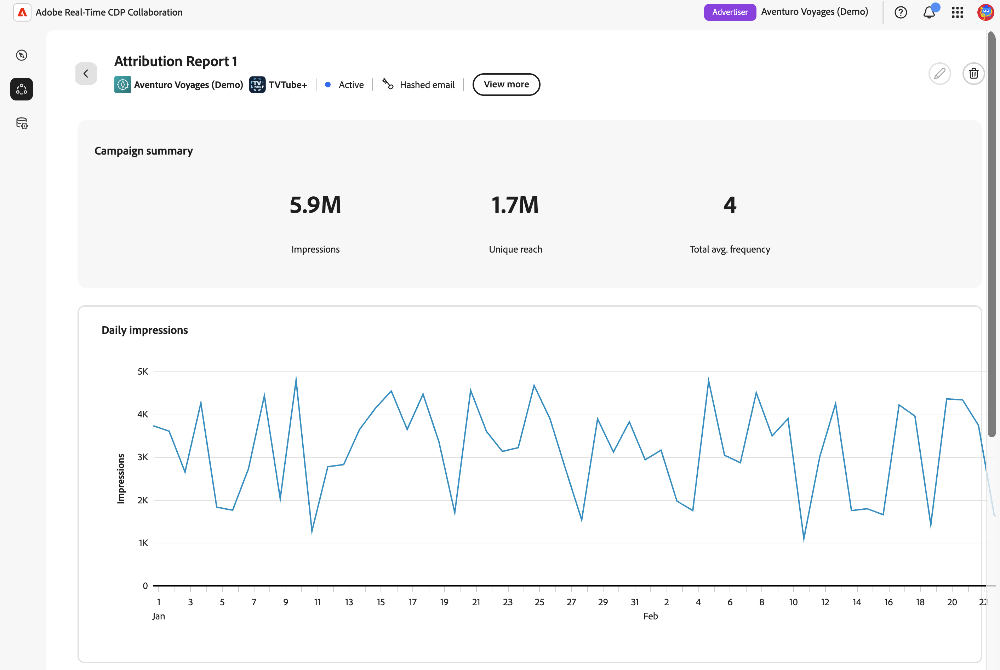

# [!DNL Amazon Marketing Cloud] 측정 보고서 만들기 {#amc-measurement-reports}

{{limited-availability-release-note}}

[!DNL Amazon Marketing Cloud]&#x200B;([!DNL AMC]) 프로젝트의 **[!UICONTROL 측정]** 탭을 사용하여 대상 도달, 빈도 및 전환 결과를 검토하십시오. AMC 프로젝트를 만든 후 [!DNL AMC] 인스턴스에서 사용할 수 있는 데이터를 사용하여 이미 실행된 캠페인에 대한 측정 보고서를 만듭니다.

>[!IMPORTANT]
>
>백그라운드 데이터 설정 쿼리가 완료될 때까지 **[!UICONTROL 측정]** 탭에 &quot;사용 가능한 측정 데이터 없음&quot;이 표시됩니다. 이 프로세스는 최대 24시간 정도 소요될 수 있습니다. 메시지가 24시간 후에도 지속되면 [문제 해결](#troubleshooting) 섹션을 참조하세요.

## 보고서 만들기 {#create-report}

[!DNL AMC] 측정 보고서를 만들려면 [캠페인 요약 보고서 만들기](../measure.md#create-campaign-summary-report-create-campaign-summary-report)의 단계를 따릅니다.

{zoomable="yes"}

### 캠페인 세부 정보 {#campaign}

**[!UICONTROL 광고주 ID]**&#x200B;이(가) [!DNL AMC] 인스턴스와 연결된 [!DNL Amazon Advertising] 계정을 식별합니다. [!DNL AMC]은(는) 이 계정 컨텍스트를 사용하여 측정을 위한 캠페인을 검색합니다.

**[!UICONTROL 캠페인 ID]** 목록은 연결된 [!DNL AMC] 인스턴스에서 사용할 수 있는 캠페인으로 자동으로 채워집니다. 캠페인은 기본 검색 전환 확인 기간 내에 있고 [!DNL AMC]의 최소 집계 임계값을 충족하기에 충분한 고유 사용자가 있는 경우에만 나타납니다. [!DNL Amazon Ads] 활동을 측정할 캠페인을 선택하십시오.

필요한 캠페인이 목록에 없으면 연결된 [!DNL Amazon Ads] 계정에 속하는지 확인하고 [문제 해결](#troubleshooting)을 검토하십시오. 임계값에 대한 자세한 내용은 [AMC 집계 임계값 설명서](https://advertising.amazon.com/API/docs/en-us/guides/amazon-marketing-cloud/aggregation-threshold)를 참조하세요.

#### 날짜 범위, 실행 날짜 및 보고서 이름 {#dates}

>[!CONTEXTUALHELP]
>id="rtcdp_collaboration_amc_measure_report_date_range"
>title="날짜 범위"
>abstract="보고서에 포함할 캠페인 데이터의 시작 날짜와 종료 날짜를 설정하십시오. 날짜 범위는 365일 전환 확인 기간으로 제한되며 최대 범위는 90일입니다. 지난 캠페인에 대해서만 보고할 수 있습니다."

>[!CONTEXTUALHELP]
>id="rtcdp_collaboration_amc_measure_report_run_date"
>title="실행 날짜"
>abstract="보고서 실행 날짜입니다. 보고서 종료 날짜를 기준으로 1일 이상이어야 하며 최대 46일까지 설정할 수 있습니다."

>[!NOTE]
>
>이미 실행된 캠페인에 대해서만 보고할 수 있습니다.

**[!UICONTROL 보고서 날짜 범위]**&#x200B;을(를) 선택한 [!DNL AMC] 캠페인이 실행된 기간으로 설정합니다. [!DNL AMC]은(는) 최대 90일의 365일 전환 확인 기간을 지원합니다.

**[!UICONTROL 보고서 실행 날짜]**&#x200B;를 설정합니다. 보고서가 실행되는 날짜입니다. 실행 날짜는 보고서 종료 날짜 후 최소 1일이어야 하며 향후 최대 46일이 될 수 있습니다. 전체 날짜 제약 조건 집합을 보려면 [AMC 제약 조건 참조](#constraints)를 참조하세요.

>[!TIP]
>
>날짜 범위가 현재 날짜로부터 30일 이내인 속성 보고서의 경우, 보고서 실행 전에 고정된 30일 전환 확인 기간 내의 모든 전환이 캡처되도록 실행 날짜를 향후 30일로 설정합니다.

#### 보고서 유형 {#report-type}

모든 [!DNL AMC] 보고서에 **[!UICONTROL 캠페인 요약]**&#x200B;이 포함되어 있습니다. 선택적으로 광고 노출 후 30일 이내에 캠페인 노출로 인해 구매 또는 등록과 같은 고객 작업이 발생했는지 여부를 측정하는 **[!UICONTROL 속성]** 데이터를 포함할 수 있습니다. 속성을 사용하려면 관련 전환 이벤트를 [!DNL AMC] 인스턴스에서 사용할 수 있어야 합니다. 도달 또는 인지도에 중점을 둔 캠페인의 경우 **[!UICONTROL 캠페인 요약]**&#x200B;에서 필요한 게재 지표를 제공합니다.

| 보고서 유형 | 설명 |
| --- | --- |
| **[!UICONTROL 캠페인 요약]** | 선택한 캠페인에 대한 도달, 빈도 및 노출 지표를 제공합니다. 항상 포함됨. |
| **[!UICONTROL 특성]** | 전환 데이터를 보고서에 추가합니다. 전환 이벤트가 [!DNL AMC] 인스턴스에 있는 경우에만 사용할 수 있습니다. [전환 이벤트](#conversion-events)를 참조하세요. |

#### 전환 이벤트(속성만) {#conversion-events}

>[!CONTEXTUALHELP]
>id="rtcdp_collaboration_amc_attribution_lookback_period"
>title="속성 전환 확인 기간"
>abstract="AMC는 고정된 30일 속성 기간 적용: 마지막 노출 후 최대 30일까지 발생하는 전환은 보고서 날짜 범위 내의 노출에 속하는 것일 수 있습니다. 이 값은 편집할 수 없습니다. 모든 적격 전환이 캡처되도록 범위 종료 후 최소 30일 후에 보고서 실행 날짜를 예약하십시오."

>[!CONTEXTUALHELP]
>id="rtcdp_collaboration_amc_measure_conversion_events"
>title="전환 이벤트"
>abstract="속성 보고서에 포함할 전환 이벤트를 최대 3개까지 선택하십시오. 사용 가능한 이벤트는 [!DNL AMC] 인스턴스에서 자동으로 검색됩니다. 이벤트가 나타나지 않으면 [!DNL AMC] 인스턴스에 기록된 전환 이벤트가 없기 때문일 수 있으며 속성을 사용할 수 없습니다."

>[!NOTE]
>
>속성 데이터를 사용하려면 [!DNL AMC] 인스턴스에 전환 이벤트를 구성해야 합니다. [!UICONTROL 속성]을 사용할 수 없거나 선택하지 않은 경우 이 섹션을 건너뛰고 **[!UICONTROL 만들기]**&#x200B;를 선택하여 양식을 제출하세요.

[!UICONTROL 속성] 보고서의 경우 [!DNL AMC]은(는) 고정된 30일 속성 전환 확인 기간을 적용합니다. 이 설정은 조정할 수 없습니다.

{zoomable="yes"}

전환 이벤트는 구매, 위시리스트 추가, 장바구니 작업 또는 제품 세부 사항 보기와 같이 [!DNL Amazon Ads]에서 추적한 현장 고객 작업을 나타냅니다. 속성 보고서는 최대 3개의 이벤트를 지원합니다. 측정하려는 캠페인 결과에 맞는 이벤트를 선택합니다. [!UICONTROL 속성] 옵션을 사용할 수 없는 경우 [문제 해결](#troubleshooting)을 참조하세요.

보고서를 만들면 예약된 상태나 보류 상태로 **[!UICONTROL 측정값]** 탭에 표시됩니다. 구성된 실행 날짜에 [!DNL AMC]이(가) 보고서 쿼리를 처리하고 24시간 내에 결과를 반환합니다.

{zoomable="yes"}

## 보고서 보기 {#view-report}

보고서가 실행되면 [!DNL AMC] 프로젝트의 **[!UICONTROL 측정]** 탭에서 결과를 사용할 수 있습니다. 보고서를 찾아 **[!UICONTROL 전체 보고서 보기]**&#x200B;를 선택하여 결과를 검토하십시오.

![[!DNL AMC] 프로젝트의 측정값 탭에서 실행 날짜, 보고서 유형 및 전체 보고서 보기 단추가 강조 표시된 완료된 보고서 카드를 표시합니다.](../../../assets/collaborate/advertising-platforms/view-full-report.png){zoomable="yes"}

보고서에는 선택한 보고서 유형에 사용할 수 있는 결과가 표시됩니다. **[!UICONTROL 캠페인 요약]** 보고서에는 선택한 Amazon 캠페인에 대한 게재 결과가 표시됩니다.

{zoomable="yes"}

**[!UICONTROL 속성]**&#x200B;을 포함하는 보고서에는 선택한 Amazon 광고 전환 이벤트와 연결된 전환 활동도 표시됩니다.

{zoomable="yes"}

보고서 결과 해석에 대한 자세한 내용은 [성과 측정](../measure.md#view-reports-view-reports)을 참조하십시오.

## [!DNL AMC] 제약 조건 참조 {#constraints}

다음 제약 조건은 모든 [!DNL AMC] 측정 보고서에 적용됩니다.

| 제한 | 값 |
| --- | --- |
| 가장 빠른 보고서 날짜 범위 시작 | 현재 날짜보다 365일 전 |
| 최신 보고서 날짜 범위 종료 | 현재 날짜로부터 45일 후. 이 옵션을 사용하여 아직 실행 중이며 앞으로 45일 이내에 완료될 캠페인에 대한 보고서를 미리 구성합니다. 보고서는 캠페인이 종료된 후 예약된 실행 날짜에 자동으로 실행됩니다. |
| 최대 보고서 날짜 범위 | 90일 |
| 속성 전환 확인 기간 | 30일([!DNL AMC]에 대해 수정됨) |
| 최소 실행 일자 | 보고서 종료 날짜 후 최소 1일 |
| 최대 실행 일자 | 향후 46일 |
| 보고서당 최대 전환 이벤트 수 | 3 |
| 캠페인 선택 | 보고서당 단일 캠페인 |
| 보고서 편집 | 사용할 수 없음. 기존 보고서가 보존됩니다. 변경이 필요한 경우 [새 보고서 만들기](#create-report) |

## 문제 해결 {#troubleshooting}

**사용 가능한 측정 데이터 없음**

**[!UICONTROL 측정]** 탭에는 프로젝트 생성 시 트리거된 백그라운드 데이터 설정 쿼리가 완료될 때까지 &quot;사용 가능한 측정 데이터 없음&quot;이 표시됩니다. 최대 24시간 정도 소요될 수 있습니다. &#39;사용 가능한 측정 데이터 없음&#39; 메시지가 24시간 후에도 지속되면 [!DNL AMC] 인스턴스에 지난 3개월 이내에 실행된 캠페인이 있는지 확인하십시오. 이는 캠페인 검색 중에 사용되는 기본 전환 확인 기간입니다. 적격 캠페인이 존재하고 메시지가 지속되는 경우 [Amazon 광고 계정](https://advertising.amazon.com/sign-in){target="_blank"}에서 캠페인 상태를 확인하십시오.

**캠페인이 [!UICONTROL 캠페인 ID] 드롭다운에 표시되지 않음**

**[!UICONTROL 측정값]** 탭이 표시되더라도 캠페인이 없을 수 있습니다. [!DNL AMC]이(가) campaign 데이터에 최소 사용자 임계값을 적용합니다. 최소 고유 사용자 임계값을 충족하지 않는 캠페인은 제외되며 보고서 쿼리는 결과를 반환하지 않습니다. 보고할 캠페인에 충분한 도달 범위가 있는지 확인합니다. [!DNL AMC]의 집계 임계값에 대한 자세한 내용은 [AMC 집계 임계값 설명서](https://advertising.amazon.com/API/docs/en-us/guides/amazon-marketing-cloud/aggregation-threshold){target="_blank"}를 참조하십시오.

**실행 날짜 이후에 결과가 표시되지 않음**

[!DNL AMC]이(가) 보고서 쿼리를 처리하고 결과를 반환할 수 있도록 예약된 실행 날짜 후 최대 24시간을 허용합니다. 해당 기간 후에도 보고서가 보류 중인 경우 실행 날짜가 지났으며 보고서 상태가 더 이상 보류 중으로 표시되지 않는지 확인하십시오.

**전환 이벤트를 사용할 수 없으며 [!UICONTROL 속성]이 회색으로 표시됩니다**

이 문제는 다음 세 가지 이유로 발생할 수 있습니다.

1. **전환 추적을 사용할 수 없습니다.** [!DNL AMC] 광고주 계정에 전환 추적이 구성되어 있지 않을 수 있습니다. [Amazon 광고 계정](https://advertising.amazon.com/sign-in){target="_blank"}(으)로 이동하여 관련 캠페인에 대한 전환 이벤트가 추적되고 있는지 확인하십시오.
2. **기록된 전환 이벤트가 없습니다.** 추적이 활성화된 경우에도 [!DNL AMC] 인스턴스가 아직 전환 이벤트를 기록하지 않았을 수 있습니다.
3. **집계 임계값이 충족되지 않았습니다.** [!DNL AMC]이(가) 전환 데이터에 최소 임계값을 적용합니다. 전환 이벤트 유형에 충분한 발생 횟수가 없으면 반환되지 않고 목록에 표시되지 않습니다.

**전환율이 예상보다 낮게 표시됩니다**

보고서 실행 날짜가 날짜 범위 종료 후 30일 이내인 경우 [!DNL AMC]이(가) 속성 기간 내에 모든 전환을 캡처하지 않았을 수 있습니다. 실행 날짜가 날짜 범위가 끝난 후 최소 30일 이후인 [새 보고서를 만듭니다](#create-report).

## 다음 단계 {#next-steps}

보고서 결과를 사용하여 캠페인 성과를 평가하고 [!DNL Amazon Advertising]에서 향후 캠페인 계획에 알립니다. 예를 들어 타깃팅을 조정하거나, 빈도 분포에서 식별된 과다 노출된 대상을 억제하거나, 성과가 좋은 배치에 지출을 재할당할 수 있습니다. 다른 캠페인 또는 보고 기간을 분석하려면 적절한 설정을 사용하여 다른 측정 보고서를 만듭니다.

사용 가능한 모든 [!DNL AMC] 공동 작업 기능에 대한 개요는 [[!DNL Amazon Marketing Cloud]](./amc.md)을(를) 참조하십시오.
