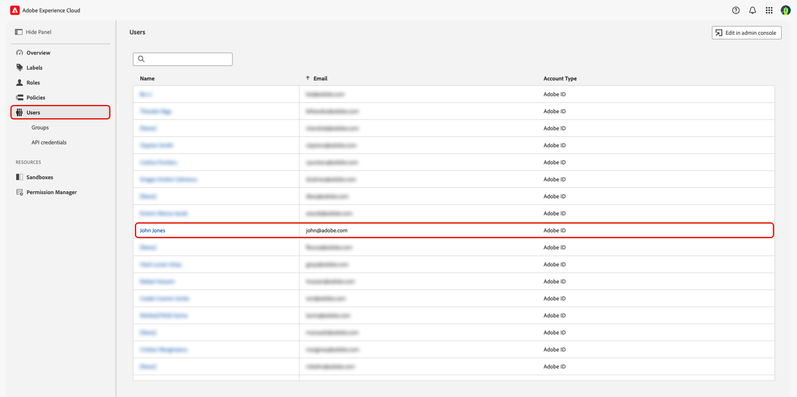

# 권한을 통한 사용자 액세스 관리 {#manage-user-access}

{{limited-availability-release-note}}

Experience Cloud [권한](https://experienceleague.adobe.com/en/docs/experience-platform/access-control/abac/permissions-ui/browse){target="_blank"} 인터페이스를 통해 Real-Time CDP Collaboration 내의 개별 구성 요소에 대한 권한 및 사용자 액세스를 관리합니다. 시스템 및 제품 관리자는 권한을 사용하여 [역할](./manage-roles.md)을 정의하여 특정 기능 및 리소스에 대한 사용자 액세스를 관리할 수 있습니다.

## 권한에 대한 액세스 구성 {#permissions-access}

권한에 액세스하려면 Adobe Experience Platform 제품에 대한 제품 관리자 및 사용자 액세스 권한이 모두 있어야 합니다. 시스템 관리자는 제품 관리자 권한을 구성해야 하지만, 사용자 권한은 시스템 또는 제품 관리자가 구성할 수 있습니다. 관리 역할에 대한 자세한 내용은 [액세스 제어 계층 구조](./overview.md#hierarchy) 안내서를 참조하십시오.

>[!TIP]
>
>이 안내서에서 **관리자**&#x200B;는 **시스템 및 제품 관리자**&#x200B;를 모두 참조합니다.

### 시스템 관리자: 제품 관리자 액세스 구성 {#admin-access}

다음 단계를 통해 사용자 제품 관리자에게 Experience Platform 제품 내의 관리 기능을 부여할 수 있는 액세스 권한을 부여합니다.

>[!IMPORTANT]
>
>시스템 관리자는 Adobe Admin Console과 같은 특정 Experience Cloud 제품에 즉시 액세스할 수 있습니다. 그러나 권한을 사용하려면 제품 관리자 및 사용자에게 Experience Platform 제품에 대한 액세스 권한을 부여해야 합니다. 시스템 관리자로서 액세스 권한을 부여하려면 아래의 단계별 안내서를 따르십시오.

자격 증명을 사용하여 [Adobe Experience Cloud](https://experience.adobe.com/){target="_blank"}에 로그인합니다. 홈 보기는 **[!UICONTROL 빠른 액세스]** 섹션 내에 사용 가능한 제품 목록과 함께 표시됩니다. **[!UICONTROL Admin Console]**&#x200B;을(를) 선택합니다.

{zoomable="yes"}

[Adobe Admin Console](https://adminconsole.adobe.com/) 개요 대시보드가 표시됩니다. **[!UICONTROL 제품 및 서비스]**&#x200B;의 **[!UICONTROL 제품]** 목록에서 **[!UICONTROL Adobe Experience Platform]**&#x200B;을(를) 선택하십시오.

Adobe Experience Platform 제품이 강조 표시된 {zoomable="yes"}

Adobe Experience Platform 대시보드가 표시됩니다. **[!UICONTROL 관리자]** 탭을 선택한 다음 **[!UICONTROL 관리자 추가]**&#x200B;를 선택합니다.

{zoomable="yes"}

**[!UICONTROL 제품 관리자 추가]** 대화 상자가 나타납니다. **[!UICONTROL 전자 메일 또는 사용자 이름]** 텍스트 필드에 사용자 전자 메일 또는 사용자 이름을 입력한 다음 드롭다운에서 올바른 계정을 선택합니다. **[!UICONTROL 저장]**&#x200B;을(를) 선택하여 사용자를 제품 관리자로 추가합니다.

![사용자 정보를 입력하고 [저장] 옵션을 선택한 상태로 제품 관리자 추가 대화 상자가 표시됩니다.](../../assets/permissions/add-product-administrators.png){zoomable="yes"}

이제 사용자는 제품 관리자 권한을 가지며 Admin Console 내에서 제품에 사용자 또는 다른 관리자를 추가하는 등의 관리 기능을 수행할 수 있습니다. 그런 다음 권한 내에서 기능에 액세스하고 수행하려면 Experience Platform 제품에 대한 사용자 액세스 권한이 필요합니다.

### 관리자: Experience Platform에 대한 사용자 액세스 권한 구성 {#user-access}

사용자 제품 관리자 액세스 권한을 부여했으므로 이제 Experience Platform 제품에 대한 사용자 액세스 권한을 제공해야 합니다. 액세스 구성의 일부로 사용자별 [제품 프로필](https://helpx.adobe.com/enterprise/using/manage-product-profiles.html)을(를) 할당합니다.

>[!TIP]
>
>이전 섹션을 따르는 경우 이미 Adobe Experience Platform 제품 내에 있으며 첫 번째 단계를 건너뛸 수 있습니다.

[Admin Console](https://adminconsole.adobe.com/){target="_blank"}(으)로 이동한 다음 **[!UICONTROL 제품 및 서비스]**&#x200B;의 **[!UICONTROL 제품]** 목록에서 **[!UICONTROL Adobe Experience Platform]**&#x200B;을(를) 선택합니다.

{zoomable="yes"}

**[!UICONTROL 사용자]** 탭을 선택한 다음 **[!UICONTROL 사용자 추가]**&#x200B;를 선택합니다.

{zoomable="yes"}

**[!UICONTROL 이 제품에 사용자 추가]** 대화 상자가 나타납니다. **[!UICONTROL 이름, 사용자 그룹 또는 전자 메일 주소]** 텍스트 필드에 사용자 이름 또는 전자 메일을 입력한 다음 드롭다운에서 올바른 계정을 선택합니다. **[!UICONTROL 제품]** 추가 옵션을 선택합니다.

{zoomable="yes"}

**[!UICONTROL 제품 프로필 선택]** 대화 상자가 나타납니다. **[!UICONTROL AEP-Default-All-Users]** 및 **[!UICONTROL 기본 프로덕션 모든 액세스]**&#x200B;를 선택한 다음 **[!UICONTROL 적용]**&#x200B;을 선택합니다.

![AEP-Default-All-Users 및 Default Production All Access 옵션이 선택되어 있고 [적용]이 강조 표시된 제품 프로필 선택 대화 상자입니다.](../../assets/permissions/select-product-profiles.png){zoomable="yes"}

정보가 올바른지 확인한 다음 **[!UICONTROL 저장]**&#x200B;을 선택합니다.

![사용자 정보 및 제품 프로필이 표시되고 [저장]이 강조 표시된 제품에 사용자 추가 대화 상자.](../../assets/permissions/save-selections.png){zoomable="yes"}

이제 사용자에게 Experience Platform에 대한 제품 관리자 및 제품 액세스 권한이 있어야 하며 권한 액세스 권한을 얻어야 합니다. 그런 다음 사용자에게 Experience Platform UI에 대한 액세스 권한을 제공하기 위해 2개의 기본 역할을 할당해야 합니다.

### 관리자: Experience Platform UI 액세스 권한 구성 {#product-access}

Real-Time CDP Collaboration에서 관리자 및 최종 사용자는 대상 및 감사 로그와 같은 Experience Platform의 데이터로 작업하게 됩니다. 이 데이터는 샌드박스라는 Experience Platform 인스턴스 내에 보관됩니다. 사용자가 이 데이터와 상호 작용할 수 있도록 하려면 사용자에게 [기본 역할](https://experienceleague.adobe.com/en/docs/experience-platform/access-control/home#default-roles){target="_blank"}을 할당해야 합니다.

시작하려면 [Adobe Experience Cloud](https://experience.adobe.com/)&#x200B;(으)로 이동합니다. 이제 **[!UICONTROL 빠른 액세스]** 내부에 **[!UICONTROL Experience Platform]** 및 **[!UICONTROL 권한]**&#x200B;이 표시됩니다.

{zoomable="yes"}

>[!NOTE]
>
> 제품은에 액세스하는 데 몇 분 정도 걸릴 수 있으며, 액세스 권한을 받았음을 알리는 이메일을 받게 됩니다. 이메일을 받은 후 Adobe Experience Cloud에서 Experience Platform 또는 권한 이 표시되지 않으면 로그아웃했다가 다시 계정에 로그인하십시오.

이제 이 단계에서 **[!UICONTROL 권한]**&#x200B;에 액세스할 수 있습니다. **[!UICONTROL Experience Platform]**&#x200B;에 액세스하려고 하면 아래와 같이 활성화된 샌드박스가 없다는 경고가 표시됩니다. 이 문제를 해결하려면 사용자에게 기본 역할을 할당해야 합니다. 시작하려면 **[!UICONTROL 권한]**&#x200B;을 선택하세요.

{zoomable="yes"}

**[!UICONTROL 권한]** 대시보드가 표시됩니다. 왼쪽 패널에서 **사용자**&#x200B;를 선택한 다음 사용자 이름을 선택합니다.

{zoomable="yes"}

**[!UICONTROL 역할]** 탭을 선택한 다음 **[!UICONTROL 역할 추가]**&#x200B;를 선택합니다.

{zoomable="yes"}

**[!UICONTROL 역할 추가]** 대화 상자가 나타납니다. **[!UICONTROL 기본 프로덕션 모든 액세스]** 및 **[!UICONTROL 샌드박스 관리자]**&#x200B;를 선택한 다음 **[!UICONTROL 저장]**&#x200B;을 선택합니다.

{zoomable="yes"}

이제 Experience Platform 및 권한에 액세스할 수 있습니다. 마지막 단계에서는 Real-Time CDP Collaboration에 대한 액세스 권한을 부여합니다.

### 관리자: Real-Time CDP Collaboration 액세스 구성 {#RTCDP-collaboration-access}

사용자에게 Real-Time CDP Collaboration에 대한 액세스 권한을 부여하려면 역할이라는 액세스 제어 개념을 사용합니다. 역할은 관리자 또는 사용자가 조직의 [리소스](https://experienceleague.adobe.com/en/docs/experience-platform/access-control/home#permissions)에 액세스할 수 있는 수준을 정의합니다.

Real-Time CDP Collaboration에 대한 개별 액세스를 구성할 때 공동 작업 리소스의 권한이 포함된 사용자 역할을 할당합니다. [역할 관리](./manage-roles.md) 안내서를 사용하여 다음에 대한 정보를 찾을 수 있습니다.

- [표준 역할 2개](./manage-roles.md#standard-roles) 및 Real-Time CDP Collaboration에 부여하는 액세스 수준
- Collaboration 리소스를 사용하여 [사용자 지정 역할](./manage-roles.md#specific-access-roles) 만들기
- 공동 작업 리소스에 포함된 권한 목록

>[!NOTE]
>
>또한 사용자는 **[!UICONTROL Sandboxes]** 리소스에서 **[!UICONTROL Prod]** 권한이 포함된 역할에 할당되어야 합니다. 두 표준 역할에는 모두 이 권한이 포함됩니다. 사용자에게 표준 역할 대신 사용자 정의 역할을 할당하도록 선택하는 경우 할당된 역할 중 하나에 이 권한이 포함되어 있는지 확인해야 합니다.

사용자 요구 액세스 수준을 포괄하는 역할을 선택하거나 만들었으면 해당 역할에 사용자를 할당해야 합니다.

#### 역할 할당

단일 사용자에게 여러 역할을 할당하거나 단일 역할에 여러 사용자를 할당할 수 있습니다. 첫 번째 사례는 [기본 역할을 할당](#product-access)하여 사용자에게 Experience Platform에 대한 액세스 권한을 부여할 때 이전에 다루었습니다. 다음 단계에서는 선택한 역할에 사용자를 직접 할당합니다.

**[!UICONTROL 권한]**&#x200B;의 왼쪽 패널에서 **[!UICONTROL 역할]**&#x200B;을(를) 선택한 다음 목록에서 역할을 선택하십시오.

{zoomable="yes"}

역할의 세부 사항 페이지가 표시됩니다. **[!UICONTROL 사용자]** 탭을 선택한 다음 **[!UICONTROL 사용자 추가]**&#x200B;를 선택합니다.

{zoomable="yes"}

**[!UICONTROL 사용자 추가]** 대화 상자가 나타납니다. 목록에서 사용자를 선택한 다음 **[!UICONTROL 저장]**&#x200B;을 선택합니다.

![사용자가 선택하고 [저장] 옵션이 강조 표시된 [사용자 추가] 대화 상자.](../../assets/permissions/add-users-to-role.png){zoomable="yes"}

이제 Experience Cloud의 **[!UICONTROL 빠른 액세스]**&#x200B;에 제품으로 나열된 **[!UICONTROL RTCDP Collaboration]**&#x200B;이(가) 사용자에게 표시됩니다.

## 다음 단계

이제 사용자는 Real-Time CDP Collaboration에 액세스할 수 있으므로 제품 사용을 시작할 수 있습니다. 제품에 대한 자세한 내용은 [개요 안내서](../home.md)를 참조하세요.
