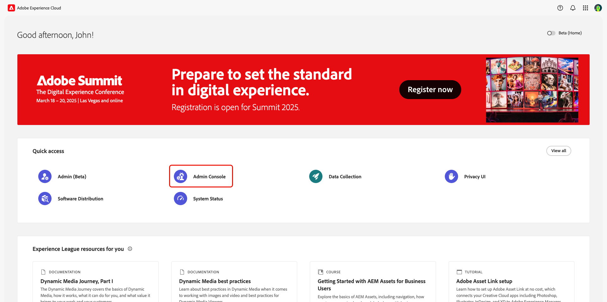
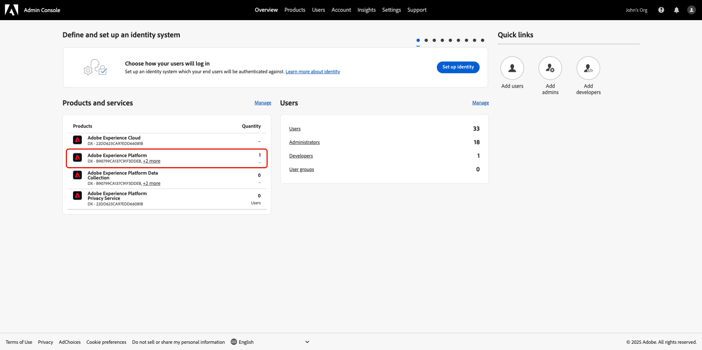
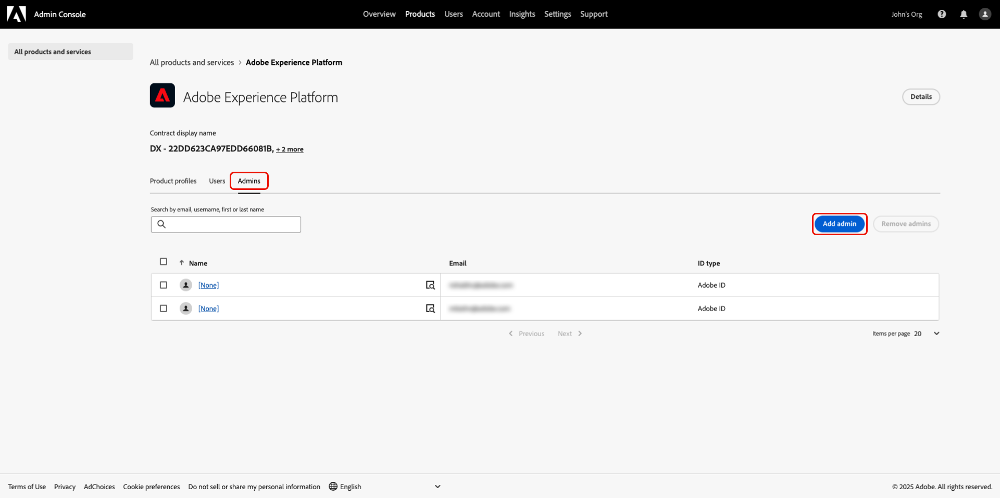

# Manage user access through Permissions {#manage-user-access}

{{limited-availability-release-note}}

Manage permissions and user access to individual components within Adobe Real-Time CDP Collaboration through the Experience Cloud [Permissions](https://experienceleague.adobe.com/en/docs/experience-platform/access-control/abac/permissions-ui/browse){target="_blank"} interface. Permissions allows system and product administrators to define [roles](./manage-roles.md) to manage user access to specific features and resources.

## Configure access to Permissions {#permissions-access}

To access Permissions, you must have both product administrator and user access to the Adobe Experience Platform product. A system administrator is required to configure product administrator privileges, while user privileges can be configured by a system or product administrator. For more information on the administrative roles, read the [access control heirarchy](./overview.md#hierarchy) guide.

>[!TIP]
>
>Throughout this guide, an **administator** will refer to **both system and product administators**.

### System Administrators: configure product administrator access {#admin-access}

Grant a user product administrator access to give them administrative capabilities within the Experience Platform product through the following steps:

>[!IMPORTANT]
>
>As a system administrator, you have out-of-the box access to specific Experience Cloud products, such as Adobe Admin Console. However, to use Permissions, you are required to give yourself product administrator and user access to the Experience Platform product. Follow the step-by-step guide below to give yourself access as a system administrator.

Log in to [Adobe Experience Cloud](https://experience.adobe.com/){target="_blank"} with your credentials. The home view displays with a list of your available products within the **[!UICONTROL Quick access]** section. Select **[!UICONTROL Admin Console]**.

{zoomable="yes"}

The [Adobe Admin Console](https://adminconsole.adobe.com/) overview dashboard displays. Select **[!UICONTROL Adobe Experience Platform]** from the **[!UICONTROL Products]** list under **[!UICONTROL Products and services]**.

{zoomable="yes"}

The Adobe Experience Platform dashboard displays. Select the **[!UICONTROL Admins]** tab and then select **[!UICONTROL Add admin]**.

{zoomable="yes"}

The **[!UICONTROL Add product administrators]** dialog appears. Enter the user email or username into the **[!UICONTROL Email or username]** text field and then select the correct account from the dropdown. Select **[!UICONTROL Save]** to finish adding the user as a product administrator.

{zoomable="yes"}

The user now has product administrator privileges and can perform administrative functions, such as adding users or other admins, to the product within the Admin Console. Next they&#39;ll need user access to the Experience Platform product to access and perform functions within Permissions.

### Administrators: configure user access to Experience Platform {#user-access}

Now that you&#39;ve granted the user product administrator access, you need to provide them user access to the Experience Platform product. As part of the access configurations, you&#39;ll assign the user specific [product profiles](https://helpx.adobe.com/enterprise/using/manage-product-profiles.html).

>[!TIP]
>
>If you&#39;re following along from the previous section, you&#39;ll already be within the Adobe Experience Platform product and you may skip the first step.

Navigate to the [Admin Console](https://adminconsole.adobe.com/){target="_blank"} and select **[!UICONTROL Adobe Experience Platform]** from the **[!UICONTROL Products]** list under **[!UICONTROL Products and services]**.

{zoomable="yes"}

Select the **[!UICONTROL Users]** tab and then select **[!UICONTROL Add users]**.

{zoomable="yes"}

The **[!UICONTROL Add users to this product]** dialog appears. Enter the user&#39;s name or email into the **[!UICONTROL Name, user group or email address]** text field and then select the correct account from the dropdown. Next, select the **[!UICONTROL Products]** add option.

{zoomable="yes"}

The **[!UICONTROL Select product profiles]** dialog appears. Select **[!UICONTROL AEP-Default-All-Users]** and **[!UICONTROL Default Production All Access]** and then select **[!UICONTROL Apply]**.

{zoomable="yes"}

Confirm the information is correct and then select **[!UICONTROL Save]**.

![사용자 정보 및 제품 프로필이 표시되고 [저장]이 강조 표시된 제품에 사용자 추가 대화 상자.](../../assets/permissions/save-selections.png){zoomable="yes"}

이제 사용자에게 Experience Platform에 대한 제품 관리자 및 제품 액세스 권한이 있어야 하며 권한 액세스 권한을 얻어야 합니다. 그런 다음 사용자에게 Experience Platform UI에 대한 액세스 권한을 제공하기 위해 2개의 기본 역할을 할당해야 합니다.

### 관리자: Experience Platform UI 액세스 권한 구성 {#product-access}

Real-Time CDP Collaboration에서 관리자 및 최종 사용자는 대상 및 감사 로그와 같은 Experience Platform의 데이터로 작업하게 됩니다. 이 데이터는 샌드박스라는 Experience Platform 인스턴스 내에 보관됩니다. 사용자가 이 데이터와 상호 작용할 수 있도록 하려면 사용자에게 [기본 역할](https://experienceleague.adobe.com/en/docs/experience-platform/access-control/home#default-roles){target="_blank"}을 할당해야 합니다.

시작하려면 [Adobe Experience Cloud](https://experience.adobe.com/)&#x200B;(으)로 이동합니다. 이제 **[!UICONTROL 빠른 액세스]** 내부에 **[!UICONTROL Experience Platform]** 및 **[!UICONTROL 권한]**&#x200B;이 표시됩니다.

{zoomable="yes"}

>[!NOTE]
>
> 제품은에 액세스하는 데 몇 분 정도 걸릴 수 있으며, 액세스 권한을 받았음을 알리는 이메일을 받게 됩니다. 이메일을 받은 후 Adobe Experience Cloud에서 Experience Platform 또는 권한 이 표시되지 않으면 로그아웃했다가 다시 계정에 로그인하십시오.

이제 이 단계에서 **[!UICONTROL 권한]**&#x200B;에 액세스할 수 있습니다. **[!UICONTROL Experience Platform]**&#x200B;에 액세스하려고 하면 아래와 같이 활성화된 샌드박스가 없다는 경고가 표시됩니다. 이 문제를 해결하려면 사용자에게 기본 역할을 할당해야 합니다. 시작하려면 **[!UICONTROL 권한]**&#x200B;을 선택하세요.

{zoomable="yes"}

**[!UICONTROL 권한]** 대시보드가 표시됩니다. 왼쪽 패널에서 **사용자**&#x200B;를 선택한 다음 사용자 이름을 선택합니다.

{zoomable="yes"}

**[!UICONTROL 역할]** 탭을 선택한 다음 **[!UICONTROL 역할 추가]**&#x200B;를 선택합니다.

{zoomable="yes"}

**[!UICONTROL 역할 추가]** 대화 상자가 나타납니다. **[!UICONTROL 기본 프로덕션 모든 액세스]** 및 **[!UICONTROL 샌드박스 관리자]**&#x200B;를 선택한 다음 **[!UICONTROL 저장]**&#x200B;을 선택합니다.

{zoomable="yes"}

이제 Experience Platform 및 권한에 액세스할 수 있습니다. 마지막 단계에서는 Real-Time CDP Collaboration에 대한 액세스 권한을 부여합니다.

### 관리자: Real-Time CDP Collaboration 액세스 구성 {#RTCDP-collaboration-access}

>[!CONTEXTUALHELP]
>id="rtcdp_collaboration_organization_permissions"
>title="사용자 액세스 관리 안내서"
>abstract=""

사용자에게 Collaboration에 대한 액세스 권한을 부여하려면 역할이라는 액세스 제어 개념을 사용합니다. 역할은 관리자 또는 사용자가 조직의 [리소스](https://experienceleague.adobe.com/en/docs/experience-platform/access-control/home#permissions)에 액세스할 수 있는 수준을 정의합니다.

Collaboration에 대한 개별 액세스를 구성할 때 공동 작업 리소스의 권한이 포함된 사용자 역할을 할당합니다. [역할 관리](./manage-roles.md) 안내서를 사용하여 다음에 대한 정보를 찾을 수 있습니다.

- [표준 역할 2개](./manage-roles.md#standard-roles) 및 Collaboration에 부여하는 액세스 수준
- Collaboration 리소스를 사용하여 [사용자 지정 역할](./manage-roles.md#specific-access-roles) 만들기
- 공동 작업 리소스에 포함된 권한 목록

>[!NOTE]
>
>또한 사용자는 **[!UICONTROL Sandboxes]** 리소스에서 **[!UICONTROL Prod]** 권한이 포함된 역할에 할당되어야 합니다. 두 표준 역할에는 모두 이 권한이 포함됩니다. 사용자에게 표준 역할 대신 사용자 정의 역할을 할당하도록 선택하는 경우 할당된 역할 중 하나에 이 권한이 포함되어 있는지 확인해야 합니다.

사용자 요구 액세스 수준을 포괄하는 역할을 선택하거나 만들었으면 해당 역할에 사용자를 할당해야 합니다.

#### 역할 할당

단일 사용자에게 여러 역할을 할당하거나 단일 역할에 여러 사용자를 할당할 수 있습니다. 첫 번째 사례는 [기본 역할을 할당](#product-access)하여 사용자에게 Experience Platform에 대한 액세스 권한을 부여할 때 이전에 다루었습니다. 다음 단계에서는 선택한 역할에 사용자를 직접 할당합니다.

**[!UICONTROL 권한]**&#x200B;의 왼쪽 패널에서 **[!UICONTROL 역할]**&#x200B;을(를) 선택한 다음 목록에서 역할을 선택하십시오.

{zoomable="yes"}

역할의 세부 사항 페이지가 표시됩니다. **[!UICONTROL 사용자]** 탭을 선택한 다음 **[!UICONTROL 사용자 추가]**&#x200B;를 선택합니다.

{zoomable="yes"}

**[!UICONTROL 사용자 추가]** 대화 상자가 나타납니다. 목록에서 사용자를 선택한 다음 **[!UICONTROL 저장]**&#x200B;을 선택합니다.

![사용자가 선택하고 [저장] 옵션이 강조 표시된 [사용자 추가] 대화 상자.](../../assets/permissions/add-users-to-role.png){zoomable="yes"}

이제 Experience Cloud의 **[!UICONTROL 빠른 액세스]**&#x200B;에 제품으로 나열된 **[!UICONTROL RTCDP Collaboration]**&#x200B;이(가) 사용자에게 표시됩니다.

## 다음 단계

이제 사용자는 Real-Time CDP Collaboration에 액세스할 수 있으므로 제품 사용을 시작할 수 있습니다. 제품에 대한 자세한 내용은 [개요 안내서](../home.md)를 참조하세요.
