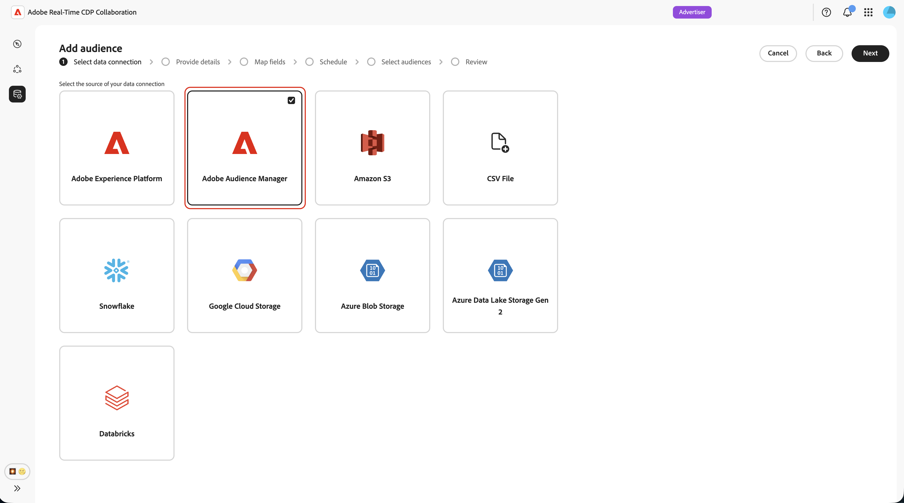
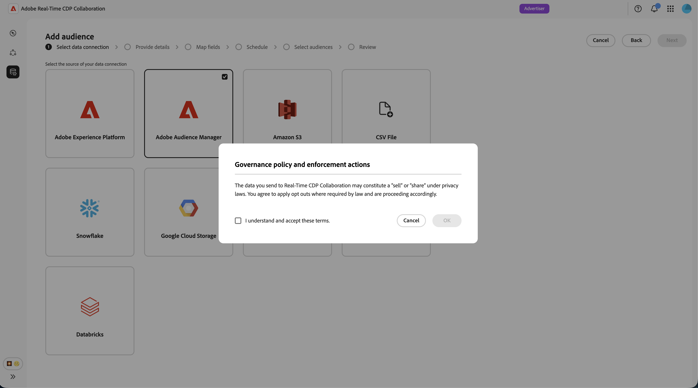
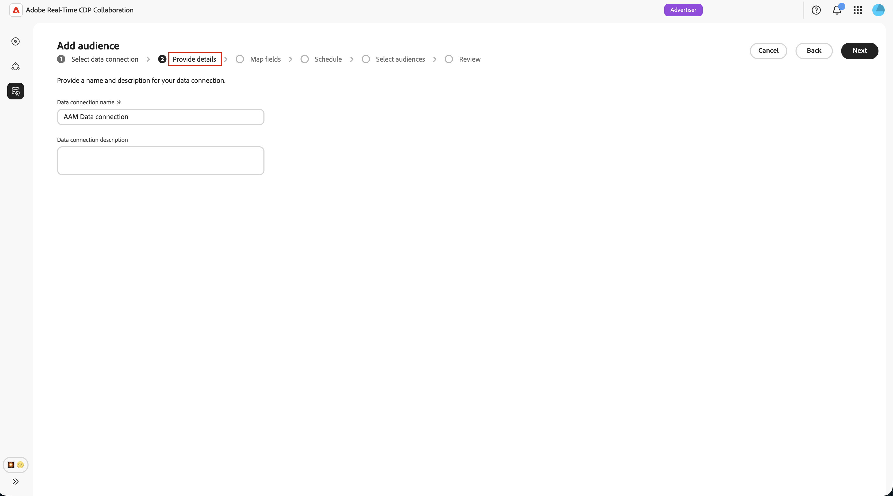
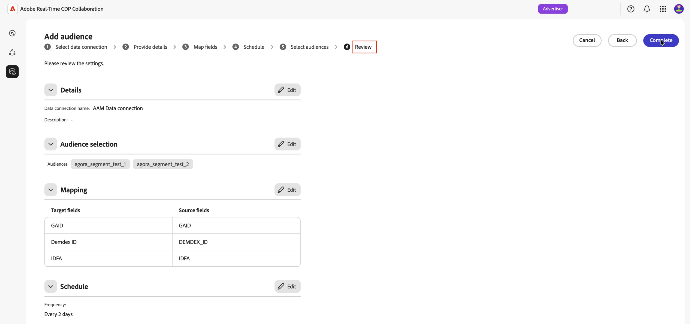
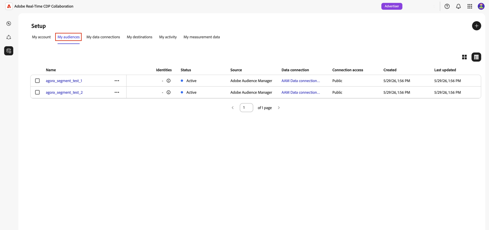
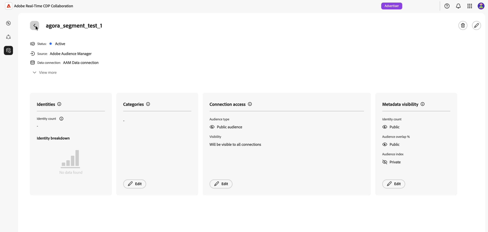

# 대상 소싱을 위한 Adobe Audience Manager 구성

적격한 자사 세그먼트를 플랫폼에 소싱할 수 있도록 Adobe Audience Manager(AAM) 인스턴스를 Adobe Real-Time CDP Collaboration에 연결하는 방법을 알아봅니다. 연결을 만든 후 Collaboration은 되풀이하는 일정에 따라 Adobe Audience Manager에서 대상 멤버십을 검색하고 이러한 대상을 공동 작업 프로젝트 내에서 중복 분석 및 활성화에 사용할 수 있도록 합니다.

>[!NOTE]
>
> Audience Manager에서 가져온 대상자는 Adobe Experience Platform에서 가져온 대상자와 동일한 거버넌스 및 데이터 처리 규칙을 따릅니다. 자사 데이터 소스에서 작성한 세그먼트만 자격이 있습니다. 타사 데이터 또는 Audience Marketplace 소스가 포함된 세그먼트는 지원되지 않습니다.

## 사전 요구 사항 {#prerequisites}

구성 워크플로를 시작하기 전에 이 섹션의 모든 항목을 완료하십시오. 불완전한 전제 조건은 설정이 실패하거나 소싱 후 대상이 나타나지 않는 가장 일반적인 이유입니다. 이 안내서를 따르려면 먼저 [계정 온보딩 및 설정](./onboard-account.md)을 완료해야 합니다.

### Adobe Audience Manager 액세스 및 권한 {#aam-access-and-permissions}

계속하기 전에 다음을 확인합니다.

* 활성 Adobe Audience Manager 계약 및 프로비저닝된 Audience Manager 인스턴스.
* 소스화할 세그먼트를 볼 수 있는 권한이 있는 Audience Manager 사용자 인터페이스에 액세스합니다.
* Audience Manager 인스턴스 및 Collaboration 계정이 동일한 Adobe IMS 조직에서 프로비저닝되었습니다. 조직 간 소싱은 지원되지 않습니다.

### 세그먼트 자격 요구 사항 {#aam-segments-requirements}

연결을 구성하면 Collaboration이 다음 규칙에 따라 세그먼트 목록을 자동으로 필터링합니다.

**자사 데이터만**

자체 자사 데이터를 기반으로 하는 세그먼트만 소싱에 사용할 수 있습니다. 타사 데이터 공급자나 AAM Audience Marketplace의 트레이트가 포함된 세그먼트는 제외됩니다.

**최신성 필터**

지난 13개월 내에 **만들거나 업데이트한** 세그먼트만 소싱에 사용할 수 있습니다. 이전 세그먼트는 연결 설정 중 및 이후 새로 고침 시 제외됩니다.

### 동의 요구 사항 {#consent-requirements}

Collaboration으로 가져온 모든 AAM 세그먼트는 동의 후 필터링되어야 합니다. 내보내기 시 프로필에 대한 옵트아웃 마커가 있는 경우 해당 프로필은 Collaboration에 도달하기 전에 제외됩니다.

>[!IMPORTANT]
>
>Collaboration에 연결하기 전에 Audience Manager 인스턴스 내에서 동의가 올바르게 구성 및 적용되는지 확인해야 합니다. Adobe은 데이터가 Audience Manager을 떠난 후 동의 규칙을 다시 적용하지 않습니다.

## Audience Manager 연결 구성 {#configure-aam-connection}

구성 워크플로는 **[!UICONTROL 설치]** 작업 영역 내의 여러 단계 마법사입니다. 각 단계를 순서대로 완료합니다. 연결을 만들기 전에 최종 검토 화면에서 연필 아이콘을 사용하여 모든 단계로 돌아갈 수 있습니다.

### 데이터 연결 추가 {#add-data-connection}

**[!UICONTROL 설정]** 작업 영역의 **[!UICONTROL 내 대상]** 탭에서 추가 아이콘()을 선택합니다. **[!UICONTROL 대상]**&#x200B;을 선택하세요.

첫 번째 대상자인 경우 **[!UICONTROL 대상자 추가]** 옵션도 선택할 수 있습니다.

![설정 작업 영역의 [내 대상] 탭에 추가 아이콘과 대상 추가 옵션이 표시됩니다.](../../assets/setup/snowflake-audience-sourcing/add-audience.png)

대상자 추가 워크플로우가 나타납니다. **[!UICONTROL 새 데이터 연결 추가]**&#x200B;를 선택한 후 **[!UICONTROL 다음]**&#x200B;을 선택합니다.

{zoomable="yes"}

### 데이터 연결로 Adobe Audience Manager 선택 {#select-aam}

데이터 소스 선택 화면에는 사용 가능한 모든 연결 유형이 나열됩니다. **[!UICONTROL Adobe Audience Manager]**&#x200B;을(를) 데이터 연결로 선택한 후 **[!UICONTROL 다음]**&#x200B;을(를) 선택하십시오.

### 동의 및 데이터 사용 확인 {#confirm-consent-data-use}

계속하기 전에 Collaboration으로 보내는 대상 데이터에 법에서 요구하는 옵트아웃을 적용했는지 확인하십시오. 데이터가 이 요구 사항을 충족하는지 확실하지 않은 경우 계속 진행하기 전에 [거버넌스 정책 및 시행 작업](./onboard-audiences.md#governance-policy-and-enforcement-actions) 안내서를 검토하십시오. 확인 확인란을 선택한 다음 **[!UICONTROL 확인]**&#x200B;을 선택하여 계속합니다.

### 연결 세부 정보 제공 {#provide-connection-details}

그런 다음 이 데이터 연결에 대한 이름 및 설명(선택 사항)을 입력합니다. 연결이 만들어지면 제공한 이름이 **[!UICONTROL 내 데이터 연결]** 탭에 나타나고 나중에 이 원본을 식별하는 데 도움이 됩니다.

* **[!UICONTROL 데이터 연결 이름]**(필수)
* **[!UICONTROL 데이터 연결 설명]**(선택 사항)

완료되면 **[!UICONTROL 다음]**&#x200B;을 선택합니다.

### ID 매핑 검토 {#review-identity-mapping}

**[!UICONTROL 매핑]** 화면은 읽기 전용입니다. Collaboration은 AAM 세그먼트에서 지원되는 id 출력을 Collaboration id 필드에 자동으로 매핑합니다. 자세한 내용은 다음 표를 참조하십시오.

| AAM id 출력 | Collaboration id 필드 | 참고 |
| ------------------- | ---------------------------- | ----- |
| `Demdex ID` | `DEMDEX_ID` | 이 통합에 지원되는 ID 출력입니다. Collaboration은 소싱 중에 Demdex ID를 ECID로 번역하지 않습니다. |
| `GAID` | `GAID` | 이 통합에 지원되는 ID 출력입니다. |
| `IDFA` | `IDFA` | 이 통합에 지원되는 ID 출력입니다. |

{style="table-layout:auto"}

매핑을 검토할 수 있지만 이 단계에서는 수정할 수 없습니다. 계속하려면 **[!UICONTROL 다음]**&#x200B;을 선택합니다.

### 데이터 새로 고침 예약 {#schedule-data-refresh}

**[!UICONTROL 일정]** 보기에서 Collaboration이 AAM 세그먼트에서 업데이트된 대상 멤버십 데이터를 검색하는 새로 고침 빈도를 설정하고 소싱에 대한 활성 날짜 범위를 정의합니다.

**[!UICONTROL 빈도]** 드롭다운을 사용하여 1일에서 6일 사이의 새로 고침 간격을 선택하십시오. 그런 다음 달력을 사용하여 대상자 소싱의 시작 및 종료 날짜를 설정합니다. 종료 날짜에 도달하면 소싱이 중지되고 이전에 소싱된 대상이 만료됩니다.

>[!IMPORTANT]
>
>Audience Manager 세그먼트는 일반적으로 트레이트 최신성 및 빈도 규칙을 기반으로 24~48시간마다 새로 고침합니다. Collaboration 새로 고침 간격을 이보다 짧게 설정하면 업데이트된 결과 없이 Collaboration 크레딧이 소비될 수 있습니다. 신용 사용량을 모니터링하려면 [신용 사용 활동 추적](./my-activity.md)을 참조하세요.

완료되면 **[!UICONTROL 다음]**&#x200B;을 선택하세요.

### 대상자 선택 {#select-audiences}

자사 데이터 소스 트레이트를 사용하고 지난 13개월 동안 생성 또는 업데이트된 적격 세그먼트 목록을 볼 수 있습니다.

Collaboration에 소싱할 세그먼트를 선택합니다. 이름별로 검색하거나 스크롤하여 특정 세그먼트를 찾을 수 있습니다. 완료되면 **[!UICONTROL 다음]**&#x200B;을 선택하세요.

>[!TIP]
>
>보려는 세그먼트가 나열되지 않은 경우 해당 세그먼트가 지난 13개월 동안 업데이트되었는지 확인하고 자사 데이터 소스 트레이트만 사용합니다. 서드파티 또는 Audience Marketplace 트레이트가 있는 세그먼트는 제외됩니다.

### 연결 검토 및 완료 {#review-and-complete}

연결을 만들기 전에 전체 구성 요약을 검토하십시오. 요약 화면에는 다음 섹션이 표시됩니다.

* **[!UICONTROL 세부 정보]**: 이 데이터 연결의 이름 및 선택적 설명.
* **[!UICONTROL 대상자 선택]**: 선택한 AAM 세그먼트입니다.
* **[!UICONTROL 매핑]**: AAM 소스 필드에서 Collaboration ID 필드로 ID 필드를 매핑합니다.
* **[!UICONTROL 일정]**: 새로 고침 빈도 및 활성 날짜 범위입니다.

변경해야 하는 경우 섹션 옆에 있는 연필 아이콘()을 선택합니다. **[!UICONTROL 완료]**&#x200B;를 선택하여 모든 섹션을 확인합니다.

데이터 연결이 만들어졌으며 대상 소싱이 진행 중임을 나타내는 확인 대화 상자가 나타납니다.

## 소스 대상자 검토 {#review-sourced-audiences}

마법사를 완료하면 Collaboration이 선택한 AAM 세그먼트에서 비동기적으로 대상 멤버십 데이터를 검색하기 시작합니다. 진행 상황을 모니터링하려면 **[!UICONTROL 설정] > [!UICONTROL 내 대상]**(으)로 이동하세요.

### 대상자 소싱 진행 상황 모니터링 {#monitor-progress}

Collaboration이 AAM 세그먼트 데이터를 검색하는 동안 **[!UICONTROL 내 대상]** 작업 영역 맨 위에 있는 배너는 소싱이 진행 중임을 나타냅니다. 개별 대상은 각 세그먼트에 대한 소싱 완료로 목록에 표시됩니다.

### 소스 대상자 세부 정보 보기 {#view-sourced-audience-details}

소싱이 완료되면 AAM 세그먼트가 **[!UICONTROL 내 대상]** 탭에 나타납니다. **[!UICONTROL Source]** 열은 해당 열을 **[!UICONTROL Adobe Audience Manager]**(으)로 식별합니다.

행을 선택하거나 **[!UICONTROL 대상자 보기]** 옵션을 선택하여 특정 대상자의 세부 정보 보기를 엽니다.

세부 사항 보기에는 다음이 표시됩니다.

* **[!UICONTROL ID]**: 총 ID 수 및 사용 가능한 분류 정보입니다.
* **[!UICONTROL 범주]**: 대상을 구성하거나 필터링하기 위해 적용한 모든 태그입니다.
* **[!UICONTROL 연결 액세스]**: 대상이 개인, 공개 또는 특정 공동 작업자와 공유되는지 여부입니다.
* **[!UICONTROL 메타데이터 가시성]**: 공동 작업자에게 표시되는 대상 정보입니다.

공동 작업 프로젝트에서 대상을 사용하기 전에 이 보기를 사용하여 대상 구성 및 가시성 설정을 확인하십시오. 범주, 연결 액세스 또는 메타데이터 가시성을 업데이트하려면 [개별 대상자 보기 및 관리](./onboard-audiences.md#view-individual-audiences)를 참조하십시오.

## 알려진 제한 사항

Audience Manager 소스 커넥터를 구성하고 사용할 때 다음 제한 사항에 유의하십시오.

* **타사 데이터 전용:** 타사 데이터 공급자 또는 Adobe Audience Marketplace의 특성을 포함하는 세그먼트는 검색할 수 없습니다. 전적으로 자체 자사 데이터 소스에서 빌드된 세그먼트만 자격이 있습니다.
* **13개월 세그먼트 최신성 기간:** 지난 13개월 이내에 만들거나 업데이트한 세그먼트만 설정 중 및 새로 고침할 때마다 선택할 수 있습니다.
* **온디맨드 새로 고침 없음:** 대상 데이터가 사용자가 구성한 일정에 따라 새로 고쳐집니다. 수동, 즉시 새로 고침은 지원되지 않습니다.
* **조직당 하나의 활성 AAM 연결:** IMS 조직당 하나의 활성 AAM 데이터 연결만 지원됩니다.
* **일치 키 제약 조건:** 일치 키를 데이터 연결에 사용하도록 설정한 후에는 제거할 수 없습니다. 활성 일치 키를 변경하려면 연결을 삭제하고 새 연결을 만듭니다.

## 문제 해결 {#troubleshooting}

초기 연결을 설정한 후 일반적인 문제를 해결하려면 이 섹션을 참조하십시오.

**대상이 나타나지 않거나 소싱이 예상보다 오래 걸립니다**

* 소싱 시간은 선택한 세그먼트의 수와 각 세그먼트 모집단의 크기로 조정됩니다.
* 대상이 24시간 내에 표시되지 않는 경우 선택한 세그먼트가 여전히 Audience Manager에서 활성 상태이고 0이 아닌 모집단 수가 있는지 확인하십시오.
* **[!UICONTROL 내 데이터 연결]** 탭에서 연결에 대한 오류 지표를 확인하십시오.
* 문제가 지속되면 데이터 연결 이름 및 표시되지 않는 세그먼트 이름을 사용하여 Adobe 고객 지원 센터에 문의하십시오.

**설정하는 동안 선택해야 하는 세그먼트를 사용할 수 없습니다**

세그먼트를 확인합니다.

* 지난 13개월 내에 생성되거나 마지막으로 업데이트되었습니다. 이전 세그먼트는 표시되지 않습니다.
* 자사 트레이트만 사용합니다. 서드파티 또는 Audience Marketplace 트레이트가 있는 세그먼트는 제외됩니다.
* 연결에 대해 구성된 IMS 조직에 속합니다.

**처음에 성공한 후 데이터 연결에 실패한 상태가 표시됩니다**

* AAM 인스턴스와 Collaboration 계정 간의 IMS 조직 관계가 변경되지 않았는지 확인합니다.
* 선택한 세그먼트가 여전히 AAM에 있고 삭제되지 않았는지 확인합니다.
* 문제가 지속되면 [연결을 삭제](./manage-data-connection.md#delete-data-connection)하고 새 연결을 만들거나 Adobe 고객 지원 센터에 문의하십시오.

## 다음 단계 {#next-steps}

이제 Audience Manager을 Collaboration에서 데이터 소스로 구성했습니다. 소싱이 완료되면 대상을 **[!UICONTROL 내 대상]** 작업 영역에서 사용할 수 있으며 공동 작업 프로젝트에서 사용할 수 있습니다. 초기 소싱 프로세스가 완료된 후에도 대상자가 나타나지 않으면 이 페이지의 [문제 해결](#troubleshooting) 섹션을 검토하십시오.

여기에서는 다음과 같은 작업을 수행할 수 있습니다.

* [공동 작업 프로젝트 만들기 및 관리](../collaborate/manage-projects.md)
* [프로젝트 내 대상자 활성화](../collaborate/activate.md)
* [중복 검토 및 성능 측정](../collaborate/measure.md)
* [대상자 설정 및 가시성 관리](./onboard-audiences.md)
* [데이터 연결 관리](./manage-data-connection.md)

다른 대상 소싱 방법은 다음을 참조하십시오.

* [대상 소싱에 대해  [!DNL Amazon S3] 구성](./configure-aws-s3-audience-sourcing.md)
* [대상 소싱에 대해  [!DNL Google Cloud Storage] 구성](./configure-gcs-audience-sourcing.md)
* [대상 소싱에 대해  [!DNL Snowflake] 구성](./configure-snowflake-audience-sourcing.md)
* [Experience Platform의 Source 대상](./onboard-audiences.md)
* [대상자 소싱에 대한 CSV 파일 업로드](./upload-csv-audience-sourcing.md)
