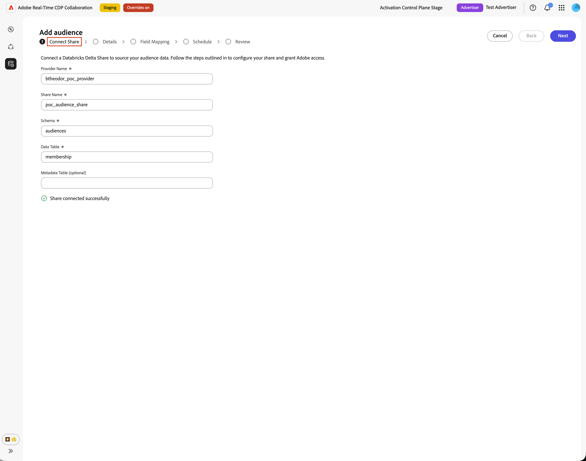
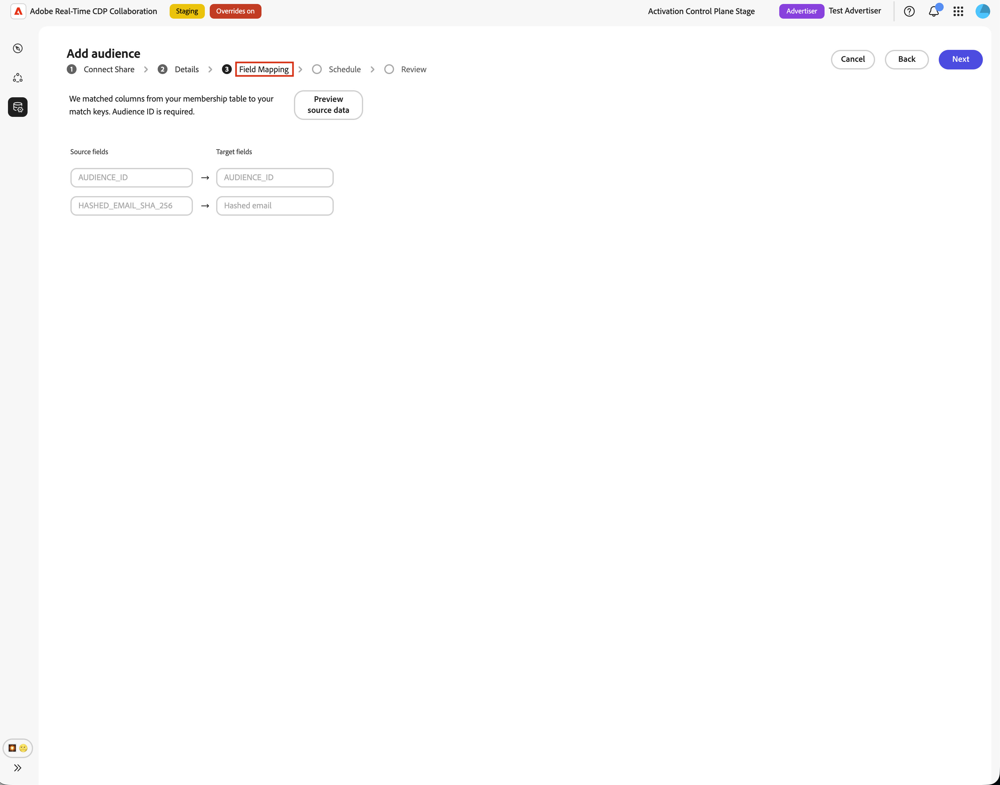
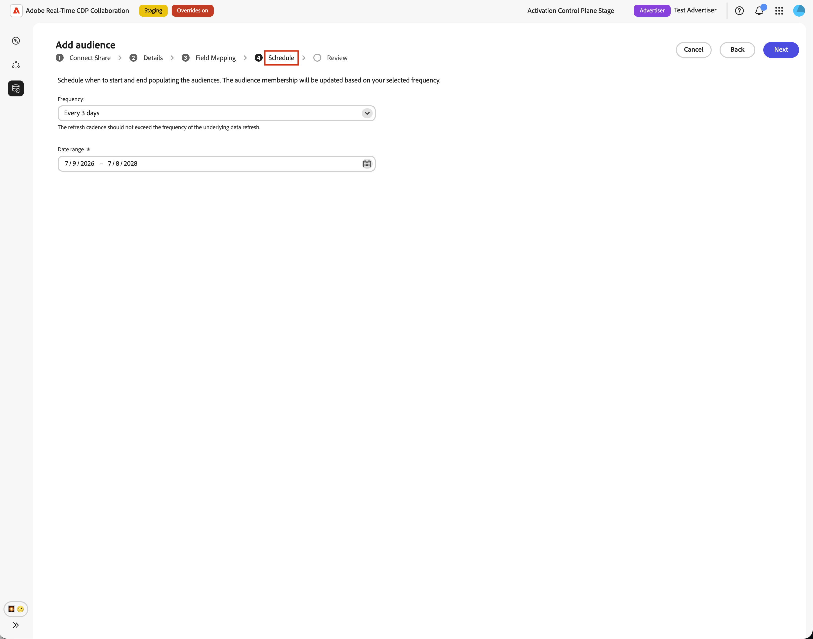

# 대상 소싱에 대해 [!DNL Databricks Delta Share] 구성

이 안내서를 사용하여 사용자 인터페이스를 통해 [!DNL Databricks Delta Share]을(를) Adobe Real-Time CDP Collaboration 및 소스 자사 대상에 연결합니다.

[!DNL Databricks Delta Share]에 연결하면 Collaboration이 Unity 카탈로그 공유에서 직접 대상 데이터를 읽습니다. 소싱이 완료되면 공동 작업 프로젝트에서 활성화 및 중복 분석에 대상을 사용할 수 있습니다.

이 안내서에서는 사전 요구 사항을 준비하고, [!DNL Delta Share]을(를) 연결하고, 원본 테이블을 지정하고, ID 필드를 매핑하고, 대상 소싱이 성공적으로 시작되는지 확인하는 방법을 설명합니다.

[!DNL Databricks]에서 가져온 대상자는 Adobe Experience Platform 및 기타 지원되는 클라우드 소스에서 가져온 대상자와 동일한 거버넌스 및 데이터 처리 규칙을 따릅니다.

사용 가능한 다른 소싱 방법에는 [Experience Platform](./onboard-audiences.md), [Amazon S3](./configure-aws-s3-audience-sourcing.md), [Google 클라우드 저장소](./configure-gcs-audience-sourcing.md), [Snowflake](./configure-snowflake-audience-sourcing.md), [Azure 저장소](./configure-azure-storage-audience-sourcing.md) 및 [CSV 파일 업로드](./upload-csv-audience-sourcing.md)가 있습니다. Collaboration에서 사용 가능한 모든 소스에 대한 자세한 내용은 [소스 개요](./source-overview.md)를 참조하세요.

## 사전 요구 사항 {#prerequisites}

구성 워크플로를 시작하기 전에 이 섹션의 전제 조건을 완료하십시오. 사전 요구 사항 누락은 소싱 후 설정이 실패하거나 대상이 나타나지 않는 일반적인 이유입니다. 이 안내서를 따르기 전에 [계정 온보딩 및 설정](./onboard-account.md)을 완료하십시오.

이 안내서의 일부 작업에는 [!DNL Databricks] 관리자의 도움이 필요합니다. 조직의 [!DNL Databricks]을(를) 관리하지 않는 경우 시작하기 전에 적절한 관리자와 협력하십시오.

### [!DNL Databricks Delta Share] 액세스 {#databricks-delta-share-access}

계속하기 전에 [!DNL Databricks] 관리자에게 다음 내용을 확인하십시오.

* 조직에서 기본 데이터 블록 간 공유(Unity 카탈로그)를 사용하여 Adobe의 [!DNL Databricks] 계정에 [!DNL Delta Share]을(를) 게시했습니다. Collaboration은 이 워크플로의 UI에서 전달자 토큰 또는 OIDC 자격 증명 항목을 지원하지 않습니다.
* Adobe의 Unity 카탈로그 메타스토어에 등록된 공급자 이름, 공유 이름 및 대상 테이블을 포함하는 스키마를 알 수 있습니다.
* Collaboration 계정 및 지역에 대해 [!DNL Databricks Delta Share]개의 대상 소싱을 사용할 수 있습니다. 해당 지역에서 아직 Databricks 소싱을 사용할 수 없는 경우 Adobe 계정 담당자에게 문의하여 타임라인을 확인하십시오.

Adobe에 공유를 게시하는 방법에 대한 단계별 지침은 이 안내서의 [Adobe에 델타 공유 게시](#publish-delta-share) 섹션을 참조하십시오.

### 대상자 데이터 준비 {#prepare-audience-data}

Collaboration에서 대상을 검색하고 ID를 올바르게 매핑할 수 있도록 대상 테이블을 구조화합니다.

* **멤버십 테이블(필수):** 프로필-대상 쌍당 하나의 행이 포함된 공유 스키마 내의 테이블입니다. 이 테이블에는 `AUDIENCE_ID`에 매핑할 수 있는 열과 지원되는 일치 키 열이 하나 이상 포함되어야 합니다. Collaboration은 소스 데이터 미리보기 및 필드 매핑에 이 테이블을 사용합니다.
* **메타데이터 테이블(선택 사항):** 별도의 대상 카탈로그(대상 ID, 이름, 개수 또는 유사한 메타데이터가 있는 대상당 하나의 행)를 유지 관리하는 경우 Collaboration에서 멤버 자격 테이블에서만 고유한 대상 ID를 추론하는 대신 대상 정의를 읽을 수 있도록 이 테이블을 제공할 수 있습니다.
* **지원되는 일치 키:** `HASHED_EMAIL_SHA_256`, `HASHED_PHONE_SHA_256`, `HASHED_IPV4_SHA_256`, `CRM_ID`, `LOYALTY_ID`, `ADFIXUS_ID` 및 Collaboration 계정에 대해 활성화된 기타 일치 키.
* **요구 사항 해시:** 모든 일치 키 값은 [!DNL Databricks]에 저장되기 전에 트리밍되고, 소문자화되고, SHA256-해시되어야 합니다. Collaboration은 수집 전에 데이터를 해시하거나 정규화하지 않습니다.
* **열 일관성:** 멤버십 테이블은 Collaboration이 활성화된 일치 키에 매핑할 수 있는 안정적인 열 이름을 표시해야 합니다.

멤버십 테이블에 있는 모든 일치 키도 Collaboration 계정에 대해 활성화해야 합니다. 일치 키를 추가하거나 사용하려면 [일치 키 설정](./onboard-account.md#set-up-match-keys)을 참조하십시오.

### 시작하기 전에 필요한 값 {#required-values}

구성 마법사를 시작하기 전에 다음 값을 준비하십시오.

| 값 | 설명 |
| ----- | ----------- |
| 공급자 이름 | Unity 카탈로그에서 Adobe이 [!DNL Delta Share]에 액세스하는 데 사용하는 공급자 식별자입니다. [!DNL Databricks] 관리자 또는 Adobe 온보딩 담당자가 이 값을 제공할 수 있습니다. 이 값은 [!DNL Databricks] 작업 영역 URL과 다릅니다. |
| 공유 이름 | Adobe에 게시된 [!DNL Delta Share]의 이름입니다. |
| 스키마 | 대상 테이블을 포함하는 공유 내의 스키마. |
| 멤버십 테이블 | 대상 멤버십 행(대상의 프로필당 한 행)을 포함하는 스키마 내의 테이블 이름입니다. |
| 메타데이터 테이블(선택 사항) | 메타데이터 기반 대상 카탈로그를 사용하는 경우 대상을 나열하는 스키마 내의 테이블 이름(대상당 한 행). |

{style="table-layout:auto"}

## [!DNL Databricks] 연결 구성 {#configure-databricks-connection}

구성 워크플로는 **[!UICONTROL 설치]** 작업 영역 내의 여러 단계 마법사입니다. 각 단계를 순서대로 완료합니다.

### 새 데이터 연결 추가 {#add-data-connection}

**[!UICONTROL 설정]** 작업 영역의 **[!UICONTROL 내 대상]** 탭에서 추가 아이콘()을 선택합니다. **[!UICONTROL 대상]**&#x200B;을 선택하세요.

첫 번째 대상자인 경우 **[!UICONTROL 추가]** 옵션도 선택할 수 있습니다.

![설정 작업 영역의 [내 대상] 탭에 추가 아이콘과 대상 추가 옵션이 표시됩니다.](../../assets/setup/add-manage-audiences/add-audiences.png)

대상자 추가 워크플로우가 나타납니다. **[!UICONTROL 새 데이터 연결 추가]**&#x200B;를 선택한 후 **[!UICONTROL 다음]**&#x200B;을 선택합니다.

{zoomable="yes"}

### 데이터 소스로 [!DNL Databricks Delta Share] 선택 {#select-databricks-delta-share}

데이터 소스 선택 화면에는 사용 가능한 모든 연결 유형이 나열됩니다. **[!UICONTROL 데이터 블록 델타 공유]**&#x200B;를 선택한 후 **[!UICONTROL 다음]**&#x200B;을 선택합니다.

### [!DNL Delta Share] 연결 {#connect-delta-share}

>[!CONTEXTUALHELP]
>id="rtcdp_collaboration_audience_sharing_databricks"
>title="Experience League"
>abstract="대상 소싱에 대한 공유를 구성하는 방법에 대한 지침은 [!DNL Databricks Delta Share] 소싱 가이드를 참조하세요."

Collaboration에서 [!DNL Delta Share]에 액세스할 수 있도록 허용하는 데 필요한 세부 정보를 제공합니다. [!DNL Databricks Delta Share]에서 공급자, 공유, 스키마 및 테이블 세부 정보를 입력하십시오. 공유 스키마에서 필수 멤버십 테이블을 사용할 수 있어야 합니다. 메타데이터 테이블을 사용하는 경우 동일한 공유 스키마에서도 사용할 수 있어야 합니다.
필요한 정보를 입력한 후 **[!UICONTROL 연결]**&#x200B;을 선택합니다.

Collaboration은 공유의 유효성을 검사하고 Adobe 작업 영역에 탑재합니다. 이 단계는 최대 1분이 소요될 수 있습니다. 연결이 설정되는 동안 진행률 표시기가 나타납니다.

| 필드 | 설명 |
| --- | --- |
| **[!UICONTROL 공급자 이름]** | Adobe이 공유를 사용하기 위해 사용하는 Unity 카탈로그 공급자 이름입니다. [시작하기 전에 필요한 값](#required-values)을 참조하세요. |
| **[!UICONTROL 이름 공유]** | Adobe에 게시된 [!DNL Delta Share]의 이름입니다. |
| **[!UICONTROL 스키마]** | 대상 테이블을 포함하는 공유 내의 스키마. |
| **[!UICONTROL 데이터 테이블]** | 대상 멤버십 행(대상의 프로필당 한 행)을 포함하는 스키마 내의 테이블 이름입니다. |
| **[!UICONTROL 메타데이터 테이블]** | 대상자를 나열하는 표(대상자당 하나의 행). |

공유를 찾을 수 없거나 스키마가 아직 표시되지 않으면 오류 메시지가 표시됩니다. [!DNL Databricks] 관리자에게 값을 확인하고 다시 시도하십시오.

### 동의 및 데이터 사용 승인 확인 {#confirm-consent}

계속하기 전에 Collaboration으로 보내는 대상 데이터에 법에서 요구하는 옵트아웃을 적용했는지 확인하십시오. 데이터가 이 요구 사항을 충족하는지 확실하지 않은 경우 계속 진행하기 전에 [거버넌스 정책 및 시행 작업](./onboard-audiences.md#governance-policy-and-enforcement-actions) 안내서를 검토하십시오. 확인 확인란을 선택한 다음 **[!UICONTROL 확인]**&#x200B;을 선택하여 계속합니다.

### 연결 세부 정보 제공 {#provide-connection-details}

이 데이터 연결에 대한 이름 및 설명(선택 사항)을 입력합니다. 제공한 이름은 **[!UICONTROL 내 데이터 연결]** 탭에 나타나며 여러 데이터 연결을 관리하는 경우 이 원본을 구분하는 데 도움이 됩니다.

* **[!UICONTROL 데이터 연결 이름]**(필수)
* **[!UICONTROL 데이터 연결 설명]**(선택 사항)

계속하려면 **[!UICONTROL 다음]**&#x200B;을 선택합니다.

### ID 필드 매핑 {#map-identity-fields}

**[!UICONTROL 매핑]** 화면에서는 Collaboration이 멤버 자격 테이블의 소스 열을 대상 ID 필드에 매핑하는 방법을 보여 줍니다. Collaboration은 계정에 대해 활성화된 열 이름 및 일치 키를 기반으로 필드를 자동으로 매핑합니다.

>[!TIP]
>
>**[!UICONTROL 원본 데이터 미리 보기]**&#x200B;를 선택하여 테이블 형식으로 멤버십 테이블의 샘플을 검토한 다음 **[!UICONTROL 닫기]**&#x200B;를 선택하여 매핑 화면으로 돌아갑니다.

![AUDIENCE_ID, HASHED_EMAIL_SHA_256 등의 열과 오른쪽 하단에 [닫기] 단추가 있는 대상 데이터의 샘플 테이블을 표시하는 &quot;데이터 블록 데이터 미리 보기&quot; 대화 상자입니다.](../../assets/setup/databricks-audience-sourcing/databricks-source-data-preview.png)

표시된 매핑이 멤버십 테이블의 열을 반영하는지 확인합니다. 계속하려면 **[!UICONTROL 다음]**&#x200B;을 선택합니다.

### 일정 새로 고침 빈도 및 날짜 범위 {#schedule-refresh}

**[!UICONTROL 일정]** 보기가 나타납니다. 드롭다운 메뉴를 사용하여 1일에서 6일 사이의 새로 고침 빈도를 선택한 다음 활성 날짜 범위를 설정합니다. 달력 아이콘을 사용하여 시작 날짜와 종료 날짜를 지정합니다.

>[!IMPORTANT]
>
>Collaboration 크레딧을 효과적으로 관리하려면 기본 데이터 새로 고침의 업데이트 빈도와 일치하거나 이를 초과하도록 새로 고침 빈도를 설정하십시오.

### 연결 검토 및 완료 {#review-and-complete}

연결을 만들기 전에 구성 요약을 검토하십시오. 요약 화면에는 다음 섹션이 표시됩니다.

* **[!UICONTROL 데이터 연결]**: 연결 이름, 공급자 이름, 공유 이름 및 구성한 스키마.
* **[!UICONTROL 매핑]**: 원본 및 대상 ID 필드 매핑입니다.
* **[!UICONTROL 일정]**: 새로 고침 빈도 및 활성 날짜 범위입니다.

모든 섹션이 올바른지 확인한 다음 **[!UICONTROL 완료]**&#x200B;를 선택하십시오.

Collaboration에서 데이터 연결을 만들고 대상 소싱이 진행 중임을 나타내는 확인 대화 상자가 나타납니다.

## 소스 대상자 검토 {#review-sourced-audiences}

구성 마법사를 완료하면 Collaboration에서 [!DNL Databricks] 테이블의 대상 소싱을 비동기적으로 시작합니다. 진행 상황을 모니터링하려면 **[!UICONTROL 설정] > [!UICONTROL 내 대상]**(으)로 이동하세요. 소싱이 즉시 완료되지 않습니다. 필요한 시간은 데이터 크기에 따라 다릅니다.

### 대상자 소싱 진행 상황 모니터링 {#monitor-sourcing-progress}

Collaboration에서 대상 데이터를 검색하는 동안 **[!UICONTROL 내 대상]** 작업 영역의 맨 위에 있는 배너는 소싱이 진행 중임을 나타냅니다. 개별 대상자는 각 대상자에 대한 소싱이 완료된 후에만 목록에 표시됩니다.

>[!TIP]
>
>대상 소싱 시간은 멤버십 테이블의 크기와 대상 검색을 위해 메타데이터 테이블을 사용하는지 여부에 따라 다릅니다. 더 큰 데이터 세트가 **[!UICONTROL 내 대상]** 작업 영역에 표시되는 데 더 오래 걸릴 수 있습니다.

### 소스 대상자 세부 정보 보기 {#view-audience-details}

소싱이 완료되면 [!DNL Databricks] 대상자가 다른 연결에서 가져온 대상자와 함께 **[!UICONTROL 내 대상자]** 탭에 나타납니다. 행 항목을 선택하거나 **[!UICONTROL 대상자 보기]**&#x200B;를 선택하여 특정 대상자에 대한 세부 보기를 엽니다.

세부 사항 보기에는 다음 패널과 함께 대상의 상태, 소스 및 데이터 연결 이름이 표시됩니다.

* **[!UICONTROL ID]**: 데이터를 사용할 수 있게 되면 대상의 총 ID 수 및 분류입니다.
* **[!UICONTROL 범주]**: 대상을 구성하거나 필터링하기 위해 적용된 모든 태그입니다.
* **[!UICONTROL 연결 액세스]**: 대상이 개인, 공개 또는 특정 공동 작업자와 공유되는지 여부입니다.
* **[!UICONTROL 메타데이터 가시성]**: ID 수, 겹침 비율, 색인 등 공동 작업자에게 표시되는 대상 정보입니다.

공동 작업 프로젝트에서 대상을 사용하기 전에 이러한 설정을 검토하십시오. 범주, 연결 액세스 또는 메타데이터 가시성을 업데이트하려면 [개별 대상자 보기 및 관리](./onboard-audiences.md#view-individual-audiences)를 참조하십시오.

### 대상자 설정 편집 {#edit-audience-settings}

세부 정보 보기를 열지 않고 **[!UICONTROL 내 대상]** 목록 보기에서 직접 대상 메타데이터를 편집할 수 있습니다. 대상에 대한 확인란을 선택하여 작업 도구 모음을 표시한 다음 다음 작업을 선택합니다. **[!UICONTROL 메타데이터 가시성 편집]**, **[!UICONTROL 연결 액세스 편집]**, **[!UICONTROL 이름 및 설명 편집]**, **[!UICONTROL 범주 편집]** 또는 **[!UICONTROL 삭제]**.

### [!DNL Databricks] 데이터 연결 보기 {#view-databricks-connection}

일치 키를 포함하여 연결 자체를 검토하려면 **[!UICONTROL 설정]** > **[!UICONTROL 내 데이터 연결]**(으)로 이동합니다. 새 [!DNL Databricks] 연결을 사용할 수 있습니다. 대상 원본이 **[!UICONTROL 데이터 블록 델타 공유]**(으)로 표시됩니다.

![소싱 상태 정보가 있는 [!DNL Databricks Delta Share] 데이터 연결을 표시하는 내 데이터 연결 탭입니다.](../../assets/setup/databricks-audience-sourcing/databricks-my-data-connections-tab.png)

## 알려진 제한 사항 {#known-limitations}

[!DNL Databricks Delta Share] 대상 소싱을 구성하고 사용할 때 다음 제약 조건에 유의하십시오.

* **네이티브 공유만:** UI는 네이티브 데이터 블록 간 [!DNL Delta Sharing]만 지원합니다. 구성 마법사에서는 전달자 토큰 및 OIDC 인증 흐름을 사용할 수 없습니다.
* **마법사 내 테이블 브라우저 없음:** 테이블 이름을 수동으로 입력해야 합니다. Collaboration은 테이블을 미리 볼 때 테이블 이름의 유효성을 검사하지만 공유에 있는 모든 테이블을 자동으로 나열하지는 않습니다.
* **메타데이터 테이블 행 제한:** 대상 검색에 메타데이터 테이블을 사용하는 경우 Collaboration은 해당 테이블에서 최대 100,000개의 대상 행을 가져옵니다. 카탈로그가 이 제한을 초과하는 경우 Adobe 지원 센터에 문의하십시오.
* **일치 키 제약 조건:** 일치 키를 데이터 연결에 사용하도록 설정한 후에는 제거할 수 없습니다. 기존 연결에 일치 키를 추가할 수 있지만 비활성화하거나 삭제할 수는 없습니다. 활성 일치 키를 변경하려면 [데이터 연결을 삭제](./manage-data-connection.md#delete-data-connection)하고 새 연결을 만들어야 합니다.
* **멤버 자격 테이블 필요:** 대상 검색에 메타데이터 테이블을 사용하는 경우에도 멤버 자격 테이블을 지정해야 합니다. Collaboration은 수집 중에 멤버십 테이블에서 id 행을 읽습니다.

## 문제 해결 {#troubleshooting}

이 섹션을 사용하여 구성 중 또는 구성 후에 발생하는 문제를 해결합니다. 공유 연결 중에 오류가 발생하면 [!DNL Databricks] 관리자와 공급자 이름, 공유 이름 및 스키마를 검토하십시오.

**공유 연결이 실패하거나 시간이 초과되었습니다**

* [!DNL Delta Share]이(가) Adobe의 [!DNL Databricks] 계정에 게시되었는지, 공급자 이름, 공유 이름 및 스키마가 올바른지 확인하십시오.
* 스키마가 공유에 표시되는지 확인합니다. 새로 게시된 공유는 전파되는 데 시간이 걸릴 수 있습니다.
* 몇 분 후에도 연결에 실패하는 경우 설정을 다시 시작하고 다시 시도하거나 Adobe 고객 지원 센터에 문의하여 공급자 이름, 공유 이름, 스키마 및 관련 오류 세부 정보를 제공하십시오. 중요한 자격 증명을 포함하지 마십시오.

**테이블 미리 보기 실패**

* 테이블 이름의 맞춤법이 올바른지, 지정한 스키마에 있는지 확인하십시오.
* 테이블이 Adobe에 게시된 [!DNL Delta Share]에 포함되어 있는지 확인하십시오.
* 메타데이터 기반 검색의 경우 계속하기 전에 멤버 자격 테이블과 메타데이터 테이블을 모두 미리 봅니다.

**필드 매핑 유효성 검사가 진행률을 차단함**

* 멤버십 테이블에 **`AUDIENCE_ID`**&#x200B;에 매핑할 수 있는 열이 포함되어 있는지 확인합니다.
* 두 개 이상의 ID 필드가 완전히 매핑되었는지 확인합니다(소스 및 타겟).
* **[!UICONTROL 원본 데이터 미리 보기]**&#x200B;를 사용하여 열 이름이 활성화된 일치 키와 일치하는지 확인하십시오.

**대상이 나타나지 않거나 소싱이 예상보다 오래 걸립니다**

* 데이터 볼륨에 따라 소싱 시간이 확장됩니다. 대형 멤버십 테이블에 대해 처리 시간이 길어질 수 있습니다.
* 대상이 24시간 이내에 나타나지 않으면 **[!UICONTROL 내 데이터 연결]** 탭에서 연결에 대한 오류 지표를 확인하십시오.
* 멤버십 테이블 구조 및 필드 매핑이 [대상 데이터 준비](#prepare-audience-data)의 요구 사항과 일치하는지 확인하십시오.
* 문제가 지속되면 Adobe 고객 지원 센터에 문의하여 데이터 연결 이름 및 테이블 세부 정보를 제공하십시오.

**처음에 성공한 후 데이터 연결에 실패한 상태가 표시됩니다**

* 연결을 만든 이후 [!DNL Databricks]에서 [!DNL Delta Share] 및 테이블의 이름이 제거되었거나 이름이 바뀌지 않았는지 확인하십시오.
* 공유에 대한 Adobe의 액세스가 해지되지 않았는지 확인합니다.
* 문제가 지속되면 Adobe 고객 지원 센터에 문의하십시오.

## Adobe에 [!DNL Delta Share] 게시 {#publish-delta-share}

[!DNL Databricks] Unity 카탈로그 [!DNL Delta Sharing]을(를) 사용하면 데이터를 복사하지 않고도 다른 [!DNL Databricks] 계정과 테이블을 안전하게 공유할 수 있습니다. Collaboration에서 대상 데이터를 읽을 수 있도록 허용하려면 [!DNL Databricks] 관리자가 Adobe의 [!DNL Databricks] 소비자 계정에 [!DNL Delta Share]을(를) 게시해야 합니다.

### 게시하기 전에 {#before-you-publish}

Adobe 계정 담당자 또는 온보딩 담당자와 협력하여 다음을 확인하십시오.

* Adobe이 내 지역에서 귀하의 공유를 받을 준비가 되었음을 확인합니다.
* Adobe이 Unity Catalog 메타스토어에서 사용하는 공급자 이름은 조직을 공유 공급자로 식별합니다.

[!DNL Databricks] 작업 영역에서 다음을 준비합니다.

* Collaboration에서 읽을 스키마와 테이블이 포함된 [!DNL Delta Share]입니다.
* 프로필-대상 쌍당 하나의 행과 **`AUDIENCE_ID`** 및 일치 키에 대한 열이 있는 멤버십 테이블입니다.
* 메타데이터 기반 대상 검색을 사용하려는 경우 선택적 메타데이터 테이블입니다.

### 공유 게시 {#publish}

조직의 [!DNL Databricks Delta Sharing] 절차에 따라 Adobe의 소비자 계정에 공유에 대한 액세스 권한을 부여합니다. 정확한 단계는 [!DNL Databricks] 배포 및 거버넌스 모델에 따라 다릅니다. 일반적으로

1. Unity 카탈로그에서 대상 스키마 및 테이블을 포함하는 공유를 만들거나 식별합니다.
2. 스키마(또는 개별 테이블)를 공유에 추가합니다.
3. 기본 Databricks에서 Databricks로의 공유를 사용하여 Adobe의 [!DNL Databricks] 소비자 계정에 공유를 부여합니다.
4. 공유가 소비자 측에 표시되는지 Adobe 담당자에게 확인하고 Collaboration 구성 마법사의 공급자 이름과 공유 이름을 확인합니다.
5. [!DNL Delta Sharing]의 [!DNL Databricks] 제품 설명서는 [Databricks 델타 공유 설명서](https://docs.databricks.com/aws/en/delta-sharing)를 참조하십시오.

### Collaboration에 대한 [!DNL Databricks] 세부 정보 수집 {#collect-databricks-details}

공유를 게시한 후에는 Collaboration 구성 워크플로에 사용할 수 있는 공급자 이름, 공유 이름, 스키마 및 테이블 이름이 있는지 확인하십시오.

Collaboration 구성 마법사를 시작하기 전에 아래의 세부 정보를 수집합니다.

| 필드 | 설명 | 예 |
| ------| ----------- | ------- |
| 공급자 이름 | Adobe의 Unity 카탈로그 메타스토어(Adobe 온보딩에서)의 공급자 식별자 | `your_org_provider` |
| 공유 이름 | 게시된 [!DNL Delta Share]의 이름 | `audience_share_prod` |
| 스키마 | 스키마 | `collaboration_audiences` |
| 멤버십 테이블 | 프로필-대상자 멤버십 행이 있는 표 | `audience_members` |
| 메타데이터 테이블(선택 사항) | 대상을 나열하는 표(대상당 하나의 행) | `audience_catalog` |

{style="table-layout:auto"}

## 다음 단계 {#next-steps}

[!DNL Databricks Delta Share]을(를) Collaboration에서 데이터 소스로 구성했습니다. 소싱이 완료되면 대상을 **[!UICONTROL 내 대상]** 작업 영역에서 사용할 수 있으며 공동 작업 프로젝트에서 사용할 수 있습니다.

여기에서는 다음과 같은 작업을 수행할 수 있습니다.

* [공동 작업 프로젝트 만들기 및 관리](../collaborate/manage-projects.md)
* [프로젝트 내 대상자 활성화](../collaborate/activate.md)
* [중복 검토 및 성능 측정](../collaborate/measure.md)
* [대상자 설정 및 가시성 관리](./onboard-audiences.md#view-individual-audiences)
* [데이터 연결 보기 및 관리](./manage-data-connection.md)

다른 대상 소싱 방법은 다음을 참조하십시오.

* [대상 소싱에 대해  [!DNL Google Cloud Storage] 구성](./configure-gcs-audience-sourcing.md)
* [대상 소싱에 대해  [!DNL Amazon S3] 구성](./configure-aws-s3-audience-sourcing.md)
* [대상 소싱에 대해  [!DNL Snowflake] 구성](./configure-snowflake-audience-sourcing.md)
* [Experience Platform의 Source 대상](./onboard-audiences.md)
* [대상자 소싱에 대한 CSV 파일 업로드](./upload-csv-audience-sourcing.md)
