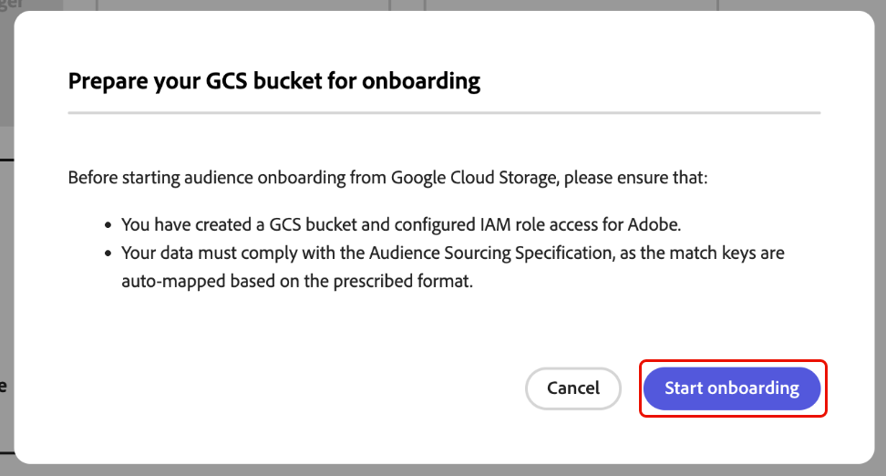
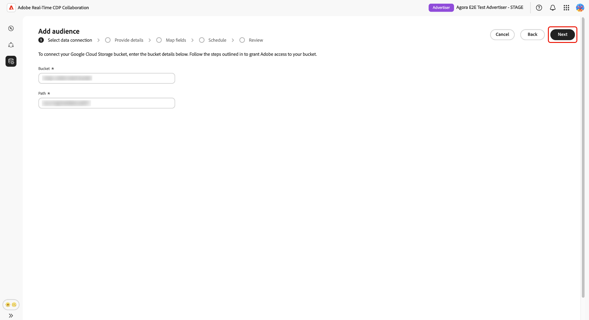
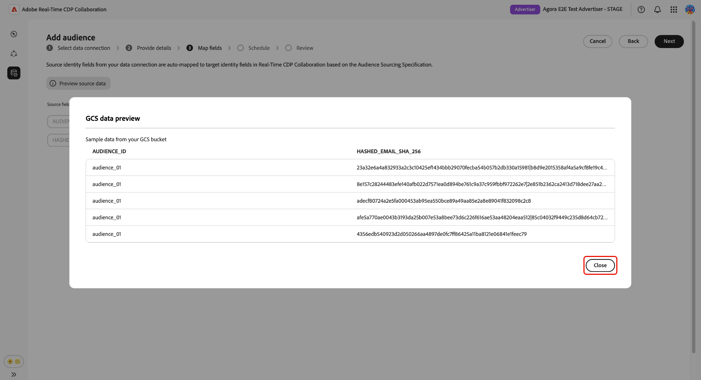
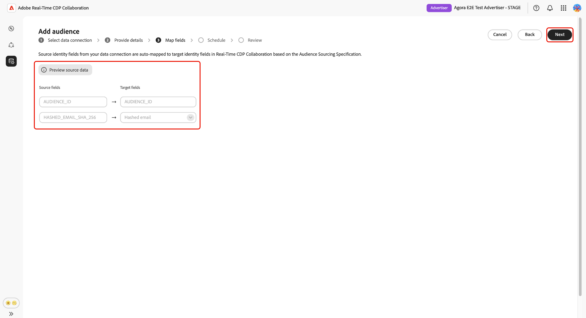
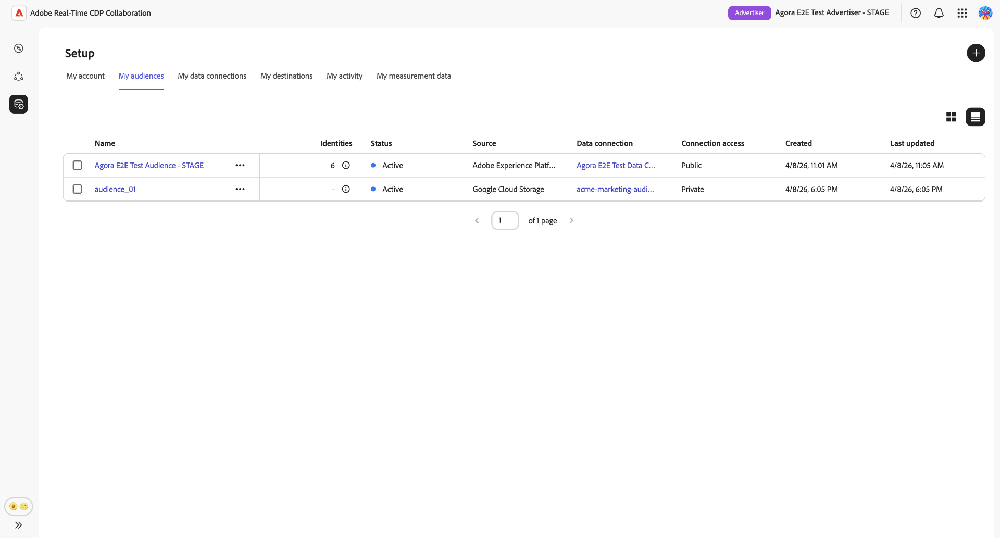
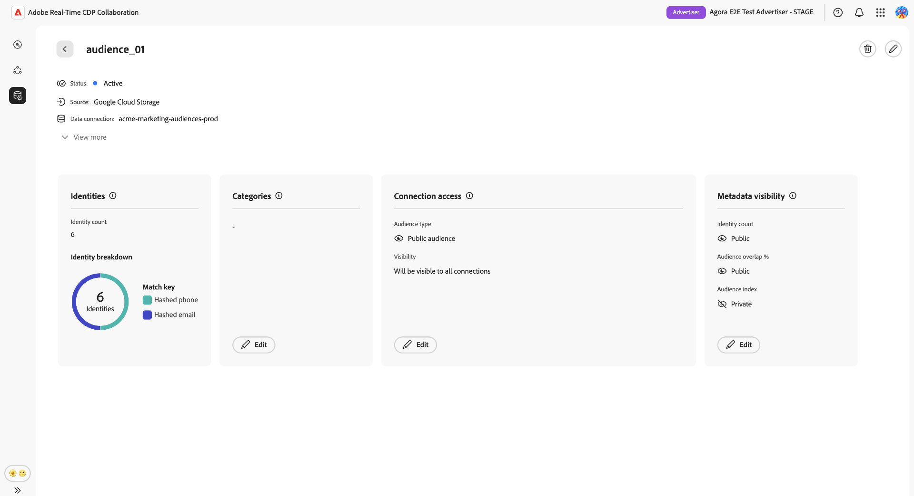
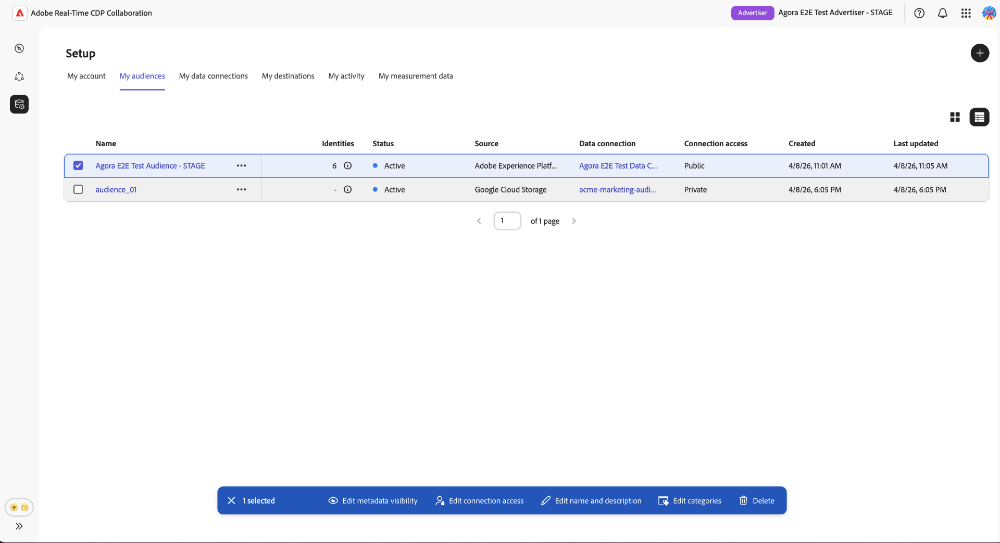

# 대상 소싱에 대해 [!DNL Google Cloud Storage] 구성

이 안내서의 단계에 따라 [!DNL Google Cloud Storage]&#x200B;(GCS) 버킷을 Adobe Real-Time CDP Collaboration에 연결하고 UI를 통해 자사 대상 데이터 소싱을 시작합니다.

GCS 버킷을 Collaboration에 연결하여 엔지니어링 지원 없이 자사 대상 데이터를 직접 수집합니다. 연결되면 Collaboration은 되풀이하는 일정에 따라 버킷의 대상을 소싱하여 공동 작업 프로젝트 내에서 활성화 및 중복 분석에 사용할 수 있도록 합니다. 대상을 소싱하려면 먼저 대상을 활성화하거나 공동 작업자와 Overlap Analysis에서 이를 사용해야 합니다.

이 안내서에서는 사전 요구 사항 준비, GCS 버킷 인증, 자동 매핑된 ID 필드 검토, 데이터 새로 고침 예약 및 소싱이 성공적으로 완료되었는지 확인과 같은 전체 구성 워크플로우를 다룹니다.

[!DNL Google Cloud Storage]에서 가져온 대상자는 Adobe Experience Platform에서 가져온 대상자와 동일한 거버넌스 및 데이터 처리 규칙을 따릅니다.

사용 가능한 다른 소싱 방법에는 [Experience Platform](./onboard-audiences.md), [Amazon S3](./configure-aws-s3-audience-sourcing.md), [Snowflake](./configure-snowflake-audience-sourcing.md) 및 [CSV 파일 업로드](./upload-csv-audience-sourcing.md)가 있습니다.

## 전제 조건 {#prerequisites}

구성 워크플로를 시작하기 전에 이 섹션의 모든 항목을 완료하십시오. 불완전한 전제 조건은 설정이 실패하거나 소싱 후 대상이 나타나지 않는 가장 일반적인 이유입니다. 이 안내서를 따르려면 먼저 [계정 온보딩 및 설정](./onboard-account.md)을 완료해야 합니다.

이 섹션의 일부 단계는 [!DNL Google Cloud] 관리자의 작업이 필요합니다. 조직의 [!DNL Google Cloud] 관리자가 아닌 경우 시작하기 전에 적절한 사용자를 식별하십시오.

### GCS 액세스 및 권한 {#gcs-access-permissions}

계속하기 전에 [!DNL Google Cloud] 관리자에게 다음 내용을 확인하십시오.

* Adobe에는 GCS 버킷에 대해 인증하고 대상 파일을 읽는 데 필요한 권한이 부여되었습니다. 단계별 지침은 [권한 설정 섹션](#setup-gcs-permissions)을 참조하세요.
* 해당 지역에서 [!DNL Google Cloud Storage]개의 대상 소싱을 사용할 수 있습니다. 이용 가능 여부는 지역(NA, EMEA, ANZ)에 따라 다릅니다. 해당 지역에서 GCS 소싱을 아직 사용할 수 없는 경우 Adobe 계정 담당자에게 문의하여 타임라인을 확인하십시오.

### 대상자 데이터 준비 {#prepare-audience-data}

소싱이 시작되기 전에 대상 파일이 **[대상 소싱 사양(v1.2)](../../assets/quick-start/RTCDP_Collaboration_Audience_Sourcing_Spec_v1.2.pdf)**&#x200B;을 준수해야 합니다. 전체 스키마 정의 및 필드 수준 예제에 대한 사양을 검토합니다. 주요 요구 사항은 다음과 같습니다.

* **파일 형식:** CSV, 쉼표를 필드 구분 기호로 사용하고 파이프(`|`)를 단일 필드 내의 여러 값에 대한 구분 기호로 사용.
* **필수 필드:** 모든 레코드에는 `AUDIENCE_ID` 열과 지원되는 일치 키 열이 하나 이상 포함되어야 합니다.
* **지원되는 일치 키:** `HASHED_EMAIL_SHA_256`, `HASHED_PHONE_SHA_256`, `HASHED_IPV4_SHA_256`, `CRM_ID`, `LOYALTY_ID`, `ADFIXUS_ID`.
* **요구 사항 해시:** 업로드하기 전에 모든 일치 키 값을 트리밍하고, 소문자화하고, SHA256-해시해야 합니다. Collaboration은 수집 전에 데이터를 해시하거나 정규화하지 않습니다.
* **열 일관성:** 버킷에 여러 대상 파일이 포함된 경우 모든 파일은 동일한 열 구조를 사용해야 합니다.

대상 파일에 있는 모든 일치 키도 Collaboration 계정에 대해 활성화되어야 합니다. 일치 키를 추가하거나 사용하려면 [일치 키 설정](./onboard-account.md#set-up-match-keys)을 참조하십시오.

### 시작하기 전에 필요한 값 {#required-values}

구성 마법사를 시작하기 전에 다음 값을 준비하십시오.

| 값 | 설명 |
| --- | --- |
| **[!UICONTROL 버킷]** | 대상 파일이 포함된 [!DNL Google Cloud Storage] 버킷의 이름입니다. |
| **[!UICONTROL 경로]** | 대상 파일이 저장된 버킷 내의 경로 접두사입니다(예: `sourcing/testdata/path1/`). |

## [!DNL Google Cloud Storage] 연결 구성 {#configure-gcs-connection}

구성 워크플로는 **[!UICONTROL 설치]** 작업 영역 내의 여러 단계 마법사입니다. 각 단계를 순서대로 완료합니다. 연결을 만들기 전에 최종 검토 화면에서 연필 아이콘을 사용하여 모든 단계로 돌아갈 수 있습니다.

### 새 데이터 연결 추가 {#add-data-connection}

**[!UICONTROL 설정]** 작업 영역의 **[!UICONTROL 내 대상]** 탭에서 추가 아이콘()을 선택합니다. **[!UICONTROL 대상]**&#x200B;을 선택하세요.

첫 번째 대상자인 경우 **[!UICONTROL 추가]** 옵션도 선택할 수 있습니다.

![설정 작업 영역의 [내 대상] 탭에 추가 아이콘과 대상 추가 옵션이 표시됩니다.](../../assets/setup/add-manage-audiences/add-audiences.png)

대상자 추가 워크플로우가 나타납니다. **[!UICONTROL 새 데이터 연결 추가]**&#x200B;를 선택한 후 **[!UICONTROL 다음]**&#x200B;을 선택합니다.

{zoomable="yes"}

### 데이터 소스로 [!DNL Google Cloud Storage] 선택 {#select-gcs}

>[!CONTEXTUALHELP]
>id="rtcdp_collaboration_audience_sourcing_specifications_gcs"
>title="온보딩을 위한 데이터 준비"
>abstract="Google Cloud Storage for Collaboration에서 대상자 데이터를 형식화하고 구조화하는 방법을 알아보려면 대상자 소싱 사양 안내서를 참조하십시오."
>additional-url="https://www.adobe.com/go/rtcdp-collaboration-audience-sourcing" text="대상자 소싱 사양 안내서 보기"

데이터 소스 선택 화면에는 사용 가능한 모든 연결 유형이 나열됩니다. **[!UICONTROL Google 클라우드 저장소]**&#x200B;를 선택한 후 **[!UICONTROL 다음]**&#x200B;을 선택합니다.

필수 구성 단계(예: GCS 버킷 설정 및 IAM 역할 할당)를 요약한 사전 요구 사항 대화 상자가 나타나고 데이터가 **[[!UICONTROL 대상 소싱 사양]](../../assets/quick-start/RTCDP_Collaboration_Audience_Sourcing_Spec_v1.2.pdf)**&#x200B;을 준수해야 한다는 점을 참고하십시오. 계속하기 전에 준수 여부를 확인하려면 **[!UICONTROL 온보딩 시작]**&#x200B;을 선택하세요.

### [!DNL Google Cloud Storage] 연결 세부 정보 입력 {#authenticate-gcs-connection}

Collaboration에서 [!DNL Google Cloud Storage] 버킷에 액세스할 수 있도록 허용하는 데 필요한 세부 정보를 제공합니다. 필요한 정보를 입력한 후 **[!UICONTROL 다음]**&#x200B;을(를) 선택합니다.

| 필드 | 설명 |
| --- | --- |
| **[!UICONTROL 버킷]** | [!DNL Google Cloud Storage] 버킷의 이름입니다. [시작하기 전에 필요한 값](#required-values)을 참조하세요. |
| **[!UICONTROL 경로]** | 대상 파일이 저장된 버킷 내의 경로 접두사입니다. |

### 동의 및 데이터 사용 승인 확인 {#confirm-consent}

Collaboration이 동의 옵트아웃을 처리하려면 먼저 대상 데이터에서 동의 옵트아웃이 제거되었는지 확인해야 합니다. 데이터가 이 요구 사항을 충족하는지 확실하지 않은 경우 계속 진행하기 전에 [거버넌스 정책 및 시행 작업](./onboard-audiences.md#governance-policy-and-enforcement-actions) 안내서를 검토하십시오. 확인 확인란을 선택한 다음 **[!UICONTROL 확인]**&#x200B;을 선택하여 계속합니다.

### 연결 세부 정보 제공 {#provide-connection-details}

이 데이터 연결에 대한 이름 및 설명(선택 사항)을 입력합니다. 제공한 이름은 **[!UICONTROL 내 데이터 연결]** 탭에 나타나며 여러 데이터 연결을 관리하는 경우 이 원본을 구분하는 데 도움이 됩니다.

* **[!UICONTROL 데이터 연결 이름]**(필수)
* **[!UICONTROL 데이터 연결 설명]**(선택 사항).

계속하려면 **[!UICONTROL 다음]**&#x200B;을 선택합니다.

### 자동 매핑된 ID 필드 검토 {#auto-mapped-fields}

**[!UICONTROL 매핑]** 화면은 읽기 전용입니다. Collaboration은 대상 소싱 사양에 정의된 열 이름을 기반으로 대상 파일의 소스 ID 필드를 대상 필드에 자동으로 매핑합니다. 이 단계에서는 매핑된 필드에 변형을 추가, 제거 또는 적용할 수 없습니다.

>[!TIP]
>
>**[!UICONTROL 원본 데이터 미리 보기]**&#x200B;를 선택하여 테이블 형식으로 대상 데이터의 샘플을 검토한 다음 **[!UICONTROL 닫기]**&#x200B;를 선택하여 매핑 화면으로 돌아갑니다.

{zoomable="yes"}

표시된 매핑이 대상 파일의 필드를 반영하는지 확인합니다. 그렇지 않으면 계속하기 전에 [대상 소싱 사양](../../assets/quick-start/RTCDP_Collaboration_Audience_Sourcing_Spec_v1.2.pdf)을 준수하도록 파일을 중지하고 수정하십시오. 계속하려면 **[!UICONTROL 다음]**&#x200B;을 선택합니다.

### 데이터 새로 고침 예약 {#schedule-data-refresh}

**[!UICONTROL 일정]** 보기에서 Collaboration이 GCS 버킷에서 업데이트된 대상 데이터를 검색하는 빈도를 설정하고 소싱에 대한 활성 날짜 범위를 정의합니다.

**[!UICONTROL 빈도]** 드롭다운을 사용하여 Collaboration이 GCS 버킷에서 업데이트된 대상 데이터를 검색하는 빈도를 선택하십시오. 사용 가능한 간격 범위는 **[!UICONTROL 매일]**&#x200B;부터 **[!UICONTROL 6일마다]**&#x200B;까지입니다.

입력 필드에 날짜 범위를 입력하거나 달력 아이콘을 선택하여 활성 소싱 기간에 대한 **[!UICONTROL 시작 날짜]** 및 **[!UICONTROL 종료 날짜]**&#x200B;를 설정하십시오. 종료 날짜에 도달하면 소싱이 중단되고 이전에 소싱된 대상이 만료되어 공동 작업 프로젝트에서 사용할 수 없게 됩니다.

>[!IMPORTANT]
>
>기본 GCS 대상 데이터가 업데이트되는 빈도와 일치하거나 이 빈도를 초과하지 않도록 새로 고침 빈도를 설정하십시오. 지원되는 최소 새로 고침 간격은 6일에 한 번입니다. 데이터 변경 사항보다 더 자주 새로 고치면 업데이트된 결과가 생성되지 않고 Collaboration 크레딧이 소비됩니다. 신용 사용량을 모니터링하려면 [신용 사용 활동 추적](./my-activity.md)을 참조하세요.

계속하려면 **[!UICONTROL 다음]**&#x200B;을 선택합니다.

### 연결 검토 및 완료 {#review-and-complete}

연결을 만들기 전에 구성 요약을 검토하십시오. 요약 화면에는 다음 섹션이 표시됩니다.

* **[!UICONTROL 데이터 연결]**: 사용자가 구성한 GCS 버킷 자격 증명 및 폴더 경로입니다.
* **[!UICONTROL 세부 정보]**: 이 데이터 연결의 이름 및 선택적 설명.
* **[!UICONTROL 매핑]**: 자동 매핑된 원본 및 대상 ID 필드입니다.
* **[!UICONTROL 일정]**: 새로 고침 빈도 및 활성 날짜 범위입니다.

연필 아이콘()을 선택합니다. 섹션 옆에 있는 을 클릭하여 해당 단계로 돌아가서 변경합니다. 모든 섹션이 올바르면 **[!UICONTROL 완료]**&#x200B;를 선택하십시오.

Collaboration에서 데이터 연결을 만들고 대상 소싱이 진행 중임을 나타내는 확인 대화 상자가 나타납니다.

## 소스 대상자 검토 {#review-sourced-audiences}

구성 마법사를 완료하면 Collaboration이 GCS 버킷에서 비동기적으로 대상을 소싱하기 시작합니다. 진행 상황을 모니터링하려면 **[!UICONTROL 설정]** > **[!UICONTROL 내 대상]**(으)로 이동하세요. 소싱이 즉시 완료되지 않습니다. 필요한 시간은 데이터 크기와 구성된 새로 고침 빈도에 따라 다릅니다.

### 대상자 소싱 진행 상황 모니터링 {#monitor-sourcing-progress}

Collaboration에서 대상 데이터를 검색하는 동안 **[!UICONTROL 내 대상]** 작업 영역의 맨 위에 있는 배너는 소싱이 진행 중임을 나타냅니다. 개별 대상자는 각 대상자에 대한 소싱이 완료된 후에만 목록에 표시됩니다.

>[!TIP]
>
>대상자 소싱 시간은 GCS 데이터의 크기와 구성한 새로 고침 빈도에 따라 다릅니다. 데이터 세트가 커지거나 새로 고침 빈도가 낮은 일정이 **[!UICONTROL 내 대상]** 작업 영역에 표시되는 데 시간이 더 오래 걸릴 수 있습니다.

### 소스 대상자 세부 정보 보기 {#view-audience-details}

소싱이 완료되면 [!DNL Google Cloud Storage] 대상자가 다른 연결에서 가져온 대상자와 함께 **[!UICONTROL 내 대상자]** 탭에 나타납니다. 행 항목을 선택하거나 **[!UICONTROL 대상자 보기]**&#x200B;를 선택하여 특정 대상자에 대한 세부 보기를 엽니다.

세부 사항 보기에는 다음 패널과 함께 대상의 상태, 소스 및 데이터 연결 이름이 표시됩니다.

* **[!UICONTROL ID]**: 데이터를 사용할 수 있게 되면 대상의 총 ID 수 및 분류입니다.
* **[!UICONTROL 범주]**: 대상을 구성하거나 필터링하기 위해 적용된 모든 태그입니다.
* **[!UICONTROL 연결 액세스]**: 대상이 개인, 공개 또는 특정 공동 작업자와 공유되는지 여부입니다.
* **[!UICONTROL 메타데이터 가시성]**: ID 수, 오버랩 비율 및 색인과 같은 대상 정보가 공동 작업자에게 표시되는 항목.

공동 작업 프로젝트에서 대상을 사용하기 전에 이러한 설정을 검토하십시오. 범주, 연결 액세스 또는 메타데이터 가시성을 업데이트하려면 [개별 대상자 보기 및 관리](./onboard-audiences.md#view-individual-audiences)를 참조하십시오.

### 대상자 설정 편집 {#edit-audience-settings}

세부 정보 보기를 열지 않고 **[!UICONTROL 내 대상]** 목록 보기에서 직접 대상 메타데이터를 편집할 수 있습니다. 대상에 대한 확인란을 선택하여 작업 도구 모음을 표시한 다음 다음 작업을 선택합니다. **[!UICONTROL 메타데이터 가시성 편집]**, **[!UICONTROL 연결 액세스 편집]**, **[!UICONTROL 이름 및 설명 편집]**, **[!UICONTROL 범주 편집]** 또는 **[!UICONTROL 삭제]**.

### GCS 데이터 연결 보기 {#view-gcs-connection}

일치 키 및 일정을 포함하여 연결 자체를 검토하거나 관리하려면 **[!UICONTROL 설정]** > **[!UICONTROL 내 데이터 연결]**&#x200B;로 이동하십시오. 새 GCS 연결을 즉시 사용할 수 있습니다. 대상 원본은 **[!UICONTROL Google 클라우드 저장소]**(으)로 표시됩니다.

## 알려진 제한 사항 {#known-limitations}

[!DNL Google Cloud Storage] 대상 소싱을 구성하고 사용할 때 다음 제약 조건에 유의하십시오.

* **일치 키 제약 조건:** 일치 키를 데이터 연결에 사용하도록 설정한 후에는 제거할 수 없습니다. 기존 연결에 일치 키를 추가할 수 있지만 비활성화하거나 삭제할 수는 없습니다. 활성 일치 키를 변경하려면 [데이터 연결을 삭제](./manage-data-connection.md#delete-data-connection)하고 새 연결을 만들어야 합니다.
* **원본당 하나의 활성 데이터 연결:** 한 번에 하나의 활성 [!DNL Google Cloud Storage] 데이터 연결만 지원됩니다. 다른 버킷에서 대상을 소싱해야 하는 경우 [기존 연결을 삭제](./manage-data-connection.md#delete-data-connection)하고 새 버킷을 가리키는 새 연결을 만드십시오.
* **하위 폴더 지원:** 대상 파일은 지정된 폴더 경로 내에 직접 있어야 합니다. Collaboration은 해당 경로 내의 하위 폴더를 트래버스하지 않습니다.

## 문제 해결 {#troubleshooting}

이 섹션을 사용하여 초기 연결을 설정한 후 발생하는 문제를 해결합니다. 인증 중에 발생하는 오류에 대해서는 자격 증명 및 버킷 권한을 검토하거나 관리자에게 문의하십시오.

**대상이 나타나지 않거나 소싱이 예상보다 오래 걸립니다**

* 소싱 시간은 데이터 볼륨 및 구성된 새로 고침 빈도에 따라 조정됩니다. 대형 데이터 세트의 경우 처리 시간이 늘어날 것으로 예상됩니다.
* 24시간 내에 대상이 나타나지 않은 경우, 대상 파일이 설정 중에 지정한 폴더 경로에 있는지 확인하고 대상 소싱 사양을 준수합니다.
* **[!UICONTROL 내 데이터 연결]** 탭에서 연결에 대한 오류 지표를 확인하십시오.
* 이 단계를 완료한 후에도 문제가 지속되면 Adobe 고객 지원 센터에 문의하여 데이터 연결 이름 및 버킷 세부 정보를 제공하십시오.

**처음에 성공한 후 데이터 연결에 실패한 상태가 표시됩니다**

* 연결을 만든 후 GCS 버킷 권한 및 자격 증명이 변경되지 않았는지 확인합니다. 버킷에 대한 Adobe의 액세스를 제거하는 모든 변경 사항으로 인해 후속 소싱 실행이 실패합니다.
* 대상 파일이 구성된 폴더 경로에 계속 존재하며 대상 소싱 사양을 준수하는지 확인합니다.
* 사용 권한 및 파일 가용성을 확인한 후에도 문제가 지속되면 [연결을 삭제](./manage-data-connection.md#delete-data-connection)하고 새 연결을 만들거나 Adobe 고객 지원 센터에 문의하십시오.

**예약된 새로 고침 중에 대상 파일 형식 오류가 발생합니다**

* 버킷의 업데이트된 파일이 [대상 소싱 사양](../../assets/quick-start/RTCDP_Collaboration_Audience_Sourcing_Spec_v1.2.pdf)의 열 구조 및 필드 요구 사항을 준수하는지 확인하십시오.
* 구성된 폴더 경로의 모든 파일이 동일한 열 구조를 사용하는지 확인합니다. 동일한 경로에 있는 혼합 형식 파일은 부분 소싱 실패를 일으킬 수 있습니다.

## [!DNL Google Cloud Storage] 권한 설정 {#setup-gcs-permissions}

[!DNL Google Cloud Storage]은(는) 클라우드에서 데이터를 저장하고 액세스할 수 있는 안전하고 확장 가능한 방법을 제공합니다. Adobe에서 GCS 버킷을 읽을 수 있도록 하려면 [!DNL Google Cloud] 계정에서 적절한 ID 및 Access Management(IAM) 권한과 서비스 계정 액세스를 구성해야 합니다.

### Adobe의 [!DNL Google Service Account] 정보 수집 {#collect-account-information}

시작하려면 내 지역과 일치하는 Adobe의 [!DNL Google Service Account]을(를) 참조하세요. 이후 단계에서 Adobe 액세스 권한을 부여하려면 이 정보가 필요합니다.

| 지역 | [!DNL Google Service Account] |
| ------------- | --------------- |
| 북미 | `kk9930000@va3-22da.iam.gserviceaccount.com` |
| EMEA | `kze830000@sfc-eufrankfurt-1-g4a.iam.gserviceaccount.com` |
| 오스트레일리아 | `knhv20000@sfc-au-1-nla.iam.gserviceaccount.com` |

{style="table-layout:auto"}

### IAM 역할 설정 {#setup-iam-role}

>[!IMPORTANT]
>
>이 설정을 완료하려면 [!DNL Google Cloud] 계정에 **계정 관리자** 권한이 있어야 합니다. 이러한 권한이 없는 경우 계속하기 전에 관리자에게 문의하십시오.

아래 단계에 따라 필요한 권한이 있는 사용자 정의 IAM 역할을 만들고 Adobe 서비스 계정에 할당합니다. 이렇게 하면 Adobe에서 GCS 대상 데이터에 안전하게 액세스할 수 있습니다.

#### IAM 역할 만들기 {#create-iam-role}

먼저 Adobe에 할당하는 데 필요한 권한을 사용하여 [!DNL Google Cloud] 프로젝트에서 사용자 지정 IAM 역할을 만듭니다.

[[!DNL Google Cloud] 콘솔](https://console.cloud.google.com)의 **[!DNL IAM & Admin]** 페이지에서 **[!DNL Roles]**(으)로 이동하여 **[!DNL Create role]**&#x200B;을(를) 선택합니다. 새 역할에 대한 제목 및 ID와 같은 필수 정보를 입력합니다.

그런 다음 역할에 다음 권한을 추가합니다.

| 사용 권한 | 용도 |
| ------------- | --------------- |
| `storage.buckets.get` | 버킷 메타데이터를 읽습니다. |
| `storage.objects.get` | 개체 데이터 및 메타데이터를 읽습니다. |
| `storage.objects.list` | 버킷의 개체를 나열합니다. |

{style="table-layout:auto"}

권한에 대한 자세한 내용은 [GCS IAM 권한](https://cloud.google.com/storage/docs/access-control/iam-permissions)을 참조하십시오. 단계별 지침은 [사용자 지정 역할을 만드는 방법](https://docs.cloud.google.com/iam/docs/creating-custom-roles)을 참조하세요.

#### Adobe에 IAM 역할 할당 {#assign-role}

그런 다음 [!DNL Google Cloud Console]에서 [**[!DNL Buckets]**페이지](https://console.cloud.google.com/storage/browser)을(를) 열고 대상 데이터가 포함된 버킷을 선택합니다.

**[!DNL Permissions]** 탭으로 이동하여 **[!DNL View by principals]**&#x200B;을(를) 선택한 다음 **[!DNL Grant access]**&#x200B;을(를) 선택합니다.

**[!DNL Add principals]** 대화 상자에서 [Adobe Google 서비스 계정](#collect-account-information)을(를) 보안 주체로 추가하고 이전에 만든 사용자 지정 IAM 역할을 할당합니다. **[!DNL Save]**&#x200B;을(를) 선택하여 설정을 확인합니다.

이제 Adobe에는 선택한 GCS 버킷의 대상 데이터에 대한 보안 액세스 권한이 있습니다. 필요에 따라 추가 [사전 요구 사항](#prerequisites)을 검토하거나 [GCS에서 Collaboration으로 대상 소싱 시작](#configure-gcs-connection)으로 진행하십시오.

#### [!DNL Google Cloud Storage] 세부 정보 수집 {#collect-gcs-details}

마지막으로 아래 표와 같이 GCS 버킷에 대한 세부 정보를 수집합니다. GCS와 Collaboration 간 연결을 설정하려면 이 정보가 필요합니다.

| 필드 | 설명 | 예 |
|------ |------------ |-------- |
| [!DNL Bucket] | 대상 파일이 포함된 [!DNL Google Cloud Storage] 버킷의 정확한 이름입니다. | `customer-data-bucket` |
| [!DNL Path] | 대상 파일이 저장된 버킷 내의 경로 접두사입니다. 모든 파일을 읽으려면 `/`(으)로 끝나야 합니다. | `sourcing/testdata/path1/` |

{style="table-layout:auto"}

## 다음 단계 {#next-steps}

[!DNL Google Cloud Storage]을(를) Collaboration에서 데이터 소스로 구성했습니다. 소싱이 완료되면 대상을 **[!UICONTROL 내 대상]** 작업 영역에서 사용할 수 있으며 공동 작업 프로젝트에서 사용할 수 있습니다.

여기에서는 다음과 같은 작업을 수행할 수 있습니다.

* [공동 작업 프로젝트 만들기 및 관리](../collaborate/manage-projects.md)
* [프로젝트 내 대상자 활성화](../collaborate/activate.md)
* [중복 검토 및 성능 측정](../collaborate/measure.md)
* [대상자 설정 및 가시성 관리](./onboard-audiences.md#view-individual-audiences)
* [이 데이터 연결의 일치 키 및 일정 관리](./manage-data-connection.md)

다른 대상 소싱 방법은 다음을 참조하십시오.

* [대상 소싱에 대해  [!DNL Amazon S3] 구성](./configure-aws-s3-audience-sourcing.md)
* [대상 소싱에 대해  [!DNL Snowflake] 구성](./configure-snowflake-audience-sourcing.md)
* [Experience Platform의 Source 대상](./onboard-audiences.md)
* [대상자 소싱에 대한 CSV 파일 업로드](./upload-csv-audience-sourcing.md)
