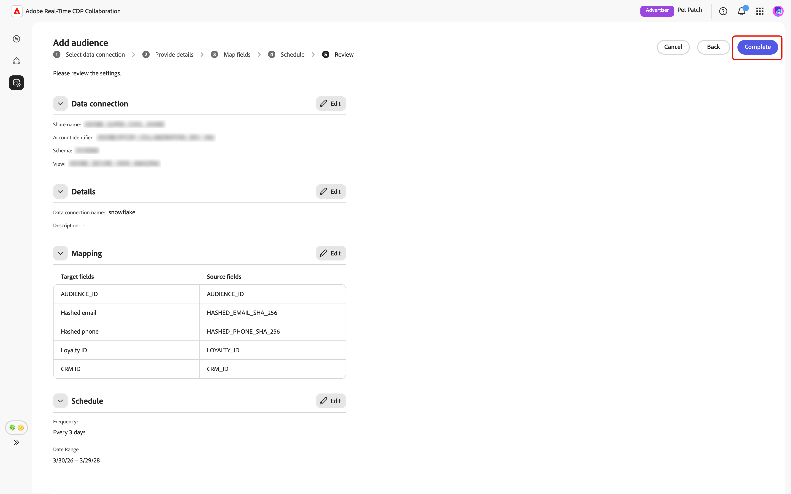

# 대상 소싱에 대해 [!DNL Snowflake] 구성

활성화 및 중복 분석을 위해 Adobe Real-Time CDP Collaboration UI에서 [!DNL Snowflake Secure Data Share]을(를) 구성하고 대상 데이터를 소스에 연결하는 방법에 대해 알아봅니다.

## 개요 {#overview}

[!DNL Snowflake]은(는) 자사 대상 데이터를 Collaboration에 소싱하기 위해 지원되는 옵션 중 하나입니다. 사용 가능한 다른 방법에는 [Experience Platform](./onboard-audiences.md)에서 대상을 소싱, [[!DNL AWS S3] 버킷](./configure-aws-s3-audience-sourcing.md)에 연결 또는 [CSV 파일](./upload-csv-audience-sourcing.md)을 업로드하는 방법이 있습니다.

[!DNL Snowflake Secure Data Share]을(를) 연결하고 대상 데이터를 Collaboration에 소싱하려면 아래 단계를 따르십시오. 설정이 완료되면 공동 작업 프로젝트에 대한 소스 대상을 검토, 활성화 및 관리할 수 있습니다.

## 전제 조건 {#prerequisites}

[!DNL Snowflake] 연결을 구성하기 전에 다음 전제 조건을 충족하는지 확인하십시오.

* [!DNL Snowflake Share]을(를) 만들고 [!DNL Snowflake] 계정에서 [!DNL Snowflake Secure Data Share]에 대한 Adobe 액세스 권한을 부여하는 데 필요한 권한을 설정했습니다. [구성 방법 [!DNL Snowflake] 권한](#set-up-snowflake-permissions)을 알아보세요.
* 다음 [!DNL Snowflake Share]개의 값을 준비했습니다.

   * **이름 공유**
   * **계정 식별자**
   * **스키마**
   * **보기**

* [!DNL Snowflake Secure Data Share]의 대상 데이터는 [대상 소싱 사양(v1.3)](../../assets/quick-start/RTCDP_Collaboration_Audience_Sourcing_Spec_v1_3.pdf) 안내서에 요약된 형식 요구 사항을 충족해야 합니다.
* [!DNL Snowflake] 대상 파일의 모든 일치 키도 Collaboration 계정에 대해 활성화해야 합니다. 계정에 [일치 키 사용](./onboard-account.md#set-up-match-keys) 또는 [새 일치 키 추가](./onboard-account.md#edit-match-keys)하는 방법을 알아보세요.

## [!DNL Snowflake] 권한 설정 {#setup-snowflake-permissions}

[!DNL Snowflake Secure Data Share]은(는) 데이터를 복사하거나 이동할 필요 없이 [!DNL Snowflake] 계정 간에 실시간 읽기 전용 데이터를 안전하게 공유할 수 있는 방법을 제공합니다. Adobe에게 [!DNL Secure Data Share]에 대한 액세스 권한을 부여하려면 [!DNL Snowflake] 계정에서 적절한 권한을 구성해야 합니다.

계속하기 전에 다음 사항을 확인하십시오.

* [!DNL Snowflake] 계정에 액세스할 수 있습니다.
* [!DNL Snowflake] 계정이 비공개 목록을 구독하고 있습니다. 필요한 권한을 구성하려면 Snowflake에 대한 관리자 권한이 필요합니다.
* [!DNL Snowflake] 계정의 클라우드 공급자와 지역을 알고 있습니다.

필요한 권한에 대한 자세한 내용은 [[!DNL Snowflake] 설명서](https://docs.snowflake.com/en/collaboration/consumer-listings-access#access-a-private-listing)를 참조하십시오.

### Adobe의 [!DNL Snowflake] 계정 정보 수집 {#collect-account-information}

시작하려면 해당 지역과 일치하는 Adobe [!DNL Snowflake] 계정 식별자를 찾아 기록해 두십시오. 이 식별자는 이후 단계에서 Adobe 액세스 권한을 부여하기 위해 필요합니다.

| 지역 | [!DNL Snowflake] 프로덕션 계정 전체 식별자 |
| ------------- | --------------- |
| 북미 | ADOBE.AGORA_SF_02 |
| EMEA | ADOBE.RTCDP_COLLABORATION_DEU1_EXTERNAL |
| 오스트레일리아 | ADOBE.RTCDP_COLLABORATION_AUS3_EXTERNAL |

{style="table-layout:auto"}

### [!DNL Snowflake Share] 만들기 및 액세스 권한 부여 {#create-grant-access-to-share}

그런 다음 [!DNL Snowflake] 계정에 [!DNL Secure Data Share]을(를) 만들고 Adobe에 대상 데이터에 대한 읽기 전용 액세스 권한을 부여합니다.

1. 소스 테이블에서 필요한 열에만 제한적으로 액세스할 수 있는 보안 보기를 만듭니다.

   ```sql
   CREATE OR REPLACE SECURE VIEW my_database.my_schema.secure_view_for_adobe AS
   SELECT 
       column1,
       column2,
       column3
   FROM my_database.my_schema.source_table;
   ```

2. 새 [!DNL Snowflake Secure Data Share] 만들기

   ```sql
   CREATE OR REPLACE SHARE adobe_data_share;
   ```

3. [!DNL Snowflake Secure Data Share]이(가) 데이터베이스 내의 개체에 액세스할 수 있도록 데이터베이스에 대한 USAGE 권한을 부여합니다.

   ```sql
   GRANT USAGE ON DATABASE my_database TO SHARE adobe_data_share;
   ```

4. [!DNL Snowflake Secure Data Share]이(가) 스키마 내의 개체에 액세스할 수 있도록 스키마에 대한 USAGE를 부여합니다.

   ```sql
   GRANT USAGE ON SCHEMA my_database.my_schema TO SHARE adobe_data_share;
   ```

5. Adobe에서 대상 데이터를 읽을 수 있도록 보안 보기에 대한 SELECT 권한을 [!DNL Snowflake Secure Data Share]에 부여합니다.

   ```sql
   GRANT SELECT ON VIEW my_database.my_schema.secure_view_for_adobe TO SHARE adobe_data_share;
   ```

6. 지역에 대한 올바른 식별자를 사용하여 Adobe의 [!DNL Snowflake] 계정을 [!DNL Snowflake Secure Data Share]에 추가합니다. [위의 지역/계정 매핑 테이블](#collect-account-information)을 참조하세요.

   ```sql
   ALTER SHARE adobe_data_share ADD ACCOUNTS = <Account Identifier based on region from the mapping table>;
   ```

### [!DNL Snowflake Share] 세부 정보 수집 {#collect-share-details}

마지막으로 아래 표에 표시된 대로 [!DNL Snowflake Share]에 대한 세부 정보를 수집합니다. [!DNL Snowflake Share]과(와) Collaboration 간의 연결을 설정하려면 이 정보가 필요합니다.

| 필드 | 예 |
| -------------------------- | --------------- |
| 계정 식별자 | CUSTOMER_ORG.CUSTOMER_SNOWFLAKE_ACCOUNT |
| [!DNL Share] 이름 | adobe_data_share |
| 스키마 이름 | 고객 스키마 |
| 이름 보기 | secure_view_for_adobe |

{style="table-layout:auto"}

## [!DNL Snowflake] 연결 구성 {#configure-snowflake-connection}

이제 [Snowflake 권한 구성](#set-up-snowflake-permissions)을 완료하고 [사전 요구 사항](#prerequisites)을 모두 충족하는지 확인한 후 [!DNL Snowflake Secure Data Share]을(를) Collaboration에 연결하여 대상 소싱을 시작할 수 있습니다.

**[!UICONTROL 설정]** 작업 영역의 **[!UICONTROL 내 대상]** 탭에서 추가 아이콘()을 선택합니다. **[!UICONTROL 대상]**&#x200B;을 선택하세요.

첫 번째 대상자인 경우 **[!UICONTROL 대상자 추가]** 옵션도 선택할 수 있습니다.

![설정 작업 영역의 [내 대상] 탭에 추가 아이콘과 대상 추가 옵션이 표시됩니다.](../../assets/setup/snowflake-audience-sourcing/add-audience.png)

대상자 추가 워크플로우가 나타납니다. **[!UICONTROL 새 데이터 연결 추가]**&#x200B;를 선택한 후 **[!UICONTROL 다음]**&#x200B;을 선택합니다.

{zoomable="yes"}

### [!DNL Snowflake]을(를) 데이터 연결로 선택 {#select-snowflake}

다음으로 **[!UICONTROL Snowflake]**&#x200B;을(를) 데이터 연결로 선택한 후 **[!UICONTROL 다음]**&#x200B;을(를) 선택하십시오.

![선택 가능한 옵션으로 사용할 수 있는 [!DNL Snowflake]의 데이터 연결 선택 화면입니다.](../../assets/setup/snowflake-audience-sourcing/select-snowflake-data-connection.png)

### 대상자 파일 검토 {#review-audience-file}

>[!CONTEXTUALHELP]
>id="rtcdp_collaboration_audience_sourcing_specifications_snowflake"
>title="온보딩을 위한 데이터 준비"
>abstract="Snowflake for Collaboration에서 대상자 데이터를 형식화하고 구조화하는 방법을 알아보려면 대상자 소싱 사양 안내서를 참조하십시오."
>additional-url="https://www.adobe.com/go/rtcdp-collaboration-audience-sourcing" text="안내서 참조"

소싱을 시작하기 전에 [!DNL Snowflake Share] 및 [!DNL Snowflake] 대상 파일의 요구 사항을 설명하는 대화 상자가 나타납니다. [!DNL Snowflake Share]이(가) 올바른 공유 이름, 계정 식별자, 스키마 및 보기로 만들어졌는지 확인하십시오. 대상 데이터의 형식이 Collaboration에서 사용할 수 있도록 올바르게 구성되어 있는지 확인하려면 **[[!UICONTROL 대상 소싱 사양]](../../assets/quick-start/RTCDP_Collaboration_Audience_Sourcing_Spec_v1_3.pdf)** 안내서를 검토하십시오.

완료되면 **[!UICONTROL 온보딩 시작]**&#x200B;을 선택하세요.

![대상 소싱 사양에 대한 링크가 있는 온보딩 대화 상자를 위해 [!DNL Snowflake Share]을(를) 준비합니다.](../../assets/setup/snowflake-audience-sourcing/prepare-snowflake-share-onboarding-dialog.png)

### [!DNL Snowflake Share] 연결 인증 {#authenticate-snowflake-share-connection}

>[!CONTEXTUALHELP]
>id="rtcdp_collaboration_audience_sharing_snowflake"
>title="Snowflake에서 대상자 추가"
>abstract="Snowflake Share를 연결하려면 Adobe의 서비스 사용자가 대상자 데이터를 검색하여 처리할 수 있도록 권한을 부여하십시오. Experience League에 설명된 단계를 따라 Adobe에 Snowflake Share에 대한 액세스 권한을 부여합니다."

이 단계에서는 [!DNL Snowflake Share]을(를) Collaboration에 연결하는 데 필요한 [!DNL Snowflake Share] 자격 증명을 제공해야 합니다.

| 필드 | 설명 | 예 |
|--------------------|-------------|------------------------------|
| 공유 이름 | [!DNL Snowflake Share]의 이름입니다. | `ADOBE_DATA_SHARE` |
| 계정 식별자 | Snowflake 계정에 대한 고유 식별자. | `CUSTOMER_ORG.CUSTOMER_SNOWFLAKE_ACCOUNT` |
| 스키마 | 대상 데이터를 포함하는 [!DNL Snowflake Share] 내의 스키마. | `CUSTOMER_SCHEMA` |
| 보기 | Collaboration이 대상 데이터를 가져오는 실제 데이터 세트입니다. | `SECURE_VIEW_FOR_ADOBE` |

{style="table-layout:auto"}

필요한 자격 증명을 모두 입력한 후 **[!UICONTROL 다음]**&#x200B;을(를) 선택합니다.

![공유 이름, 계정 식별자, 스키마 및 보기 필드가 있는 [!DNL Snowflake Share] 연결 양식과 다음 단추가 강조 표시되어 있습니다.](../../assets/setup/snowflake-audience-sourcing/snowflake-authentication-credentials-form.png)

[!DNL Snowflake Share]이(가) Collaboration에 성공적으로 연결되었음을 확인하는 확인 대화 상자가 다음 페이지 하단에 나타납니다.

![확인 대화 상자에서 [!DNL Snowflake Share] 연결이 성공적으로 설정되었음을 확인합니다.](../../assets/setup/snowflake-audience-sourcing/snowflake-share-connection-established.png)

### 이름 및 설명 입력 {#provide-name-description}

**[!UICONTROL 세부 정보 제공]** 보기에서 [!DNL Snowflake] 데이터 연결에 대한 설명 이름과 선택적 설명을 입력하십시오. 완료되면 **[!UICONTROL 다음]**&#x200B;을 선택합니다.

![세부 정보 제공 화면에 데이터 연결의 이름과 설명이 표시되고 [다음] 단추가 강조 표시됩니다.](../../assets/setup/snowflake-audience-sourcing/provide-name-description.png)

### 필드 매핑 {#map-fields}

**[!UICONTROL 매핑]** 화면은 현재 읽기 전용입니다. 변형을 추가, 삭제 또는 적용할 수 없습니다. Collaboration은 **[대상 소싱 사양(v1.3)](../../assets/quick-start/RTCDP_Collaboration_Audience_Sourcing_Spec_v1_3.pdf)**&#x200B;을 기반으로 [!DNL Snowflake Share] 데이터의 소스 ID 필드를 대상 필드에 자동으로 매핑합니다.

매핑된 필드를 시각적으로 확인하고 계속하려면 **[!UICONTROL 다음]**&#x200B;을(를) 선택하십시오. **[!UICONTROL 원본 데이터 미리 보기]** 옵션을 사용하여 [!DNL Snowflake Share]에서 샘플 데이터를 미리 볼 수도 있습니다.


미리 보기를 선택하면 샘플 데이터가 표 형식으로 표시된 **[!UICONTROL [!DNL Snowflake Share]데이터 미리 보기]** 대화 상자가 나타납니다. 이 내용을 검토한 다음 **[!UICONTROL 닫기]**&#x200B;를 선택합니다.

![[!DNL Snowflake Share] 데이터 미리 보기 대화 상자에 [!DNL Snowflake Share]의 샘플 데이터가 표시되고 닫기 옵션이 강조 표시됩니다.](../../assets/setup/snowflake-audience-sourcing/preview-source-data.png)

<!-- NOTE: Manual mapping will be available in the future. -->
<!-- In the **[!UICONTROL Map fields]** screen, you can use the **[!UICONTROL Source field]** and **[!UICONTROL Target field]** dropdowns to update the auto-mapped fields, or include additional fields with the **[!UICONTROL Add field]** option. Once finished, select **[!UICONTROL Next]**. -->

<!--  -->

### 일정 새로 고침 빈도 및 날짜 범위 {#refresh-frequency-date-range}

그런 다음 **[!UICONTROL 일정]** 보기에서 드롭다운 메뉴를 사용하여 1일에서 6일 사이의 새로 고침 빈도를 선택합니다. 그런 다음 달력 아이콘을 사용하여 소싱 대상의 시작 날짜와 종료 날짜를 지정합니다.

>[!IMPORTANT]
>
>Collaboration 크레딧을 효과적으로 관리하려면 기본 [!DNL Snowflake] 데이터의 업데이트 빈도와 일치하거나 초과하지 않도록 새로 고침 빈도를 설정하십시오. 지원되는 최소 새로 고침 간격은 6일에 한 번입니다.


### 연결 검토 및 완료 {#review-and-complete}

마지막으로 요약 화면에서 구성 설정을 검토합니다. 이 보기에는 다음 섹션의 요약이 포함되어 있습니다.

* **[!UICONTROL 데이터 연결]**: [!DNL Snowflake Share]의 공유 이름, 계정 식별자, 구성표 및 보기를 표시합니다.
* **[!UICONTROL 세부 정보]**: 나중에 식별하는 데 도움이 되도록 데이터 연결의 이름 및 선택적 설명을 표시합니다.
* **[!UICONTROL 매핑]**: 대상 파일의 원본 필드가 Collaboration에서 사용되는 대상 필드에 매핑되는 방식을 표시합니다.
* **[!UICONTROL 일정]**: 연결이 소싱에 대한 대상 데이터 및 활성 날짜 범위를 새로 고치는 빈도를 표시합니다.

섹션을 편집해야 하는 경우 연필 아이콘()을 선택합니다. **[!UICONTROL 완료]**&#x200B;를 선택하여 모든 섹션을 확인합니다.



확인 대화 상자에서 데이터 연결이 성공적으로 만들어졌으며 대상 소싱이 진행 중임을 확인합니다.

## 소스 대상자 검토 {#review-sourced-audiences}

설정이 완료되면 Collaboration은 [!DNL Snowflake Share]에서 대상을 소싱하기 시작합니다. 대상 소싱이 진행 중인 경우 보기의 맨 위에 배너가 표시됩니다.


>[!TIP]
>
>대상 소싱 시간은 [!DNL Snowflake] 데이터의 크기와 구성한 새로 고침 빈도에 따라 다릅니다. 데이터 세트가 커지거나 새로 고침 빈도가 낮은 일정이 **[!UICONTROL 내 대상]** 작업 영역에 표시되는 데 시간이 더 오래 걸릴 수 있습니다.

소싱이 완료되면 **[!UICONTROL 내 대상]** 탭에서 Experience Platform에서 가져온 대상과 동일한 기능 및 정보로 대상자를 사용할 수 있습니다.


표 보기 또는 표 보기에서 행 항목을 선택하거나 **[!UICONTROL 대상자 보기]**&#x200B;를 선택하여 특정 대상자에 대한 개요를 봅니다. 대상자의 상태, 소스 및 데이터 연결 이름과 **[!UICONTROL ID]**, **[!UICONTROL 범주]**, **[!UICONTROL 연결 액세스]** 및 **[!UICONTROL 메타데이터 가시성]**&#x200B;에 대한 세부 패널이 표시됩니다. 자세한 내용은 [개별 대상자를 보는 방법](./onboard-audiences.md#view-individual-audiences)을 참조하세요.

공동 작업 프로젝트에서 대상을 사용하기 전에 이 보기를 사용하여 대상 구성 및 가시성 설정을 확인하십시오.

## [!DNL Snowflake] 데이터 연결 보기 {#view-snowflake-connection}

새로 추가한 [!DNL Snowflake] 연결은 **[!UICONTROL 내 데이터 연결]** 탭에서 즉시 사용할 수 있습니다. 대상 원본이 [!UICONTROL [!DNL Snowflake]]&#x200B;(으)로 표시됩니다.

[!DNL Snowflake] 데이터 연결에는 다른 대상 데이터 연결과 동일한 기능 및 세부 정보가 포함되어 있습니다. [데이터 연결을 보고 관리하는 방법](../setup/manage-data-connection.md)에 대해 자세히 알아보세요.

![내 데이터 연결 탭에 소싱 상태 정보가 있는 [!DNL Snowflake] 데이터 연결이 표시됩니다.](../../assets/setup/snowflake-audience-sourcing/data-connection-tab-snowflake.png)

## 다음 단계 {#next-steps}

이제 [!DNL Snowflake]을(를) Collaboration의 데이터 소스로 구성하고 연결했습니다. 소싱이 완료되면 [공동 작업 프로젝트를 만들고](../collaborate/manage-projects.md), [대상을 활성화하고](../collaborate/activate.md), [중복 및 통찰력을 검토하고](../collaborate/measure.md), [대상 설정 및 가시성을 관리합니다](./onboard-audiences.md).

다른 대상 소싱 방법에 대한 자세한 내용은 다음 설명서를 참조하십시오.

* [대상 소싱에 대해  [!DNL Amazon S3] 구성](./configure-aws-s3-audience-sourcing.md)
* [Experience Platform의 Source 대상](./onboard-audiences.md)
* [대상자 소싱에 대한 CSV 파일 업로드](./upload-csv-audience-sourcing.md)
