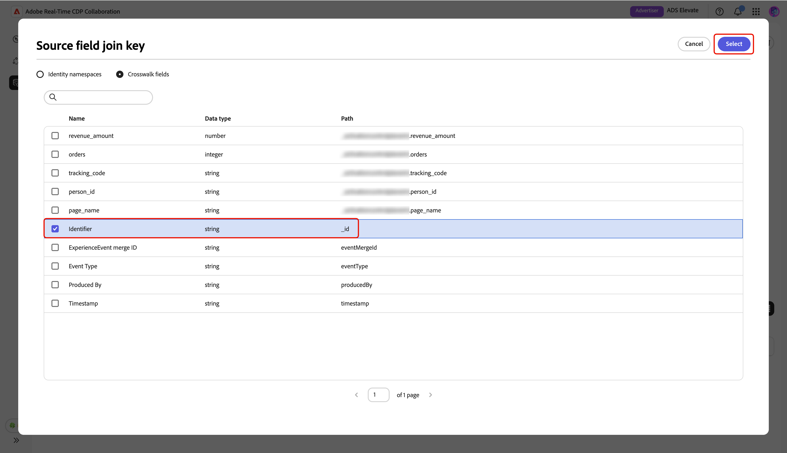

# 측정 데이터 연결 관리

{{limited-availability-release-note}}

## 개요

Real-Time CDP Collaboration의 측정 데이터 연결을 사용하여 다양한 플랫폼에서 전환 데이터를 소스화합니다. 기존 데이터 연결에 대한 세부 정보를 관리하고 키를 일치시키는 방법에 대해 알아봅니다.

## 측정 데이터 연결 보기 {#view-measurement-data-connections}

전환 데이터 소스 방법, 일치 키 사용 중, 연결에 연결된 모든 전환 이벤트 등 기존 측정 데이터 연결에 대한 세부 사항을 볼 수 있습니다.

**[!UICONTROL 설정]** 작업 영역에서 **[!UICONTROL 내 데이터 연결]** 탭으로 이동합니다. 현재 측정 데이터 연결은 모두 표 형식 또는 표 형식으로 **[!UICONTROL 측정]** 섹션 아래에 표시됩니다. 관련 연결 카드에서 **[!UICONTROL 데이터 연결 보기]**&#x200B;를 선택하거나 테이블 보기에서 데이터 연결 이름을 선택하여 해당 작업 영역을 열고 모든 세부 정보를 봅니다.

{zoomable="yes"}

### 측정 데이터 연결 세부 정보 {#measurement-data-connection-details}

이 섹션에서는 데이터 연결에 대한 다음 세부 사항을 확인할 수 있습니다.

| 필드 | 설명 |
|-------------------|-------------|
| 상태 | 측정 데이터 연결의 현재 상태(예: **[!UICONTROL 활성]**). |
| 소스 | 이 연결에 대한 측정 데이터를 제공하는 플랫폼 또는 시스템입니다. |
| 샌드박스 | 측정 데이터 연결이 구성된 샌드박스의 이름입니다. |
| 데이터 세트 | 연결에서 측정 데이터 소싱에 사용되는 데이터 세트 이름. |
| 마지막 업데이트 | 측정 데이터 연결에 대한 최신 업데이트 타임스탬프. |
| 마지막으로 업데이트한 사람 | 측정 데이터 연결을 마지막으로 수정한 사용자입니다. |
| 생성일 | 측정 데이터 연결이 생성된 시점의 타임스탬프입니다. |
| 생성자 | 원래 측정 데이터 연결을 만든 사용자입니다. |

{style="table-layout:auto"}

### 일치 키 {#match-keys}

일치 키는 [측정 데이터를 소스](./onboard-measurement-data.md)할 때 소스 필드를 매핑한 대상 필드입니다. 일치 키가 작동하는 방법에 대한 자세한 내용은 [일치 키](./onboard-account.md#set-up-match-keys) 안내서를 참조하세요.

{zoomable="yes"}

### 전환 이벤트 {#conversion-events}

데이터 연결에 첨부된 전환 이벤트 목록이 작업 공간 하단에 표시됩니다. 목록에는 상태, 전환 유형 및 소스를 포함하여 각 이벤트에 대한 간단한 개요가 표시됩니다. 이벤트 이름을 선택하여 해당 구성을 보고 편집하거나 삭제 옵션()을 사용하여 전환 이벤트를 제거할 수 있습니다. 전환 이벤트 관리에 대한 전체 안내서는 [측정 데이터 추가 및 관리](./onboard-measurement-data.md) 안내서를 참조하십시오.

{zoomable="yes"}

## 측정 데이터 연결 편집 {#edit-measurement-data-connection}

언제든지 기존 측정 데이터 연결의 세부 정보를 업데이트하고 키를 일치시켜 보고 및 분석이 정확하게 유지되도록 할 수 있습니다. 시작하려면 **[!UICONTROL 내 데이터 연결]** 탭으로 이동하여 편집할 측정 데이터 연결을 선택하십시오. 이렇게 하면 아래 단계에 따라 필요한 변경 작업을 수행할 수 있는 데이터 연결 작업 영역이 열립니다.

### 이름 및 설명 편집 {#edit-name-and-description}

데이터 연결의 이름 및 설명을 업데이트하려면 현재 연결 이름 옆에 있는 편집 아이콘()을 선택합니다.

{zoomable="yes"}

**[!UICONTROL 데이터 연결 편집]** 대화 상자에서 원하는 값으로 필드를 업데이트한 다음 **[!UICONTROL 저장]**&#x200B;을 선택하여 변경 사항을 적용합니다.

{zoomable="yes"}

세부 정보가 성공적으로 업데이트되었는지 확인하는 대화 상자가 나타납니다.

### 일치 키 편집 {#edit-match-keys}

>[!IMPORTANT]
>
>데이터 연결에 대한 일치 키를 편집하기 전에 다음을 참고하십시오.
>
>* 계정에 대해 구성된 일치 키만 데이터 연결에 사용할 수 있습니다.
>* 이때 데이터 연결에 일치 키를 추가할 수 있지만 일치 키가 활성화되면 제거할 수 없습니다.

데이터 연결 작업 영역의 **[!UICONTROL 키 일치]** 패널에서 **[!UICONTROL 편집]**&#x200B;을(를) 선택합니다.

{zoomable="yes"}

데이터 연결에 대한 모든 변경 사항이 연결된 모든 전환에 적용됨을 설명하는 확인 대화 상자가 나타납니다. **[!UICONTROL 확인]**&#x200B;을(를) 선택하여 확인합니다. 나중에 이 확인을 건너뛰도록 선택할 수 있습니다.

{zoomable="yes"}

**[!UICONTROL 일치 키]** 대화 상자에서 데이터 보강 설정을 검토하고 원본 필드와 대상 필드(일치 키) 간의 현재 매핑을 확인할 수 있습니다.

{zoomable="yes"}

#### 보강 {#enrichment}

[측정 데이터를 소스](./onboard-measurement-data.md)할 때 데이터 보강이 활성화되지 않은 경우 실시간 고객 프로필의 특성을 사용하여 이벤트 데이터 세트를 보강할 수 있습니다. 측정 데이터에 대해 데이터 보강이 켜지면 비활성화할 수 없습니다. 필요에 따라 데이터 보강 조인 키를 계속 업데이트할 수 있습니다.

**[!UICONTROL 키 일치]** 대화 상자에서 데이터 강화를 활성화하면 UI가 확장되어 **[!UICONTROL 프로필의 ID로 이벤트 데이터 강화]** 섹션에 더 많은 구성 옵션이 표시됩니다.

**[!UICONTROL Source 필드 조인 키]** 옵션을 선택하십시오.

{zoomable="yes"}

**[!UICONTROL Source 필드 조인 키]** 대화 상자에서 소스 필드를 선택한 후 **[!UICONTROL 선택]**&#x200B;을 선택합니다.

{zoomable="yes"}

그런 다음 **[!UICONTROL 프로필 가입 키]** 옵션을 선택합니다. **[!UICONTROL 프로필 가입 키]** 대화 상자의 목록에서 프로필 필드를 선택합니다. 검색 옵션을 사용하여 원하는 필드를 찾을 수 있습니다. 그런 다음 **[!UICONTROL 선택]**&#x200B;을(를) 선택하여 확인합니다.

{zoomable="yes"}

#### 매핑 편집 {#edit-mapping}

기존 일치 키를 편집하려면 **[!UICONTROL 일치 키]** 대화 상자에서 연결된 원본 필드와 대상 필드를 업데이트하십시오. 새 일치 키를 포함하려면 **[!UICONTROL 필드 추가]**&#x200B;를 선택하십시오. 이렇게 하면 소스 필드와 대상 필드 간의 추가 매핑을 정의할 수 있는 빈 행이 만들어집니다.

![필드 추가를 선택하면 [키 일치] 대화 상자에 입력할 수 있는 빈 새 매핑 행이 표시됩니다.](/help/assets/setup/manage-measurement-data-connection/add-new-field.png){zoomable="yes"}

그런 다음 빈 소스 필드를 선택합니다. **[!UICONTROL 원본 필드 선택]** 대화 상자에 **[!UICONTROL ID 네임스페이스]** 및 **[!UICONTROL 프로필 특성]**&#x200B;과 같은 옵션 아래에 그룹화된 사용 가능한 원본 필드 목록이 표시됩니다. 목록을 필터링하고 검색 옵션을 사용하여 원하는 소스 필드를 찾을 수 있습니다.

원하는 소스 필드를 선택한 후 **[!UICONTROL 선택]**&#x200B;을(를) 선택하십시오.

{zoomable="yes"}

**[!UICONTROL 키 일치]** 대화 상자에서 드롭다운 메뉴를 사용하여 새 소스 필드를 대상 필드에 매핑합니다. 사용 가능한 모든 대상 필드는 Collaborator 계정에 대해 구성된 일치 키입니다. 필요한 대상 필드가 없으면 [계정의 일치 키를 편집](./onboard-account.md#edit-match-keys)하여 추가하십시오.

**[!UICONTROL 해시된 휴대폰]** 대상 필드에 일반 텍스트 전화 소스 필드를 매핑할 때와 같이 해시되지 않은 필드를 해시된 대상 필드에 소싱하려면 **[!UICONTROL 변환 적용]** 옵션을 사용하십시오.

{zoomable="yes"}

필드 매핑을 완료한 후 업데이트를 검토하고 **[!UICONTROL 확인]**&#x200B;을 선택하여 변경 내용을 적용합니다.

{zoomable="yes"}

확인 대화 상자에서 일치 키가 성공적으로 업데이트되었는지 확인합니다.

## 데이터 연결 삭제

데이터 연결을 삭제하면 Collaboration 전체의 모든 기본 전환, 관련 설정 및 사용이 제거됩니다. 이 작업은 실행 취소할 수 없습니다.

기존 데이터 연결을 삭제하려면 개별 데이터 연결의 작업 영역에서 삭제 아이콘()을 선택하십시오.

{zoomable="yes"}

확인 대화 상자가 나타납니다. 데이터 연결 삭제를 완료하려면 **[!UICONTROL 삭제]**&#x200B;을(를) 선택하십시오.

{zoomable="yes"}

확인 대화 상자에서 데이터 연결이 성공적으로 삭제되었음을 확인합니다.

## 다음 단계 {#next-steps}

측정 데이터 연결을 관리한 후 다음을 수행할 수 있습니다.

* 필요에 따라 데이터 연결에 연결된 전환 이벤트를 더 추가합니다. 자세한 단계는 [측정 데이터 추가 및 관리](./onboard-measurement-data.md) 설명서를 참조하십시오.
* 측정 보고서를 생성하여 캠페인의 성과 및 영향에 대한 통찰력을 얻으십시오. 사용 가능한 보고서 유형 및 보고서 유형을 만드는 방법에 대한 자세한 내용은 [성능 측정](/help/guide/collaborate/measure.md) 안내서를 참조하십시오.
