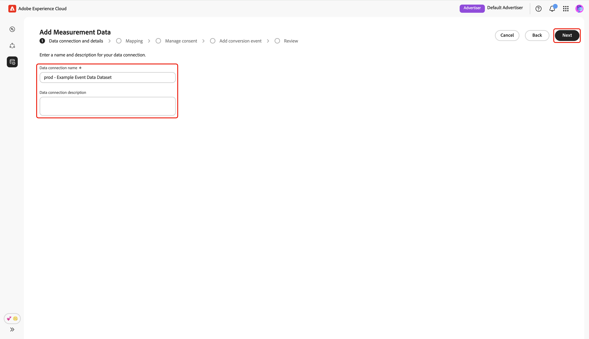
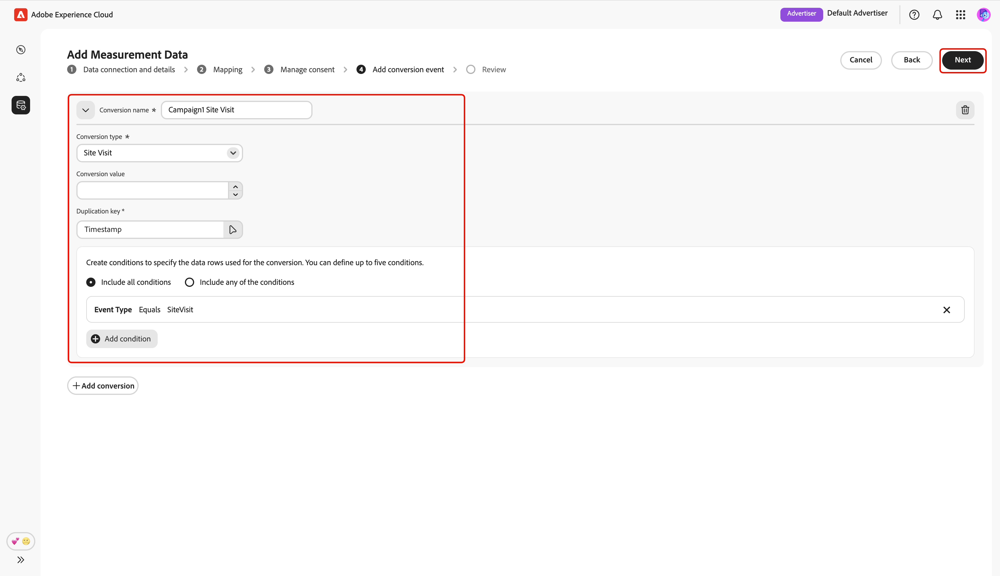
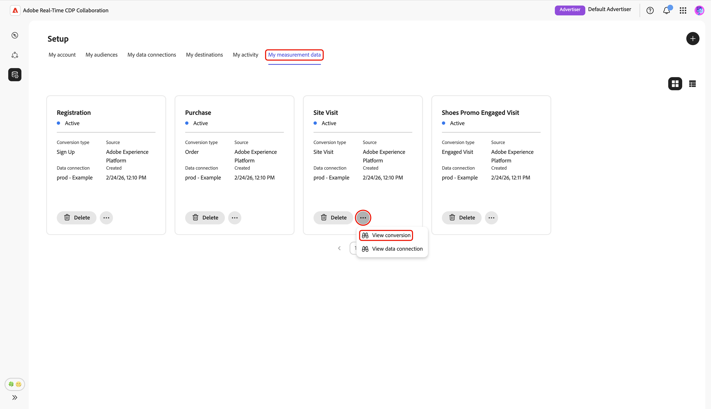
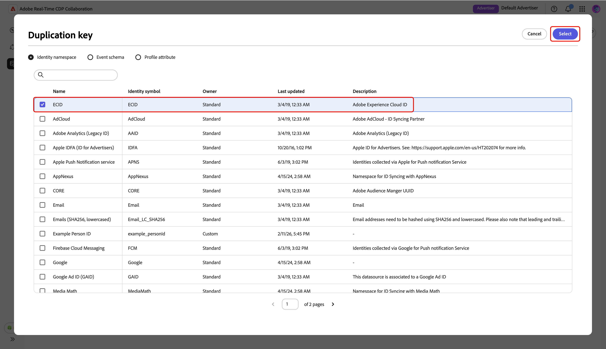
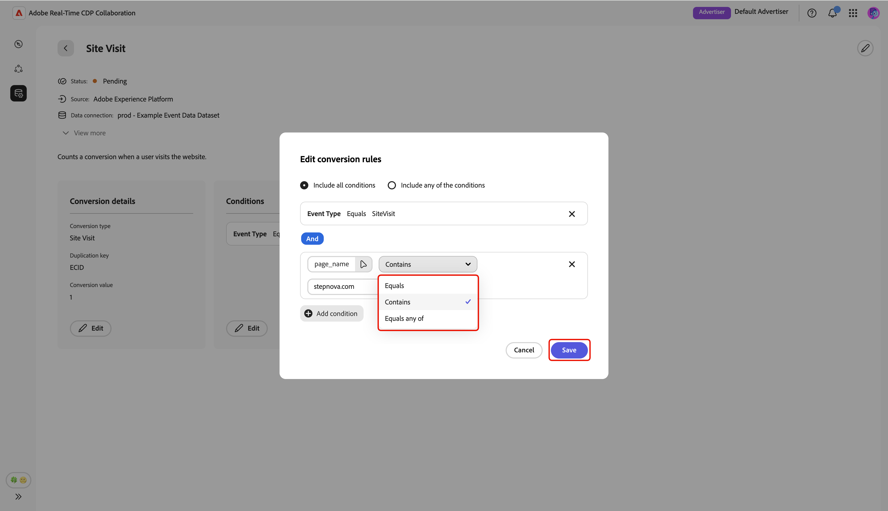

# 측정 데이터 추가 및 관리 {#add-and-manage-measurement-data}

>[!CONTEXTUALHELP]
>id="rtcdp_collaboration_onboard_measurement_data"
>title="자세히 보기"
>abstract=""

>[!CONTEXTUALHELP]
>id="rtcdp_collaboration_measurement_data_target_fields"
>title="대상 필드"
>abstract="측정 대상 필드에 대한 플레이스홀더."

>[!CONTEXTUALHELP]
>id="rtcdp_collaboration_measurement_data_source_fields"
>title="소스 필드"
>abstract="측정 소스 필드에 대한 플레이스홀더."

>[!CONTEXTUALHELP]
>id="rtcdp_collaboration_import_measurement_mapping_source_fields"
>title="소스 필드 매핑"
>abstract="소스 필드의 측정 매핑에 대한 플레이스홀더."

>[!CONTEXTUALHELP]
>id="rtcdp_collaboration_import_measurement_mapping_target_fields"
>title="대상 필드 매핑"
>abstract="대상 필드의 측정 매핑에 대한 플레이스홀더."

{{limited-availability-release-note}}

이 문서에서는 Adobe Real-Time CDP Collaboration에 캠페인 측정 데이터를 추가하는 단계에 대해 간략하게 설명합니다. 게시자는 Adobe 팀과 협력하여 캠페인 측정 데이터를 업로드할 수 있습니다. 해당 데이터가 업로드되고 처리되면 게시자와 광고주 모두 광범위한 [캠페인 측정 보고서](/help/guide/collaborate/measure.md)를 볼 수 있습니다.

## 측정 데이터 추가 {#add-measurement-data}

광고주는 캠페인 측정 보고서에 사용할 수 있도록 전환 이벤트가 포함된 측정 데이터를 Collaboration에 업로드할 수 있습니다. 전환 데이터에는 일반적으로 사용자 식별자(예: 해시된 이메일 또는 장치 ID), 전환 이벤트의 타임스탬프 및 구매 또는 등록과 같은 특정 전환 이벤트 세부 정보와 같은 필드가 포함됩니다.

측정 데이터를 소싱하려면 **[!UICONTROL 설정]** 작업 영역에서 **[!UICONTROL 내 측정 데이터]** 탭으로 이동합니다. 추가 아이콘()을 선택합니다. **[!UICONTROL 측정 데이터]**&#x200B;를 선택합니다.

첫 번째 측정 데이터인 경우 **[!UICONTROL 추가]** 옵션도 선택할 수 있습니다.

![[추가] 옵션과 [측정 데이터] 옵션이 강조 표시된 [내 측정 데이터] 탭](../../assets/setup/add-manage-measurement-data/add-measurement-data.png){zoomable="yes"}

**[!UICONTROL 측정 데이터 추가]** 화면이 나타나고 측정 데이터 소스에 대한 단계 요약이 표시됩니다. **[!UICONTROL 온보딩 시작]**&#x200B;을 선택합니다.

{zoomable="yes"}

### 데이터 연결 및 세부 정보 {#data-connection-and-details}

이 단계에서는 데이터 연결을 구성하고 측정 데이터에 대한 세부 사항을 지정해야 합니다.

#### 측정 데이터 유형 선택 {#select-measurement-data-type}

측정 데이터 유형은 캠페인 측정을 위해 가져오는 이벤트의 종류를 정의합니다. 현재 전환 데이터는 지원되는 유형입니다.

**[!UICONTROL 전환 데이터]**&#x200B;를 측정 데이터 형식으로 선택한 후 **[!UICONTROL 다음]**&#x200B;을 선택합니다.

{zoomable="yes"}

#### 데이터 연결 선택 {#select-data-connection}

데이터 연결은 측정 데이터를 Collaboration에 소스화하는 소스입니다. 초기 데이터 연결을 설정하고 첫 번째 측정 데이터 세트를 소싱했으면 동일한 데이터 연결을 사용하여 추가 측정 데이터를 계속 소싱할 수 있습니다.

데이터 연결을 추가하려면 **[!UICONTROL 새 데이터 연결 추가]**&#x200B;를 선택한 후 **[!UICONTROL 다음]**&#x200B;을 선택합니다.

{zoomable="yes"}

#### 데이터 소스 선택 {#select-data-source}

그런 다음 데이터 연결 소스를 선택합니다. 현재 Adobe Experience Platform은 유일하게 지원되는 데이터 소스입니다.

데이터 원본을 선택한 후 **[!UICONTROL 다음]**&#x200B;을(를) 선택하십시오.

{zoomable="yes"}

#### 샌드박스 선택 {#select-sandbox}

Collaboration 캠페인 측정 보고서에 사용할 측정 데이터를 포함하는 샌드박스를 선택합니다. 사용 가능한 샌드박스 목록에서 샌드박스를 선택한 후 **[!UICONTROL 다음]**&#x200B;을 선택합니다.

{zoomable="yes"}

#### 측정 데이터 세트 선택 {#select-measurement-dataset}

선택한 샌드박스의 데이터 세트 목록이 나타납니다. 데이터 집합을 측정 데이터로 선택한 후 **[!UICONTROL 다음]**&#x200B;을 선택합니다. 검색 옵션을 사용하여 선호하는 데이터 세트를 필터링하고 찾을 수 있습니다.

{zoomable="yes"}

#### 이름 및 세부 정보 제공 {#provide-name-and-details}

그런 다음 데이터 연결의 이름과 설명을 입력합니다. 이 정보는 나중에 데이터 연결을 식별하는 데 도움이 됩니다.

{zoomable="yes"}

### 매핑 {#mapping}

다음 단계는 측정 데이터의 필드를 Collaboration에서 사용되는 해당 대상 필드에 매핑하는 것입니다. 조인 키를 매핑하여 실시간 고객 프로필의 속성으로 이벤트 데이터 세트를 보강하고 이러한 속성을 사용하여 측정 보고서를 분류할 수도 있습니다.

#### 이벤트 데이터 강화 {#enrich-event-data}

이벤트 데이터를 보강하려면 **[!UICONTROL Source 필드 조인 키]** 옵션을 선택하십시오.

{zoomable="yes"}

**[!UICONTROL Source 필드 조인 키]** 대화 상자에서 소스 필드를 선택한 후 **[!UICONTROL 선택]**&#x200B;을 선택합니다.

{zoomable="yes"}

그런 다음 **[!UICONTROL 프로필 가입 키]** 옵션을 선택합니다. **[!UICONTROL 프로필 가입 키]** 대화 상자의 목록에서 프로필 필드를 선택합니다. 검색 옵션을 사용하여 원하는 필드를 찾을 수 있습니다. 그런 다음 **[!UICONTROL 선택]**&#x200B;을(를) 선택하여 확인합니다.

{zoomable="yes"}

#### 필드 매핑 {#mapping-fields}

측정 데이터의 소스 필드를 Collaboration의 대상 필드에 매핑하려면 **[!UICONTROL 매핑]** 화면에서 빈 소스 필드를 선택하십시오.

{zoomable="yes"}

**[!UICONTROL ID 네임스페이스]** 및 **[!UICONTROL 이벤트 스키마]**&#x200B;와 같은 옵션 아래에 그룹화된 사용 가능한 소스 필드 목록을 표시하는 **[!UICONTROL 소스 필드 선택]** 대화 상자가 나타납니다. 검색 옵션을 사용하여 필터링하고 목록에서 소스 필드를 찾을 수 있습니다.

원하는 소스 필드를 선택한 후 **[!UICONTROL 선택]**&#x200B;을(를) 선택하십시오.

{zoomable="yes"}

그런 다음 드롭다운 메뉴를 사용하여 선택한 소스 필드를 적절한 타겟 필드에 매핑합니다. 사용 가능한 모든 대상 필드는 Collaborator 계정에 대해 구성된 [일치 키](./onboard-account.md#set-up-match-keys)입니다.

{zoomable="yes"}

필요에 따라 매핑 행을 추가하거나 제거할 수 있습니다. 해시되지 않은 소스 필드를 해시된 대상 필드에 매핑해야 하는 경우(예: 일반 텍스트 이메일을 [!UICONTROL 해시된 이메일]에 매핑) **[!UICONTROL 변환 적용]** 옵션을 사용하여 필요한 해시를 적용하십시오.

완료되면 매핑된 필드를 검토하고 데이터 보강이 활성화된 경우 키를 조인합니다. 그런 다음 **[!UICONTROL 다음]**&#x200B;을 선택합니다.

{zoomable="yes"}

### 동의 관리 {#manage-consent}

계속하기 전에 Collaboration에서의 데이터 사용이 Real-Time CDP 데이터 거버넌스 정책을 준수한다는 것을 확인해야 합니다. 모든 데이터는 동의 요구 사항 또는 적용 가능한 사용자 정의 동의 정책에 따라 사전 필터링되어야 하므로 더 이상 처리할 필요가 없습니다.

승인을 확인하려면 **[!UICONTROL 다음]**&#x200B;을 선택하세요.

{zoomable="yes"}

[매핑 단계 동안 프로필 강화를 활성화](#enrich-event-data)하면 사전 정의된 옵션 목록에서 동의 정책을 구성할 수 있습니다. 여기에는 다음 항목이 포함되어 있습니다.

* **마케팅 작업**: Experience Platform에서 Collaboration으로 가져올 대상 데이터를 제어하려면 이 마케팅 작업을 사용하십시오.
* **동의 규칙**: Collaboration으로 가져온 데이터에 적용할 동의 규칙을 선택하십시오.
* **대상**: 대상 필터를 사용하여 동의를 위한 대상 프로필을 포함하거나 제외합니다.

>[!NOTE]
>
>**[!UICONTROL 데이터 Collaboration]**&#x200B;은(는) C4, C5 및 C9 데이터 사용 레이블을 지원하며 **[!UICONTROL 데이터 과학]**&#x200B;은(는) C9만 지원합니다. Experience Platform 설명서에서 데이터 사용 레이블에 대해 자세히 알아보십시오.
>
>* [데이터 사용 레이블 개요](https://experienceleague.adobe.com/ko/docs/experience-platform/data-governance/labels/overview){target="_blank"}
>* [용어집](https://experienceleague.adobe.com/ko/docs/experience-platform/data-governance/labels/reference){target="_blank"}

기본 설정을 선택한 후 **[!UICONTROL 다음]**&#x200B;을 선택합니다.

{zoomable="yes"}

계속하기 전에 **[!UICONTROL 거버넌스 정책 및 적용 작업]** 대화 상자에서 조건을 확인하고 동의해야 합니다. 확인란을 선택한 다음 **[!UICONTROL 확인]**&#x200B;을 선택합니다.

{zoomable="yes"}

#### 대상자 필터 {#audience-filter}

동의를 위해 특정 대상 프로필을 포함하거나 제외하려면 **[!UICONTROL 대상 필터]** 드롭다운 메뉴를 사용하십시오. 이 필터를 선택하면 UI가 업데이트되어 **[!UICONTROL 대상자 찾아보기]** 옵션이 표시됩니다. **[!UICONTROL 대상자 찾아보기]**&#x200B;를 선택하십시오.

{zoomable="yes"}

**[!UICONTROL 대상자 선택]** 대화 상자가 나타납니다. 목록에서 대상자를 선택한 다음 **[!UICONTROL 선택]**&#x200B;합니다.

{zoomable="yes"}

이제 선택한 대상자가 나타나고 필요한 경우 제거할 수 있는 옵션이 표시됩니다. 동의 설정을 검토한 후 **[!UICONTROL 다음]**&#x200B;을 선택하세요.

{zoomable="yes"}

### 전환 이벤트 추가 {#add-conversion-event}

다음으로 캠페인이 사이트 방문, 등록 또는 구매 완료에 미치는 영향을 측정할 전환 이벤트를 정의합니다. 측정을 위해 최대 **3**&#x200B;개의 개별 전환 이벤트를 지정할 수 있습니다.

전환 이벤트의 이름을 입력한 다음 드롭다운 메뉴를 사용하여 전환 유형을 선택합니다.

{zoomable="yes"}

변환에 대한 값을 입력하거나, 현재 값을 할당하지 않으려면 비워 둘 수 있습니다.

{zoomable="yes"}

그런 다음 중복 키를 지정하여 이벤트 데이터 세트에서 동일한 기본 전환 이벤트에 속하는 행(예: 등록 프로세스 동안 동일한 타임스탬프)을 나타내야 합니다. This prevents counting the same conversion multiple times in measurement reports. To do this, select **[!UICONTROL Duplication key]**. In the **[!UICONTROL Duplication key]** dialog, find and choose the key, followed by **[!UICONTROL Select]**.

{zoomable="yes"}

After specifying the duplication key, you can add up to **5** conditions to include only relevant rows from the event dataset for the conversion. Choose to apply all or any of these conditions.

Select **[!UICONTROL Add condition]**, then select the condition option.

{zoomable="yes"}

In the **[!UICONTROL Select source field]** dialog, find and choose a source field for the condition rule, followed by **[!UICONTROL Select]**.

{zoomable="yes"}

Use the dropdown menu to select a logic operator, then enter the value for the confition rule.

{zoomable="yes"}

To add another conversion event, select **[!UICONTROL Add conversion]**. You can include up to **3** conversion events in total. Once finished, review the conversion configurations and select **[!UICONTROL Next]**.

{zoomable="yes"}

### 검토 {#review}

The **[!UICONTROL Review]** screen appears with a summary of measurement data settings. Review and ensure all the information are correct. If you need to change any section, use the **[!UICONTROL Edit]** option.

Finally, select **[!UICONTROL Complete]** to finish adding your measurement data.

{zoomable="yes"}

A confirmation dialog confirms that your measurement data was created successfully. You can see the new conversion events configured from your measurement data in the **[!UICONTROL My measurement data]** workspace.

{zoomable="yes"}

When in grid view or table view, select a row item or the **[!UICONTROL View conversion]** option within an event card to see an overview of a specific conversion event. 이벤트의 상태, 소스 및 데이터 연결 이름과 다음에 대한 세부 패널이 표시됩니다.

* **[!UICONTROL 전환 세부 정보]**: 해당 형식, 고유 이벤트를 식별하는 데 사용된 복제 키 및 할당된 전환 값(지정된 경우)을 포함하여 전환에 대한 키 정보를 표시합니다.
* **[!UICONTROL 조건]**: 이 전환 이벤트에 적용된 조건 규칙을 표시합니다.

{zoomable="yes"}

## 측정 데이터 편집 {#edit-measurement-data}

측정 데이터를 소싱한 후 언제든지 전환 이벤트의 세부 사항 및 조건 규칙을 편집할 수 있습니다.

**[!UICONTROL 내 측정 데이터]** 탭에서 관련 전환 이벤트 카드 내의 줄임표 옵션()을 선택합니다. 그런 다음 드롭다운 메뉴에서 **[!UICONTROL 전환 보기]**&#x200B;를 선택하여 해당 전환 이벤트에 대한 세부 페이지를 엽니다.

{zoomable="yes"}

### 이름 및 설명 편집 {#edit-name-and-description}

이벤트의 이름과 설명을 업데이트하려면 페이지의 오른쪽 상단에 있는 편집 아이콘()을 선택하십시오.

{zoomable="yes"}

**[!UICONTROL 이름 및 설명 편집]** 대화 상자에서 원하는 값으로 필드를 업데이트한 다음 **[!UICONTROL 저장]**&#x200B;을 선택하여 변경 사항을 적용합니다.

{zoomable="yes"}

세부 정보가 성공적으로 업데이트되었는지 확인하는 대화 상자가 나타납니다.

### 전환 세부 정보 편집 {#edit-conversion-details}

이벤트의 다음 전환 세부 사항을 업데이트할 수 있습니다.

| 필드 | 설명 |
|-------------------|-------------|
| 전환 유형 | 사이트 방문, 구매 또는 등록과 같은 전환 이벤트의 카테고리입니다. |
| 중복 키 | 동일한 전환 이벤트에 속하는 이벤트 데이터 세트의 행에 대한 식별자(예: 동일한 타임스탬프). 중복 수를 방지합니다. |
| 전환 값 | 각 전환과 연계된 값. |

{style="table-layout:auto"}

편집을 시작하려면 **[!UICONTROL 전환 세부 정보]** 패널에서 **[!UICONTROL 편집]**&#x200B;을(를) 선택하십시오.

{zoomable="yes"}

**[!UICONTROL 전환 세부 정보 편집]** 대화 상자에서 드롭다운 메뉴를 사용하여 전환 유형을 업데이트합니다. 변환에 대한 값을 입력하거나 값을 할당하지 않으려면 비워 둘 수 있습니다. 복제 키를 편집하려면 기존 키 옵션을 선택합니다.

{zoomable="yes"}

**[!UICONTROL 복제 키]** 대화 상자에 **[!UICONTROL ID 네임스페이스]** 및 **[!UICONTROL 이벤트 스키마]**&#x200B;와 같은 옵션 아래에 그룹화된 사용 가능한 필드 목록이 표시됩니다. 원하는 키를 찾은 후 **[!UICONTROL 선택]**&#x200B;합니다.

{zoomable="yes"}

완료되면 업데이트를 검토하고 **[!UICONTROL 저장]**&#x200B;을 선택하여 변경 내용을 적용합니다.

{zoomable="yes"}

세부 정보가 성공적으로 업데이트되었는지 확인하는 대화 상자가 나타납니다.

### 상태 편집 {#edit-conditions}

조건 규칙은 이벤트 데이터 세트의 어떤 데이터 행이 전환으로 포함되는지 지정합니다. 필요에 따라 이러한 규칙을 업데이트하여 측정이 분석에 가장 관련성이 높은 데이터만 반영하는지 확인합니다.

조건을 편집하려면 **[!UICONTROL 조건]** 패널에서 **[!UICONTROL 편집]**&#x200B;을(를) 선택하십시오.

{zoomable="yes"}

**[!UICONTROL 전환 규칙 편집]** 대화 상자에서 모든 조건의 현재 세부 정보를 볼 수 있습니다. 기존 조건 옵션을 선택하여 소스 필드, 논리 규칙 및 값을 포함한 세부 정보를 업데이트합니다.

{zoomable="yes"}

추가 전환 규칙을 포함하려면 **[!UICONTROL 조건 추가]**&#x200B;를 선택하십시오. 그런 다음 새 빈 조건 옵션을 선택합니다.

{zoomable="yes"}

**[!UICONTROL 소스 필드 선택]** 대화 상자에서 **[!UICONTROL ID 네임스페이스]** 및 **[!UICONTROL 이벤트 스키마]**&#x200B;와 같은 옵션 아래에 그룹화된 사용 가능한 필드를 볼 수 있습니다. 조건에 사용할 필드를 선택한 다음 **[!UICONTROL 선택]**&#x200B;을 선택합니다. **[!UICONTROL 검색]** 옵션을 사용하여 원하는 필드를 빠르게 찾을 수 있습니다.

{zoomable="yes"}

그런 다음 드롭다운 메뉴를 사용하여 사용 가능한 목록에서 논리 연산자를 선택하고 조건에 대한 값을 입력합니다.

{zoomable="yes"}

각 변환에 대해 지정된 모든 조건이 필요한 경우 **[!UICONTROL 모든 조건 포함]**&#x200B;을 사용하거나 **[!UICONTROL 조건 포함]**&#x200B;을 사용하여 하나 이상의 조건과 일치하는 변환을 허용합니다. 업데이트를 마치면 **[!UICONTROL 저장]**&#x200B;을 검토하고 선택하여 변경 내용을 적용합니다.

{zoomable="yes"}

세부 정보가 성공적으로 업데이트되었는지 확인하는 대화 상자가 나타납니다.

## 측정 데이터 삭제 {#delete-measurement-data}

측정 데이터를 삭제하면 연결된 전환 이벤트와 모든 연결된 측정 세부 정보가 프로젝트에서 영구적으로 제거됩니다. 이 이벤트를 사용하는 모든 측정 보고서는 해당 전환 지표를 잃게 되며 더 이상 업데이트할 수 없습니다. 이 작업은 실행 취소할 수 없습니다.

기존 전환 이벤트를 삭제하려면 **[!UICONTROL 설정]** 작업 영역에서 **[!UICONTROL 내 측정 데이터]** 탭으로 이동합니다. 격자 보기에서 관련 이벤트 카드 내에서 **[!UICONTROL 삭제]**&#x200B;를 선택합니다. 테이블 보기에서 이벤트 이름 옆에 있는 삭제 아이콘()을 선택합니다.

{zoomable="yes"}

**[!UICONTROL 측정 삭제]** 대화 상자가 나타나고 이벤트 삭제를 확인하는 메시지가 표시됩니다. **[!UICONTROL 삭제]**&#x200B;를 선택합니다.

{zoomable="yes"}

전환 이벤트가 성공적으로 삭제되었는지 확인하는 대화 상자가 나타납니다.

## 다음 단계 {#next-steps}

Collaboration에서 측정 데이터 소싱을 완료했습니다. 이제 광고주로서 속성 보고서를 만들어 캠페인이 전환을 유도하고 전반적인 영향을 측정하는 방법을 살펴볼 수 있습니다. 게시자인 경우 공동 작업자에게 캠페인에 대한 속성 보고서 생성을 요청하십시오. 자세한 지침은 [속성 보고서 만들기](../collaborate/measure.md#create-attribution-report) 안내서를 참조하십시오.
