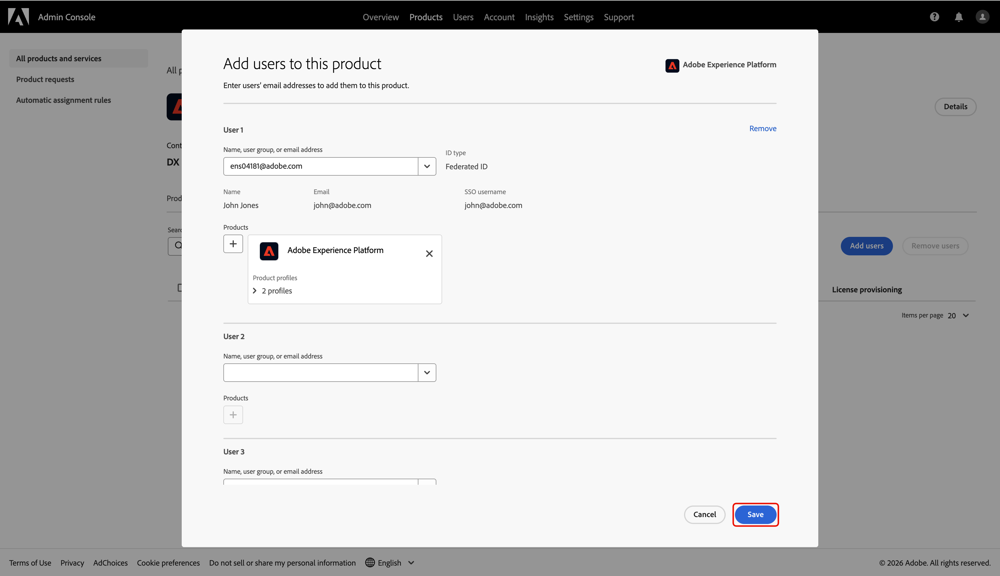

# Collaboration [!DNL Starter] 온보딩에 대한 관리자 액세스 구성

Collaboration [!DNL Starter]을(를) 통해 Adobe Experience Platform에 액세스하는 조직의 첫 번째 사용자는 팀에 대한 액세스 설정 및 관리를 담당합니다. Real-Time CDP Collaboration에서 작업을 시작하려면 자신에게 필요한 관리자 및 사용자 권한을 부여해야 합니다. 권한 인터페이스에서 공동 작업에 대한 권한을 관리할 수 있도록 Admin Console에서 필요한 액세스를 구성하는 방법에 대해 알아보려면 이 안내서를 참조하십시오.

## 전제 조건 {#prerequisites}

계속하기 전에 다음을 확인하십시오.

* 라이선스가 있는 Collaboration 파트너의 초대를 수락했습니다. 초대 요구 사항에 대한 자세한 내용은 [Collaboration [!DNL Starter] 개요](../overview/starter-overview.md#prerequisites)를 참조하세요.
* Collaboration 약관을 검토하고 서명했습니다.
* Adobe 시작 이메일을 받고 최초 계정 생성을 완료했습니다.

## 액세스 설정 {#setup-access}

[!DNL Starter] 워크플로우를 통해 Adobe 계정을 만들면 시스템 관리자 역할이 자동으로 할당됩니다. 이를 통해 Admin Console에서 사용자 및 제품 액세스를 관리할 수 있습니다. 그러나 Collaboration에 대한 액세스를 관리하는 데 필요한 **[!UICONTROL 권한]**&#x200B;에 대한 액세스 권한이 아직 없습니다.

Admin Console을 사용하여 Experience Platform에 대한 **제품 관리자 액세스 권한**&#x200B;과 Experience Platform 제품에 대한 **사용자 액세스 권한**&#x200B;을 모두 부여하면 **[!UICONTROL 권한]**&#x200B;을 얻을 수 있습니다.

Experience Cloud의 역할 및 제품에 대해 자세히 알아보려면 [액세스 제어 개요](../permissions/overview.md) 설명서를 읽어 보십시오.

>[!TIP]
>
>이 안내서에서 **관리자**&#x200B;는 **시스템 및 제품 관리자**&#x200B;를 모두 참조합니다.

### 제품 관리자 액세스 구성 {#configure-product-admin-access}

Collaboration [!DNL Starter]에 대한 액세스 설정을 시작하기 위한 관리자 권한을 부여하려면 이 섹션을 참조하십시오.

#### Admin Console 액세스 {#access-admin-console}

먼저 자격 증명을 사용하여 [Adobe Experience Cloud](https://experience.adobe.com/){target="_blank"}에 로그인하십시오. **[!UICONTROL 빠른 액세스]** 섹션에서 사용 가능한 제품 목록을 볼 수 있습니다. **[!UICONTROL Admin Console]**&#x200B;을(를) 선택합니다.

{zoomable="yes"}

#### Adobe Experience Platform 제품 대시보드 액세스 {#access-adobe-experience-platform}

[Admin Console](https://adminconsole.adobe.com/) 작업 영역이 새 탭에서 열립니다. **[!UICONTROL 제품 및 서비스]**&#x200B;의 **[!UICONTROL 제품]** 목록에서 **[!UICONTROL Adobe Experience Platform]**&#x200B;을(를) 선택하십시오.

Adobe Experience Platform 제품이 강조 표시된 {zoomable="yes"}

#### 제품 관리자 추가 {#add-product-admin}

**[!UICONTROL Adobe Experience Platform]** 제품 대시보드에서 **[!UICONTROL 관리자]** 탭으로 이동합니다. **[!UICONTROL 관리자 추가]**&#x200B;를 선택합니다.

{zoomable="yes"}

**[!UICONTROL 제품 관리자 추가]** 대화 상자에 전자 메일 주소 또는 사용자 이름을 입력한 다음 드롭다운에서 올바른 계정을 선택합니다. 완료되면 **[!UICONTROL 저장]**&#x200B;을 선택합니다.

{zoomable="yes"}

이제 제품 관리자가 되었으며 Admin Console 내의 제품에 사용자 또는 다른 관리자를 추가할 수 있습니다. 그런 다음 자신에게 Experience Platform 제품에 대한 액세스 권한을 부여하여 권한에서 기능에 액세스하고 작업을 수행합니다.

### 사용자 액세스 구성 {#configure-user-access}

Collaboration 권한을 관리하려면 관리자 액세스 권한 외에 제품에 대한 **사용자 액세스 권한**&#x200B;이 있어야 합니다. 시스템 또는 제품 관리자가 사용자 액세스를 구성할 수 있습니다.

>[!TIP]
>
>이전 섹션에서 팔로우하는 경우 이미 Admin Console의 **[!UICONTROL Adobe Experience Platform]** 제품 대시보드에 있어야 합니다. 여기에서 [사용자로 추가](#add-user)로 진행합니다.

사용자 액세스 구성을 시작하려면 다음 단계를 완료하십시오.

1. [Adobe Experience Cloud 홈페이지에서 Admin Console에 액세스](#access-admin-console).
2. [Adobe Experience Platform 제품 대시보드로 이동](#access-adobe-experience-platform).

#### 제품에 사용자 추가 {#add-user}

이제 **[!UICONTROL Adobe Experience Platform]** 제품 대시보드에 있습니다. **[!UICONTROL 사용자]** 탭으로 이동한 다음 **[!UICONTROL 사용자 추가]**&#x200B;를 선택합니다.

{zoomable="yes"}

**[!UICONTROL 이 제품에 사용자 추가]** 대화 상자가 나타나고 이름, 사용자 그룹 또는 전자 메일 주소를 입력하라는 메시지가 표시됩니다. 값을 입력한 다음 드롭다운 목록에서 계정을 선택합니다.

{zoomable="yes"}

그런 다음 **[!UICONTROL 제품]**&#x200B;에서 추가 아이콘 을 선택합니다.

사용 가능한 [제품 프로필](https://helpx.adobe.com/kr/enterprise/using/manage-product-profiles.html) 목록이 포함된 대화 상자가 나타납니다. **[!UICONTROL AEP-Default-All-Users]** 및 **[!UICONTROL 기본 프로덕션 모든 액세스]**&#x200B;를 선택합니다. 그런 다음 **[!UICONTROL 적용]**&#x200B;을 선택합니다.

{zoomable="yes"}

마지막으로 **[!UICONTROL 저장]**&#x200B;을 선택하여 제품에 새 사용자를 추가합니다.

{zoomable="yes"}

사용자 액세스 권한이 있으면 [Adobe Experience Cloud](https://experience.adobe.com/){target="_blank"}(으)로 다시 이동합니다. **[!UICONTROL 사용 권한]** 및 **[!UICONTROL Real-Time CDP Collaboration]**&#x200B;을(를) **[!UICONTROL 빠른 액세스]**&#x200B;에서 사용할 수 있는지 확인하십시오.

{zoomable="yes"}

>[!TIP]
>
>**[!UICONTROL 권한]** 및 **[!UICONTROL Real-Time CDP Collaboration]**&#x200B;이(가) **[!UICONTROL 빠른 액세스]**&#x200B;에 표시되지 않으면 로그아웃한 후 다시 로그인하세요.

## 다음 단계 {#next-steps}

이제 **관리자 액세스**&#x200B;와 **사용자 액세스**&#x200B;를 모두 사용하여 Collaboration 기능 및 리소스에 대한 역할을 정의하고 특정 권한을 할당하며 사용자 액세스를 관리할 수 있는 권한을 입력할 수 있습니다. 단계별 지침은 [권한 제어 안내서](./starter-permission-controls.md)를 참조하세요.
