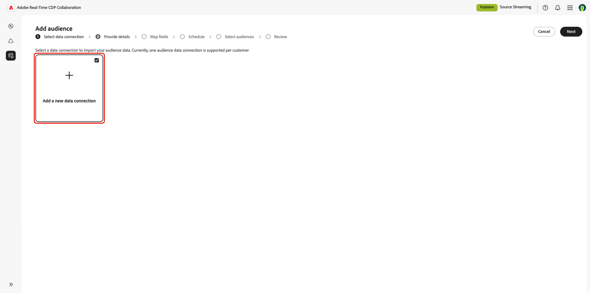

# 대상자 소싱에 대한 CSV 파일 업로드

이 안내서에서는 Adobe Real-Time CDP Collaboration UI에서 CSV 파일을 업로드하여 대상 데이터를 소스 데이터로 만들어 공동 작업 프로젝트에서 사용하도록 하는 단계를 제공합니다.

## 개요 {#overview}

CSV 파일 업로드는 공동 작업 프로젝트에 대한 자사 대상 데이터를 소스화하는 한 가지 방법입니다. 이는 [AWS S3 버킷에 연결](./configure-aws-s3-audience-sourcing.md) 또는 [Experience Platform에서 대상 소싱](./onboard-audiences.md)의 대안입니다.

대상 데이터가 포함된 CSV 파일을 업로드하고 Collaboration 내에서 자사 대상을 소스 및 관리하려면 이 워크플로우를 따르십시오. 활성화 및 중복 분석을 위해 ID 필드를 매핑할 수 있습니다. 파일이 업로드되고 처리되면 공동 작업 프로젝트를 검토, 활성화 및 관리할 수 있는 **[!UICONTROL 내 대상]** 작업 영역에서 소스 대상을 사용할 수 있게 됩니다.

>[!IMPORTANT]
>
>* CSV 업로드를 통해 가져온 대상은 **7일** 동안 사용할 수 있습니다. 이 기간이 지나면 대상자가 만료되며 공동 작업 프로젝트에서 사용하기 위해 다시 업로드해야 합니다.
>
>* 이때 세션당 하나의 CSV 파일을 업로드할 수 있습니다. 대상을 추가하려면 소스화하려는 각 파일에 대해 업로드 워크플로우를 다시 완료하십시오.

## 전제 조건 {#prerequisites}

대상 소싱을 위해 CSV 파일을 업로드하려면 먼저 다음을 확인하십시오.

* Real-Time CDP Collaboration에서 계정 온보딩을 완료했습니다. 단계별 지침은 [계정 온보딩](./onboard-account.md)을 참조하십시오.
* 조직에 대상을 추가하는 데 필요한 권한입니다.
* 이메일이나 전화와 같은 ID 필드가 있는 대상자 데이터가 포함된 CSV 파일.

## CSV 파일 업로드 {#upload-csv-file}

**[!UICONTROL 설정]** 작업 영역의 **[!UICONTROL 내 대상]** 탭에서 추가 아이콘()을(를) 선택한 다음 **[!UICONTROL 대상]**&#x200B;을 선택합니다.

첫 번째 대상자인 경우 **[!UICONTROL 추가]** 옵션도 선택할 수 있습니다.

![설정 작업 영역의 [내 대상] 탭에 추가 아이콘과 대상 추가 옵션이 표시됩니다.](../../assets/setup/add-manage-audiences/add-audiences.png)

대상자 추가 워크플로우가 나타납니다. **[!UICONTROL 새 데이터 연결 추가]**&#x200B;를 선택한 후 **[!UICONTROL 다음]**&#x200B;을 선택합니다.

{zoomable="yes"}

### CSV 파일을 데이터 연결로 선택 {#select-csv-file}

**[!UICONTROL CSV 파일]**&#x200B;을(를) 데이터 연결로 선택한 후 **[!UICONTROL 다음]**&#x200B;을(를) 선택하십시오.

### 파일 선택 {#select-file}

로컬 시스템에서 CSV 파일을 업로드하려면 **[!UICONTROL 컴퓨터에서 선택]**&#x200B;을 선택하십시오. 또는 업로드할 CSV 파일을 [!UICONTROL CSV 파일 드래그 앤 드롭] 패널로 드래그 앤 드롭할 수 있습니다.

>[!IMPORTANT]
>
>CSV 파일만 지원됩니다. 최대 파일 크기는 **2GB**&#x200B;입니다.

업로드되면 UI에 열 수, 예상 행 수, 파일 구조 및 처음 10개 데이터 행의 미리보기가 포함된 요약이 표시됩니다.

요약을 검토하고 **[!UICONTROL 다음]**&#x200B;을 선택합니다.

#### 파일 바꾸기 {#replace-file}

다른 CSV 파일을 업로드하려면 **[!UICONTROL 파일 바꾸기]**&#x200B;를 선택하고 새 파일을 선택하십시오. 그런 다음 인터페이스가 새로 고침되어 새 데이터의 업데이트된 요약이 표시됩니다.

수정된 요약을 검토한 후 **[!UICONTROL 다음]**&#x200B;을 선택합니다.

![다른 CSV 파일을 업로드하려면 [파일 바꾸기] 옵션을 선택하십시오.](../../assets/setup/csv-audience-sourcing/replace-file.png)

### 동의 승인 확인 {#confirm-consent}

계속하기 전에 동의 옵트아웃이 대상 데이터에서 제거되었음을 확인해야 합니다. Collaboration에는 데이터 공유를 옵트아웃한 사용자 없이 깨끗한 대상 데이터가 필요합니다.

확인 상자를 선택한 다음 **[!UICONTROL 확인]**&#x200B;을 선택하여 확인합니다. 그런 다음 대화 상자가 닫히고 필드 매핑 화면으로 이동합니다.

### 소스 ID 필드 매핑 {#map-fields}

필드 매핑은 Collaboration이 활성화 및 중복 분석에 대상 데이터를 사용하는 방법을 결정합니다. **[!UICONTROL 필드 매핑]** 화면에서 드롭다운 메뉴를 사용하여 CSV 파일의 각 소스 ID 필드를 Collaboration의 해당 대상 필드에 매핑합니다.

데이터 형식 또는 설명을 포함하여 대상 필드에 대한 추가 정보가 필요한 경우 **[!UICONTROL 대상 필드 세부 정보]**&#x200B;를 선택하십시오.

그런 다음 매핑된 필드를 검토하고 **[!UICONTROL 다음]**&#x200B;을(를) 선택하십시오.

### 업로드 검토 및 완료 {#review-and-complete}

CSV 파일의 대상자 설정에 대한 요약이 포함된 **[!UICONTROL 검토]** 화면이 나타납니다. 다음 섹션의 정보를 검토하십시오.

* **[!UICONTROL 파일 정보]**: 파일 이름, 열 수 및 예상 행 수를 표시합니다.
* **[!UICONTROL 매핑]**: 업로드한 대상 파일의 원본 필드(예: `email`)가 Collaboration에서 사용되는 대상 필드(예: 해시된 이메일)에 매핑되는 방법을 나열합니다.

섹션을 편집해야 하는 경우 연필 아이콘을 선택합니다. **[!UICONTROL 완료]**&#x200B;를 선택하여 모든 섹션을 확인합니다.

요약 섹션 아래에 진행률 표시줄이 표시되어 업로드 진행률을 나타냅니다. 업로드가 완료되면 확인 대화 상자에서 CSV 대상자가 만들어지고 대상자 소싱이 진행 중임을 확인합니다.

## 소스 대상자 검토 {#review-sourced-audiences}

CSV 파일을 업로드한 후 Collaboration은 파일에서 대상을 소싱하기 시작합니다. 이 프로세스는 몇 분 정도 소요될 수 있습니다. 소싱이 완료되면 **[!UICONTROL 내 대상]** 탭에서 Experience Platform에서 가져온 대상과 동일한 기능 및 정보로 대상자를 사용할 수 있습니다.

표 보기 또는 표 보기에서 행 항목을 선택하거나 **[!UICONTROL 대상자 보기]**&#x200B;를 선택하여 특정 대상자에 대한 개요를 봅니다. 대상자의 상태, 소스 및 데이터 연결 이름과 함께 다음에 대한 세부 패널이 표시됩니다.

**[!UICONTROL ID]**: 데이터를 사용할 수 있게 되면 총 ID 수 및 분류를 표시합니다.
**[!UICONTROL 범주]**: 대상을 구성하거나 필터링하는 데 사용되는 모든 태그를 표시합니다.
**[!UICONTROL 연결 액세스]**: 대상자가 개인, 공개 또는 특정 공동 작업자와 공유되는지 여부를 표시합니다.
**[!UICONTROL 메타데이터 가시성]**: 공동 작업자가 볼 수 있는 대상 정보(ID 수, 겹침 비율, 색인 등)를 표시합니다.

공동 작업 프로젝트에서 대상을 사용하기 전에 이 보기를 사용하여 대상 구성 및 가시성 설정을 확인하십시오. 자세한 내용은 [개별 대상자를 보는 방법](./onboard-audiences.md#view-individual-audiences)을 참조하세요.

## 다음 단계 {#next-steps}

이제 Collaboration에서 CSV 파일을 성공적으로 업로드했습니다. 소싱이 완료된 후 다음을 수행할 수 있습니다.

* 소스 대상자와 공동 작업 프로젝트를 만듭니다. [대상자 검색](../../guide/collaborate/discover.md)을 참조하세요.
* 연결된 대상에 대한 대상을 활성화합니다. [대상자 활성화](../../guide/collaborate/activate.md)를 참조하십시오.
* 대상자 겹침 및 통찰력을 검토합니다. [캠페인 성과 측정](../../guide/collaborate/measure.md)을 참조하세요.
* 대상자 설정 및 가시성을 관리합니다. [Source 및 대상자 관리](./onboard-audiences.md)를 참조하세요.

다른 대상 소싱 방법에 대한 자세한 내용은 [대상 소싱을 위한 AWS S3 구성](./configure-aws-s3-audience-sourcing.md) 또는 [Experience Platform의 Source 대상 구성](./onboard-audiences.md)을 참조하십시오.
